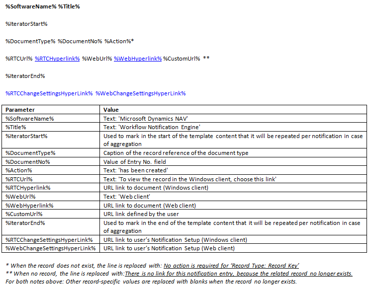
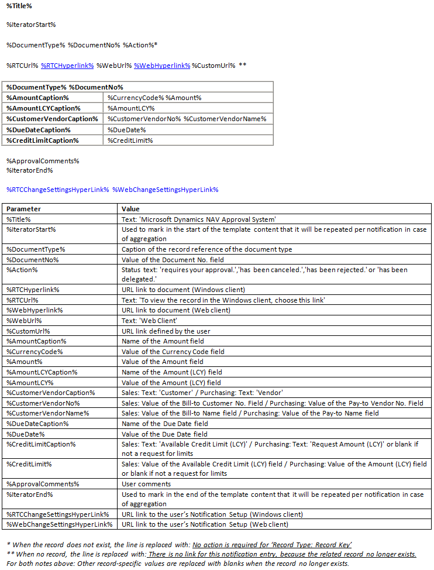

# Behandle varslingsmalerHow to: Manage Notification Templates
Varslinger sendes til brukere i arbeidsflyten for å varsle dem om trinn de må utføre, eller for å informere om statusen for trinn i arbeidsflyten.Notifications are sent to workflow users to notify them about steps they must make or to inform them about the status of workflow steps. Du definerer hvem som mottar varsel og når, ved å konfigurere godkjenning av brukere, brukernes varslingstidsplan og svarene i arbeidsflyten for å definere varslingsmottakeren.You set up who receives notification and when by setting up approval users, the users’ notification schedule, and the involved workflow responses to define the notification recipient. Hvis du vil ha mer informasjon, kan du se [Konfigurere arbeidsflytvarsler](across-setting-up-workflow-notifications.md).For more information, see [Setting Up Workflow Notifications](across-setting-up-workflow-notifications.md).  

 Varslinger er basert på maler som definerer innholdet i og oppsettet av meldingen.Notifications are based on templates that define the content and layout of the notification. Du kan eksportere innholdet i en varslingsmal, redigere den, og deretter importere til samme eller en ny varslingsmal.You can export the content of a notification template, edit it, and then import into the same or a new notification template. Dette er beskrevet i følgende fremgangsmåter.This is described in the following procedures.  

 Den generelle versjonen av [!INCLUDE[d365fin](includes/d365fin_md.md)] inneholder tre varslingmaler, én for å informere om forespørsler om godkjenning, én for å varsle om nye poster og én for å varsle om forfalte godkjenningsforespørsler.The generic version of [!INCLUDE[d365fin](includes/d365fin_md.md)] contains three notification templates, one for notifying about approval requests, one for notifying about new records, and one for notifying about overdue approval requests. Tre forhåndsdefinerte varslingsmaler støtter **E-post** og **Notat** som varslingsmetode.The three predefined notification templates support **Email** and **Note** as notification method. Hvis du vil vise innholdet i de tre varslingsmalene, kan du se delen "Innhold i varslingsmalene" i dette emnet.To view the content of the three notification templates, see the “Content of the Notification Templates” section in this topic.

## Slik oppretter du en ny varslingsmal:To create a new notification template  
1.  Velg ikonet , angi **Varslingsmaler**, og velg deretter den relaterte koblingen.Choose the  icon, enter **Notification Templates**, and then choose the related link.  
2.  Velg handlingen **Ny** i vinduet **Varslingsmaler**.In the **Notification Templates** window, choose the **New** action.  
3.  Fyll ut feltene som beskrevet i tabellen nedenfor.Fill the fields as described in the following table.  

    |FeltField|BeskrivelseDescription|  
    |---------------------------------|---------------------------------------|  
    |**Kode****Code**|Identifiser varslingsmalen.Identify the notification template.|  
    |**Beskrivelse****Description**|Beskriv varslingsmalen.Describe the notification template.|  
    |**Varslingsmetode****Notification Method**|Angi om varslingen sendes som en e-post eller et notat.Specify if the notification is sent as an email or as a note.|  
    |**Type****Type**|Angi forretningsprosessen som varslingen skal brukes for.Specify the business process that the notification will be used for.   Velg én av følgende typer:Select one of the following types:   -   **Godkjenning** angir at malen brukes til å varsle brukere i arbeidsflyter for godkjenning.-   **Approval** specifies that the template is used to notify users in approval workflows. -   **Ny post** angir at malen skal varsle godkjennere når en ny post, for eksempel et kundekort, trenger deres godkjenning.-   **New Record** specifies that the template is to notify approvers when a new record, such as a customer card, needs their approval. -   **Forfalt** angir at malen brukes til å varsle brukere om forfalte godkjenningsforespørsler.-   **Overdue** specifies that the template is used to notify users about overdue approval requests.|  
    |**Standard****Default**|Angi om varslingsmalen vil bli brukt som standard.Specify if the notification template will be used by default.|  

## Slik endrer du en varslingsmal:To modify a notification template  
1.  Velg ikonet , angi **Varslingsmaler**, og velg deretter den relaterte koblingen.Choose the  icon, enter **Notification Templates**, and then choose the related link.  
2.  I vinduet **Varslingsmaler** velger du varslingsmalen du vil opprette eller endre.In the **Notification Templates** window, select the notification template that you want to modify.  
3.  Velg **Eksporter malinnhold**.Choose the **Export Template Content** action.  
4.  I **Eksporter fil**-vinduet velger du **Lagre**-knappen, og deretter gir du navn til HTML-filen og lagrer den på en passende plassering.In the **Export File** window, choose the **Save** button, and then name and save the HTML file in an appropriate location.  
5.  Høyrevelg filen, velg **Åpne med**, og velg deretter det aktuelle programmet.Right-choose the file, choose **Open with**, and then choose the relevant program.  

    > [!NOTE]  
    >  Innhold for varslingsmaler av typen E-post er i HTML-format.Content for notification templates of type Email are in HTML format. Innhold for varslingsmaler av typen Notat er i TXT-format.Content for notification templates of type Note are in TXT format.  
6.  Rediger innholdet i varslingsmalen ved å legge til, endre eller fjerne parametervariabler for å definere det ønskede innholdet, og lagre det.Edit the content of the notification template by adding, changing, or removing parameter variables to define the content that you want, and then save it. Hvis du vil ha mer informasjon, se delen "Innhold i varslingsmalene".For more information, see the “Content of the Notification Templates” section.  

    Fortsett med å importere det endrede innholdet tilbake til den samme eller en ny varslingsmal.Proceed to import the modified content back into the same or a new notification template.  
7.  Hvis du vil endre varslingsmalen som du eksporterte, velger du malen du valgte i trinn 2, i vinduet **Varslingsmaler**.To modify the notification template that you exported, in the **Notification Templates** window, select the template that you selected in step 2.  

    Hvis du vil importere det endrede malinnholdet til en ny varslingsmal, kan du eventuelt følge fremgangsmåten for å opprette en ny varslingsmal, og deretter velge den nye varslingsmalen.Alternatively, to import the modified template content into a new notification template, follow the “To create a new notification template” procedure, and then select the new notification template.  
8.  Velg **Importer malinnhold**.Choose the **Import Template Content** action.  
9. Hvis du endrer en eksisterende varslingsmal, velger du **Ja**-knappen på meldingen om overskriving av den eksisterende malen.If you are modifying an existing notification template, choose the **Yes** button on the message about overwriting the existing template.  
10. I vinduet **Velg en fil for import** velger du HTML-filen som du endret i trinn 6, og velger deretter **Åpne**-knappen.In the **Select a file to import** window, choose the HTML file that you modified in step 6, and then choose the **Open** button.  

Den eksisterende eller nye varslingsmalen i vinduet **Varslingsmaler** er nå oppdatert med det endrede innholdet.The existing or new notification template in the **Notification Templates** window is now updated with the modified content.  

### Innhold i varslingsmaleneContent of the Notification Templates  
De tre varslingsmaltypene **Ny post**, **Godkjenning** og **Forfalt** har forskjellig innhold.The three notification template types, **New Record**, **Approval**, and **Overdue**, have different content.  

Parameterverdier settes automatisk inn i varslinger i henhold til typen varslingsmal.Parameter values are automatically inserted in notifications according to the notification template type.  

#### Ny postNew Record  
   

#### GodkjenningApproval  
   

#### ForfaltOverdue  
   

## Se ogsåSee Also  
 [Konfigurere arbeidsflytvarsler](across-setting-up-workflow-notifications.md) [Setting Up Workflow Notifications](across-setting-up-workflow-notifications.md)   
 [Konfigurere e-post](madeira-how-setup-email.md) [How to: Set up Email](madeira-how-setup-email.md)   
 [Konfigurere arbeidsflytbrukere](across-how-to-set-up-workflow-users.md) [How to: Set Up Workflow Users](across-how-to-set-up-workflow-users.md)   
 [Konfigurere godkjenningsbrukere](across-how-to-set-up-approval-users.md) [How to: Set Up Approval Users](across-how-to-set-up-approval-users.md)   
 [Opprette arbeidsflyter](across-how-to-create-workflows.md) [How to: Create Workflows](across-how-to-create-workflows.md)   
 [Bruke jobbkøer til å planlegge oppgaver](admin-job-queues-schedule-tasks.md) [Use Job Queues to Schedule Tasks](admin-job-queues-schedule-tasks.md)   
 [ArbeidsflytWorkflow](across-workflow.md)   

