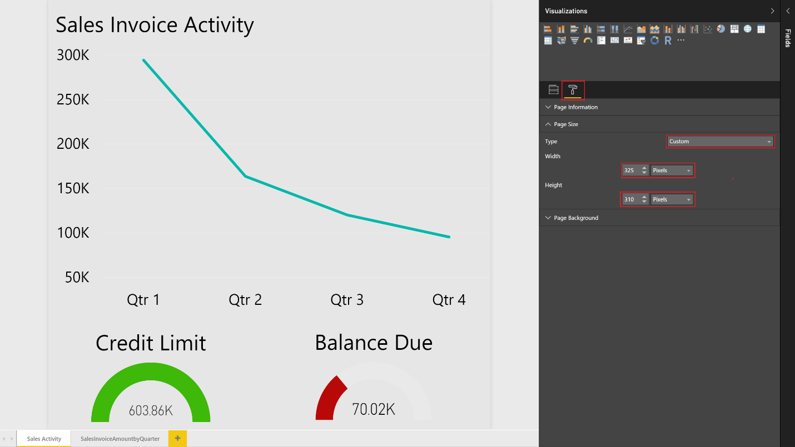

# Vise listedata i Power BI-rapporter i Dynamics NAVViewing List Data in Power BI Reports in Dynamics NAV
[!INCLUDE[d365fin](includes/d365fin_md.md)] inkluderer en faktaboks kontrollelement på en rekke viktige listesider som gir ytterligere innsikt i dataene i listen. includes a FactBox control element on a number of key list pages that provides additional insight into the data in the list. Når du flytter mellom radene i listen, er oppdateres og filtreres rapporten for den valgte posten.As you move between rows in the list, the report is updated and filtered for the selected entry. Du kan opprette egendefinerte rapporter for å vises i kontrollen, men det finnes et par regler å følge når du oppretter rapporter for å sikre at de gir den ønskede virkemåten.You can create custom reports to display in this control, but there are a few rules to follow when creating the reports to ensure they provide the desired behavior.  

> [!NOTE]  
>   Du må ha en gyldig konto med [!INCLUDE[d365fin](includes/d365fin_md.md)] og med Power BI.You must have a valid account with [!INCLUDE[d365fin](includes/d365fin_md.md)] and with Power BI. Du må også laste ned [Power BI Desktop](https://powerbi.microsoft.com/en-us/desktop/).Also, you must download [Power BI Desktop](https://powerbi.microsoft.com/en-us/desktop/). Hvis du vil ha mer informasjon, kan du se [Bruke [!INCLUDE[d365fin](includes/d365fin_md.md)] som en datakilde for Power BI](across-how-use-financials-data-source-powerbi.md).For more information, see [Using [!INCLUDE[d365fin](includes/d365fin_md.md)] as a Power BI Data Source](across-how-use-financials-data-source-powerbi.md).  

## RapportdatasettReport Data Set
Når du oppretter rapporten i Power BI Desktop, kan du angi datakilden eller webtjeneste som inneholder dataene som er knyttet til listen som du vil knytte til rapporten.When you create the report in Power BI Desktop, specify the data source or web service that contains the data related to the list that you want to associate the report with. For eksempel, hvis du vil opprette en rapport for salgslisten, sikre at datasettet ikke inneholder informasjon som er knyttet til salg.For example, if you want to create a report for the Sales List, ensure that the data set contains information related to sales.  

Hvis du vil filtrere data i rapporter som er basert på posten som er valgt på listesiden, må den primære nøkkelen brukes som et rapportfilter.To filter data on the reports based upon the record selected from the list page, the primary key must be used as a report filter. Primærnøklene må være en del av datasettet for at rapportene skal filtreres på riktig måte.The primary keys will need to be part of your data set in order for the reports to filter correctly. I de fleste tilfeller er primærnøkkelen for en liste **Nr.**In most cases, the primary key for a list is the **No.** -feltet.field.  

## Definere rapportfilteretDefining the Report Filter
Rapporten må ha et grunnleggende rapportfilter (ikke en side eller et visuelt filter og ikke et avansert filter) for å filtreres på riktig måte i Power BI-faktaboksen for kontrollen.The report is required to have a basic report filter (not a page or visual filter and not advanced filter) to filter correctly in the Power BI Fact Box Control. Filteret som blir sendt til Power BI-rapporten fra hver listeside baseres på primærnøkkelen som beskrevet i forrige del.The filter that is passed to the Power BI report from each list page will be based on the primary key as described in the previous section.  

Hvis du vil definere et filter for rapporten, velger du primærnøkkelen fra listen over tilgjengelige felt, og deretter dra og slippe feltet i **Rapportfilter**-delen.To define a filter for the report, select the primary key from the list of available fields, and then drag and drop that field into the **Report Filter** section.  

## Rapportstørrelse og -fargeReport Size and color
Størrelsen på rapporten må settes til 325 x 310 piksler.The size of the report must be set to 325 pixels by 310 pixels. Dette er nødvendig for riktig skalering av rapporten i den tilgjengelige plassen som er tillatt av Power BI-faktabokskontrollen.This is required for the proper scaling of the report in the available space allowed by the Power BI Fact Box control. Hvis du vil definere størrelsen på rapporten, fokusere utenfor oppsettsområdet til rapporten, og velg deretter malerrulleikonet.To define the size of the report, place focus outside of the report layout area, and then choose the paint roller icon.

Du kan endre bredden og høyden på rapporten ved å velge **Egendefinert** i **Type**-feltet.You can change the width and height of the report by choosing **Custom** in the **Type** field.

På samme måte, hvis du vil få bakgrunnen på rapporten til å blandes inn i bakgrunnsfargen for Power BI-faktabokskontrollen, definere en egendefinert rapport bakgrunnsfargen for *E5E5E5*.Similarly, if you want to have the background of the report blend into the background color of the Power BI Fact Box control, define a custom report background color of *E5E5E5*. Dette er valgfritt.This is optional.  

## Rapporter med flere siderReports with Multiple Pages
Du kan opprette én enkelt rapport med flere sider med Power BI.With Power BI, you can create a single report with multiple pages. Bilder som du vil se i [!INCLUDE[d365fin](includes/d365fin_md.md)]-listesider må være på den første siden i rapporten i Power BI.The visuals that you want to see in the [!INCLUDE[d365fin](includes/d365fin_md.md)] list pages must be on the first page of the report in Power BI.  

> [!NOTE]  
>  Faktaboksen Power BI kan bare vise den første siden i rapporten. Hvis du vil vise andre sider, må du utvide rapporten og bruke fanene nederst i rapporten til å navigere til andre sider.The Power BI Fact Box can show only the first page of your report; if you want to see other pages, you must expand the report and use tabs at the bottom of the report to navigate to other pages.  

## Lagre rapportenSaving Your Report

Når du lagrer rapporten, er det en anbefalt fremgangsmåte at navnet på rapporten inneholder navnet på listesiden du vil vise i rapporten.When you save your report, it's a best practice that the name of the report contains the name of the list page that you want to display the report in. For eksempel må ordet *Leverandør* ligge et sted i rapportnavnet for rapporter som du vil gjøre tilgjengelig i leverandøroversikten.For example, the word *Vendor* must be contained somewhere in the report name for reports that you want to make available on the Vendor list.  

Dette er ikke et krav. Det vil imidlertid gjøre prosessen med å velge rapporter raskere.This is not a requirement; however, it will make the process of selecting reports quicker. Når rapportsiden åpnes fra en listeside, vil vi sende et filter basert på navnet på siden for å avgrense rapporter som vises.When the report selection page is opened from a list page, we will pass in a filter based on the page name to limit the reports that are displayed.  Du kan fjerne filteret for å få en fullstendig liste over rapporter som er tilgjengelige for deg i Power BI.You may remove the filter to get a full list of reports available to you in Power BI.  

## FeilsøkingTroubleshooting
Denne delen inneholder en løsning for de vanligste problemene som kan oppstå når du oppretter en Power BI-rapport.This section provides a workaround for the most typical issues that can occur when you create the Power BI report.  

**Brukeren ser ikke en rapport på siden Velg rapport de vil velge** Hvis du ikke kan velge en rapport, en mulig løsning er å bekrefte navnet på rapporten for å sikre at den inneholder navnet på siden.**User does not see a report on the Select Report page they want to select** If you cannot select a report, a possible solution is to verify the name of the report to ensure it contains the name of the list page. Du kan fjerne filteret for å få en fullstendig liste over rapporter som er tilgjengelige i Power BI.You can also clear the filter to get a full list of Power BI reports available.  

**Rapporten er lastet inn, men tom, ikke filtrert eller filtrert feil** Kontroller at rapportfilteret inneholder den høyre primærnøkkelen.**Report is loaded but blank, not filtered or filtered incorrectly** Verify that the report filter contains the right primary key. I de fleste tilfeller er det **Nr.**-In most cases, this is the **No.** feltet, men i **Finanspost**-tabellen, for eksempel, må du bruke **Løpenr.**-feltet.field, but in the **G/L Entry** table, for example, you must use the **Entry No.** field  .

**Rapporten er lastet inn, men det viser siden du ikke har forventet** Kontroller at siden du vil vise er den første siden i rapporten.**Report is loaded, but it shows the page you have not expected** Verify that the page you want displayed is the first page in your report.  

**Rapporten vises med uønsket grå kantlinjer, er for liten eller for stor****Report appears with unwanted gray boarders, is too small or too large**

Kontroller at størrelsen på rapporten er satt til 325 x 310 piksler.Verify that the report size is set to 325 pixels x 310 pixels. Lagre rapporten, og deretter oppdater listesiden.Save the report, and then refresh the list page.  

## Se ogsåSee Also
[Bruke [!INCLUDE[d365fin](includes/d365fin_md.md)] som en datakilde for Power BI](across-how-use-financials-data-source-powerbi.md)[Using [!INCLUDE[d365fin](includes/d365fin_md.md)] as a Power BI Data Source](across-how-use-financials-data-source-powerbi.md)  
[Velkommen til [!INCLUDE[d365fin_long](includes/d365fin_long_md.md)]](index.md)  [Welcome to [!INCLUDE[d365fin_long](includes/d365fin_long_md.md)]](index.md)    
[Konfigurere [!INCLUDE[d365fin](includes/d365fin_md.md)]](setup.md)  [Setting Up [!INCLUDE[d365fin](includes/d365fin_md.md)]](setup.md)    
[FinansFinance](finance.md)  

