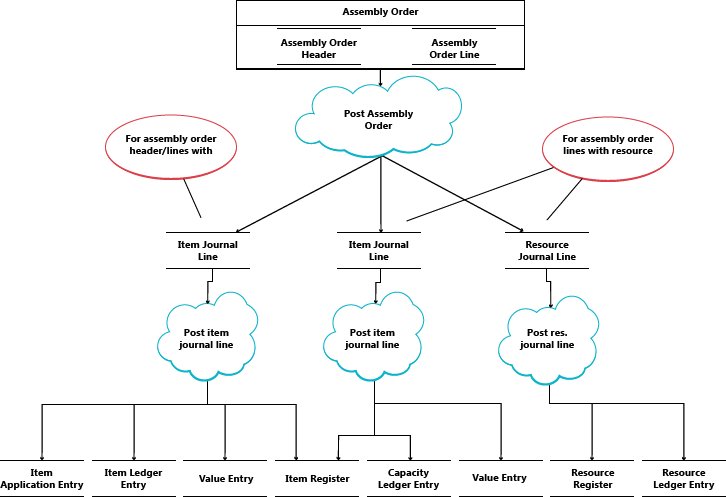

# Designdetaljer: Bokføre monteringsordre
Monteringsordrebokføring er basert på de samme prinsippene som ved bokføring av lignende aktiviteter for salgsordrer og produksjonsforbruk/-avgang. Prinsippene kombineres imidlertid slik at monteringsordrer har sine egne brukergrensesnitt for bokføring, som for salgsordrer, mens den faktiske bokføringen skjer i bakgrunnen som direkte vare- og ressurskladdbokføringer, som for produksjonsforbruk, avgang og kapasitet.  

De forbrukte komponentene og de brukte ressursene konverteres og avgis som monteringsvaren når monteringsordren bokføres, på lignende måte som ved bokføring av produksjonsordrer. Hvis du vil ha mer informasjon, kan du se [Designdetaljer: Bokføre produksjonsordre](design-details-production-order-posting.md). Kostnadsflyten for monteringsordrer er imidlertid mindre komplisert, spesielt fordi bokføring av monteringskost bare forekommer én gang og derfor ikke genererer lager for varer i arbeid.  

Følgende kladdebokføringer skjer under bokføring av monteringsordrer:  

-   Varekladden bokfører positive vareposter, som representerer avgang av monteringsvaren, fra monteringsordrehodet.  
-   Varekladden bokfører negative vareposter, som representerer forbruk av monteringskomponenter, fra monteringsordrelinjene.  
-   Ressurskladden bokfører forbruk av monteringsressurser (tidsenheter) fra monteringsordrelinjene.  
-   Kapasitetskladden bokfører verdiposter som er knyttet til ressursforbruk, fra monteringsordrelinjene.  

Diagrammet nedenfor viser strukturen til vare- og ressursposter som er resultat av bokføring av monteringsordrer.  

  

> [!NOTE]  
>  Produksjonsressurser og arbeidssentre er inkludert for å illustrere at kapasitetsposter opprettes fra både produksjon og montering.  

Diagrammet nedenfor viser hvordan monteringsdata flyter inn i poster under bokføring:  

  

## Bokføringsrekkefølge  
Bokføringen av en monteringsordre skjer i følgende rekkefølge:  

1.  Monteringsordrelinjene bokføres.  
2.  Monteringsordrehodet bokføres.  

Tabellen nedenfor gir en oversikt over handlingssekvensen.  

|Handling|Beskrivelse|  
|------------|-----------------|  
|Starter bokføring|1. Utfør foreløpige kontroller. 2. Legg til bokføringsnummer og endre ordrehodet for monteringsordren. 3. Frigi monteringsordren.|  
|Post|<ol><li>Opprett bokført monteringsordrehode.</li><li>Kopiere merknadslinjer.</li><li>Bokføre monteringsordrelinjer (forbruk):   <ol><li>Opprett et statusvindu for å beregne monteringsforbruk.</li><li>Få det gjenværende antallet som varekladdelinjen skal baseres på.</li><li>Tilbakestill forbrukte og gjenstående antall.</li><li>For monteringsordrelinjer av typen Vare:   <ol><li>Fyll ut feltene på hver varekladdelinje.</li><li>Overfør reservasjoner til varekladdelinjen.</li><li>Bokføre varekladdlinjen for å opprette vareposter.</li><li>Opprett lagerkladdelinjene og bokfør dem.</li></ol></li><li>For monteringsordrelinjer av typen Ressurs:   <ol><li>Fyll ut feltene på hver varekladdelinje.</li><li>Bokfør varekladdelinjen. Dermed opprettes kapasitetsposter.</li><li>Opprett og bokfør ressurskladdelinje.</li></ol></li><li>Overfør feltverdier fra monteringsordrelinjen til en nyopprettet, bokført monteringsordrelinje.</li></ol></li><li>Bokføre monteringsordrehodet (avgang):   <ol><li>Fyll ut feltene på hver varekladdelinje.</li><li>Overfør reservasjoner til varekladdelinjen.</li><li>Bokføre varekladdlinjen for å opprette vareposter.</li><li>Opprett lagerkladdelinjene og bokfør dem.</li><li>Tilbakestill monteringsantall og gjenstående antall.</li></ol></li></ol>|  

> [!IMPORTANT]  
>  Monteringsavgang bokføres med faktisk kostnad, i motsetning til produksjonsavgang, som bokføres med forventet kostnad.  

## Kostjustering  
 Når en monteringsordre er bokført, noe som betyr at komponenter (materiale) og ressurser er montert til en ny vare, skal det være mulig å fastslå faktisk kost for monteringsvaren og faktisk lagerkost for de involverte komponentene. Dette gjøres ved å videresende kostnader fra de bokførte postene i kilden (komponentene og ressursene) til de bokførte postene i målet (monteringsvaren). Kostnader videresendes ved å beregne og generere nye poster kalt justeringsposter, som blir knyttet til målpostene.  

 Monteringskostnadene som skal videresendes, oppdages med gjenkjenningsmekanismen for ordrenivå. Hvis du vil ha informasjon om andre mekanismer for gjenkjenning av justering, kan du se [Designdetaljer: Kostjustering](design-details-cost-adjustment.md).  

### Registrere justeringen  
Gjenkjenningsfunksjonen for ordrenivå brukes i konverteringsscenarier, produksjon og montering. Funksjonen fungerer som følger:  

-   Kostjustering registreres ved å merke ordren hver gang et materiale / en ressurs bokføres som forbrukt/brukt.  
-   Kost videresendes ved å utligne kostnadene fra materiale/ressurs mot avgangsposter som er knyttet til samme ordre.  

Figuren nedenfor viser justeringspoststrukturen og hvordan monteringskostnader justeres.  

  

### Utføre justeringen  
Spredningen av oppdagede justeringer fra material- og ressurskostpriser til monteringsavgangsposter utføres av kjørselen **Juster kostverdi – vareposter**. Den inneholder funksjonen for å justering flere nivåer, som består av følgende to elementer:  

-   Utfør monteringsordrejustering – som videresender kostnader fra material- og ressursbruk til monteringsavgangsposten. Linje 5 og 6 i algoritmen nedenfor er ansvarlige for dette.  
-   Justere enkeltnivå – som videresender kostnader for enkeltvarer ved hjelp av lagermetoden. Linje 9 og 10 i algoritmen nedenfor er ansvarlige for dette.  

  

> [!NOTE]  
>  Elementet Make WIP Adjustments på linje 7 og 8 er ansvarlig for å videresende produksjonsmateriale og kapasitetsforbruk til avgangen til uferdige produksjonsordrer. Dette brukes ikke ved justering av monteringsordrekost, siden begrepet om VIA ikke gjelder for montering.  

Hvis du vil ha informasjon om hvordan kostnader fra montering og produksjon bokføres i Finans, kan du se [Designdetaljer: Lagerbokføring](design-details-inventory-posting.md).  

## Monteringskostnader er alltid faktiske  
 Begrepet om varer i arbeid (VIA) gjelder ikke i bokføring av monteringsordrer. Monteringskostnader bokføres bare som faktiske kostnader, aldri som forventede kostnader. Hvis du vil ha mer informasjon, kan du se [Designdetaljer: Bokføre forventet kost](design-details-expected-cost-posting.md).  

Følgende datastruktur gjør dette mulig.  

-   I **Type**-feltet på varekladdelinjer, i tabellene **Kapasitetspost** og **Verdipost**, brukes *Ressurs* til å identifisere ressursposter for montering.  
-   I feltet **Vareposttype** på varekladdlinjene, i tabellene **Kapasitetspost** og **Verdipost**, brukes *Monteringsavgang* og *Monteringsforbruk* til å identifisere henholdsvis vareposter for monteringsavgang og poster for forbrukte monteringskomponenter.  

I tillegg blir bokføringsgruppefelt i monteringsordrehodet og monteringsordrelinjene fylt ut som standard, som vist nedenfor.  

|Enhet|Type|Bokføringsgruppe|Bokføringsgruppe - vare|  
|------------|----------|-------------------|------------------------------|  
|Monteringsordrehode|Vare|Bokføringsgruppe - lager|Bokføringsgruppe - vare|  
|Monteringsordrelinje|Vare|Bokføringsgruppe - lager|Bokføringsgruppe - vare|  
|Monteringsordrelinje|Ressurs||Bokføringsgruppe - vare|  

Bare faktiske kostnader blir derfor postert til finans, og ingen midlertidige konti fylles ut fra bokføring av monteringsordrer. Hvis du vil ha mer informasjon, se [Designdetaljer: Konti i Finans](design-details-accounts-in-the-general-ledger.md).  

## Monter til ordre  
Vareposten som er et resultat av bokføring av et montere-til-ordre-salg, blir fast utlignet mot den relaterte vareposten for monteringsavgangen. Kostnaden for et montere til ordre-salg er på samme måte avledet fra monteringsordren den var koblet til.  

Vareposter av typen Salg som stammer fra bokføring av montere-til-ordre-antallet, er merket med **Ja** i feltet **Monter til ordre**.  

Bokføring av ordrelinjer der en del er lagerantall og en annen del er montere-til-ordre-antall fører til separate vareposter, én for lagerantallet og én for montere-til-ordre-antallet.  

## Se også  
 [Designdetaljer: Kostberegning for beholdning](design-details-inventory-costing.md)   
 [Designdetaljer: Bokføre produksjonsordre](design-details-production-order-posting.md)   
 [Designdetaljer: Kostmetoder](design-details-costing-methods.md)  
 [Administrere lagerkostnader](finance-manage-inventory-costs.md)  
 [Finans](finance.md)  
 [Arbeide med [!INCLUDE[d365fin](includes/d365fin_md.md)]](ui-work-product.md)  

