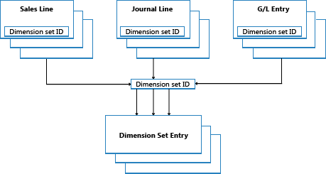

# Dimensjonssettposter – oversikt
Dette emnet beskriver hvordan dimensjonssettposter lagres og bokføres i [!INCLUDE[d365fin](includes/d365fin_md.md)].  
  
## Dimensjonssett  
Et dimensjonssett er en unik kombinasjon av dimensjonsverdier. Det lagres som dimensjonssettposter i databasen. Hver dimensjonssettpost representerer én enkelt dimensjonsverdi. Dimensjonssettet identifiseres av en felles dimensjonssett-ID som tilordnes hver dimensjonssettpost som tilhører dimensjonssettet.  
  
Eksempelet nedenfor viser et dimensjonssett som har tre dimensjonssettposter. Dimensjonssettet identifiseres av en dimensjonssett-ID, som er 108.  
  
|Dimensjonssett-ID|Dimensjonskode|Dimensjonsverdikode|Navn på dimensjonsverdi|  
|----------------------|--------------------|--------------------------|--------------------------|  
|108|OMRÅDE|70|Amerika – nord|  
|108|FIRMATYPE|HOME|Hjem|  
|108|AVDELING|SALG|Salg|  
  
## Dimensjonssettposter  
Dimensjonssett lagres i tabellen med **Dimensjonssettpost** som dimensjonssettposter med samme ID for dimensjonssett.  
  
  
  
Når du oppretter en ny kladdelinje, et nytt dokumenthode eller en ny dokumentlinje, kan du angi en kombinasjon av dimensjonsverdier. I stedet for at hver dimensjonsverdi lagres eksplisitt i databasen, tilordnes en dimensjonssett-ID til kladdelinjen, dokumenthodet eller dokumentlinjen for å angi dimensjonssettet.  
  
Når du redigerer og lukker vinduet **Rediger dimensjonssettposter**, blir det utført en kontroll for å se om kombinasjonen av dimensjonsverdier eksisterer som et dimensjonssett i tabellen. Hvis kombinasjonen forekommer i tabellen, tilordnes den tilsvarende dimensjonssett-IDen til kladdelinjen, dokumenthodet eller dokumentlinjen. Ellers legges et nytt dimensjonssett til i tabellen, og den nye dimensjonssett-IDen tilordnes til kladdelinjen, dokumenthodet eller dokumentlinjen.  
  
## Ytelsesforbedring  
Ved å lagre dimensjonssett én gang i databasen beholdes databaseplassen, og den generelle ytelsen blir forbedret.  
  
## Se også  
[Designdetaljer: Søke etter dimensjonskombinasjoner](design-details-searching-for-dimension-combinations.md)   
[Designdetaljer: Tabellstruktur](design-details-table-structure.md)   
[Designdetaljer: Dimensjonsbehandling for kodeenhet 408](design-details-codeunit-408-dimension-management.md)   
[Designdetaljer: Kodeeksempler på endrede mønstre i endringer](design-details-code-examples-of-changed-patterns-in-modifications.md)   
[Designdetaljer: Dimensjonssettposter](design-details-dimension-set-entries.md)   

