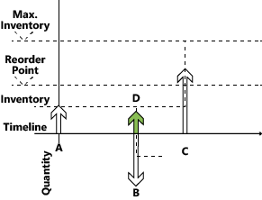

# Designdetaljer: Håndtere forventet negativ lagerbeholdning
Gjenbestillingspunktet uttrykker forventet behov i løpet av leveringstiden for varen. Når gjenbestillingspunktet passeres, er det på tide å bestille mer. Det forventede beholdningsnivået må være stort nok til å dekke behovet til den nye ordren mottas. I mellomtiden håndterer sikkerhetslageret svingninger i behovet opptil et servicenivåmål.  

 Planleggingssystemet anser det derfor som en nødssituasjon hvis et fremtidig behov ikke kan betjenes fra den beregnede beholdningen, eller uttrykt i en annen måte, den beregnede beholdningen blir negativ. Systemet håndterer et slikt unntak ved å foreslå en ny forsyningsordre som dekker en del av behovet som ikke kan dekkes av lageret eller annen forsyning. Ordrestørrelsen på den nye forsyningsordren tar ikke maksimumsbeholdningen eller gjenbestillingsantallet med i betraktningen. Den tar heller ikke ordremodifikatorene Maks. bestillingsantall, Min. bestillingsantall og Bestillingsfaktor med i betraktningen. I stedet gjenspeiles den nøyaktige mangelen.  

 Planleggingslinjen for denne typen forsyningsordre har et kritisk advarselsikon, og tilleggsinformasjon gis ved oppslag for å informere brukeren om situasjonen.  

 I illustrasjonen nedenfor representerer forsyning D en kritisk bestilling for å justere for negativt lager.  

   

1.  Forsyning **A**, opprinnelig beregnet beholdning, er under gjenbestillingspunktet.  

2.  Det opprettes en ny foroverplanlagt forsyning (**C**).  

     (Antall = Maks. beholdning – Forventet beholdningsnivå)  

3.  Forsyning **A** lukkes av behov **B**, som ikke er helt dekket.  

     (Behov **B** kan prøve å planlegge forsyning C i, men det vil ikke skje i henhold til tidsperiodekonseptet.)  

4.  Ny forsyning (**D**) blir opprettet for å dekke det gjenværende antallsbehovet **B**.  

5.  Behovet **B** er lukket (opprette en påminnelse til beregnet beholdning).  

6.  Den nye forsyningen **D** lukkes.  

7.  Beregnet beholdning er kontrollert. Gjenbestillingspunktet er ikke overskredet.  

8.  Forsyning **C** lukkes (det finnes ikke mer behov).  

9. Sluttkontroll: Det finnes ingen utestående påminnelser for beholdningsnivå.  

> [!NOTE]  
>  Trinn 4 viser hvordan systemet reagerer i versjoner før Microsoft Dynamics NAV 2009 SP1.  

 Med dette avsluttes beskrivelsen av sentrale prinsipper vedrørende lagerplanlegging basert på gjenbestillingsprinsipper. Følgende del beskriver egenskapene til de fire gjenbestillingsprinsippene som støttes.  

## Se også  
 [Designdetaljer: Gjenbestillingsprinsipper](design-details-reordering-policies.md)   
 [Designdetaljer: Planleggingsparametere](design-details-planning-parameters.md)   
 [Designdetaljer: Håndtere gjenbestillingsprinsipper](design-details-handling-reordering-policies.md)   
 [Designdetaljer: Forsyningsplanlegging](design-details-supply-planning.md)

