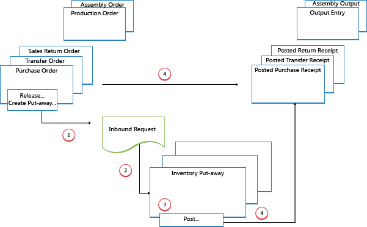
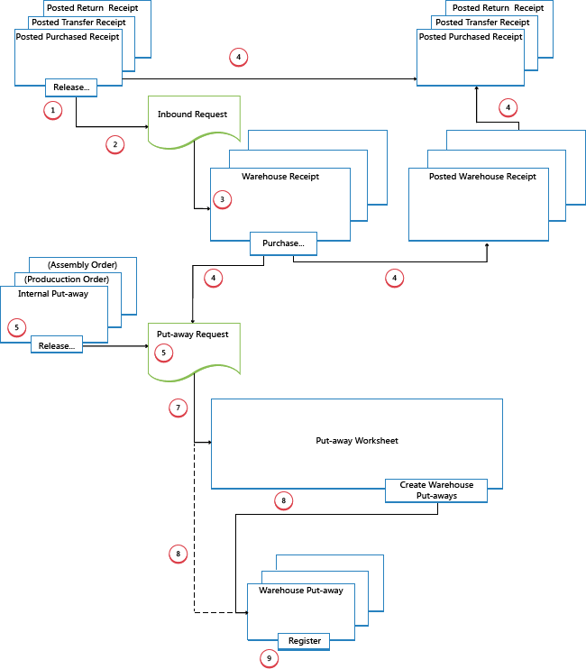

# Designdetaljer: Inngående lagerflyt
Den inngående flyten på et lager begynner når varene ankommer på lageret på selskapslokasjonen, enten de mottas fra eksterne kilder eller fra en annen selskapslokasjon. En ansatt registrerer varene, vanligvis ved å skanne en strekkode. Fra mottaksområdene utførers lageraktiviteter på ulike kompleksitetsnivåer for å hente varer til lagringsområdet.  

 Hvert element identifiseres og samsvares med en tilsvarende inngående kildedokument. Følgende inngående kildedokumenter finnes:  

- Bestilling  
- Inngående overføringsordre  
- Ordreretur  

I tillegg finnes følgende interne kildedokumenter som fungerer som innkommende kilder:  

- Produksjonsordre med avgangsbokføring  
- Monteringsordre med avgangsbokføring  

De to siste representerer inngående flyter til lageret fra interne operasjonsområder. Hvis du vil ha mer informasjon om lagerhåndtering for interne innkommende og utgående prosesser, kan du se
[Designdetaljer: Interne lagerflyter](design-details-internal-warehouse-flows.md).  

Prosesser og dokumenter for brukergrensesnitt i inngående lagerflyter er forskjellige for grunnleggende og avanserte lagerkonfigurasjoner. Hovedforskjellen er at aktiviteter utføres ordre for ordre i grunnleggende lagerkonfigurasjoner, og de konsolideres for flere ordrer i avanserte lagerkonfigurasjoner. Hvis du vil ha mer informasjon om ulike kompleksitetsnivåer for lageret, kan du se [Designdetaljer: Lageroversikt](design-details-warehouse-setup.md).  

I [!INCLUDE[d365fin](includes/d365fin_md.md)] kan de inngående prosessene for mottak og plassering utføres på fire måter ved hjelp av forskjellige funksjoner, avhengig av kompleksitetsnivået til lageret.  

|Metode|Inngående prosess|Hyller|Mottak|Plassering|Kompleksitetsnivå (se [Designdetaljer: Lageroppsett](design-details-warehouse-setup.md))|  
|------------|---------------------|----------|--------------|----------------|--------------------------------------------------------------------------------------------------------------------|  
|A|Bokføre mottak og plassering fra ordrelinjen|X|||2|  
|B|Bokføre mottak og plassering fra et lagerplasseringsdokument|||X|3|  
|L|Bokføre mottak og plassering fra et lagermottaksdokument||X||4/5/6|  
|D|Bokføre mottak fra et lagermottaksdokument og bokføre plassering fra et lagerplasseringsdokument||X|X|4/5/6|  

Hvilken metode som er aktuell å velge, avhenger av selskapets vanlige praksis og organisasjonens kompleksitetsnivå. I et ordre for ordre-lagermiljø, der de fleste ansatte på lageret arbeider direkte med ordredokumenter, kan et selskap for eksempel bruke metode A. Et ordre for ordre-lager som har en mer kompleks plasseringsprosess eller der det ikke er egne lageransatte til å utføre lageraktiviteter, kan skille plasseringsfunksjonene fra ordredokumentet (metode B). Selskaper som må planlegge behandling av flere ordrer kan i tillegg dra nytte av å bruke bekreftelse lagermottaks (metode C og D).  

I metode A, B og C kombineres mottaks- og plasseringshandlingen i ett trinn når tilsvarende dokumenter bokføres som mottatt. I metode D blir mottaket bokført først for å gjenkjenne lagerøkningen og at varer er tilgjengelige for salg. Lagermedarbeideren registrerer deretter plasseringen for å gjøre varene tilgjengelige for plukking.  

## Enkle lageroppsett  
Diagrammet nedenfor illustrerer inngående lagerflyter etter dokumenttype i grunnleggende lagerkonfigurasjoner. Tallene i diagrammet svarer til trinnene nedenfor diagrammet.  

  

### 1: Frigi kildedokument / opprett lagerplassering  
Når varer mottas på lageret, frigir brukeren som er ansvarlig for mottak, kildedokumentet, for eksempel en bestilling eller inngående overføringsordre, for å signalisere til lagermedarbeidere at de mottatte varene kan plasseres på lager. Brukeren kan også opprette lagerplasseringsdokumenter for enkelte ordrelinjene med en push-metode, basert på angitte hyller og antall som skal håndteres.  

### 2: Opprett inngående forespørsel  
Når det inngående kildedokumentet frigis, opprettes en inngående lagerforespørsel automatisk. Den inneholder referanser til kildedokumenttype og /nummer, og er ikke synlige for brukeren.  

### 3: Opprett lagerplassering  
I vinduet **Lagerplassering** henter brukeren som er ansvarlig, de ventende kildedokumentlinjene basert på inngående lagerforespørsler. Det kan også hende at lagerplasseringslinjene allerede er opprettet med en push-metode, av brukeren som er ansvarlig for kildedokumentet.  

### 4: Bokfør lagerplassering  
På hver linje for varer som er plassert, helt eller delvis, fyller lagermedarbeideren ut feltet **Antall** og bokfører deretter lagerplasseringen. Kildedokumenter som er knyttet til lagerplasseringen, bokføres som mottatt.  

Det blir opprettet positive vareposter og lagerposter, og plasseringsforespørselen slettes hvis ferdigbehandlet. Eksempel: Feltet **Mottatt (antall)** i den inngående kildedokumentlinjen oppdateres. Det opprettes et postert mottaksdokument som for eksempel gjenspeiler bestillingen og de mottatte varene.  

## avanserte lageroppsett  
Diagrammet nedenfor illustrerer inngående lagerflyter etter dokumenttype i avanserte lagerkonfigurasjoner. Tallene i diagrammet svarer til trinnene nedenfor diagrammet.  

  

### 1: Frigi kildedokument  
Når varer mottas på lageret, frigir brukeren som er ansvarlig for mottak, kildedokumentet, for eksempel en bestilling eller inngående overføringsordre, for å signalisere til lagermedarbeidere at de mottatte varene kan plasseres på lager.  

### 2: Opprett inngående forespørsel  
Når det inngående kildedokumentet frigis, opprettes en inngående lagerforespørsel automatisk. Den inneholder referanser til kildedokumenttype og /nummer, og er ikke synlige for brukeren.  

### 3: Opprett lagermottak  
I vinduet **Lagermottak** henter brukeren som er ansvarlig for mottak av varer, de ventende kildedokumentlinjene basert på inngående lagerforespørsel. Flere kildedokumentlinjer kan kombineres i ett lagermottaksdokument.  

Brukeren fyller ut feltet **Ant. som skal håndt.** og velger om nødvendig mottakssonen og hyllen.  

### 4: Bokfør lagermottak  
Brukeren bokfører lagermottaket. Det blir opprettet positive vareposter. Eksempel: Feltet **Mottatt (antall)** i den inngående kildedokumentlinjen oppdateres.  

### 5: Opprett intern lagerplassering  
Brukeren som er ansvarlig for å plassere fra interne operasjoner, oppretter en intern plassering for varer som må plasseres på lageret, for eksempel produksjons- eller monteringsavgang. Brukeren angir antall, sone og hylle som varer skal plasseres fra, eventuelt med funksjonen **Hent hylleinnhold**. Brukeren frigir den interne plasseringen på lageret, som gjør at en inngående lagerforespørsel opprettes, slik at oppgaven kan hentes i lagerplasseringsdokumenter eller i plasseringsforslaget.  

### 6: Opprett plasseringsforespørsel  
Når det inngående kildedokumentet bokføres, opprettes en lagerplasseringsforespørsel automatisk. Den inneholder referanser til kildedokumenttype og /nummer, og er ikke synlige for brukeren. Avhengig av oppsettet vil utdata fra en produksjonsordre også opprette en plasseringsforespørsel om å plassere de ferdige varene på lageret.  

### 7: Generer plasseringsforslagslinjer (valgfritt)  
Brukeren som er ansvarlig for å koordinere plassering, henter plasseringslinjer i **Plasseringsforslag** basert på bokførte lagermottak eller interne operasjoner med komponentforbruk. Brukeren velger linjene som skal plasseres, og klargjør plasseringene ved å angi hvilke hyller det skal tas fra, hvilke det skal plasseres i, og hvor mange enheter som skal håndteres. Hyllene kan være forhåndsdefinert av definisjonen av lagerlokasjonen eller operasjonsressursen.  

Når alle plasseringer er planlagt og tilordnet til lagermedarbeidere, genererer brukeren lagerplasseringsdokumentene. Fullstendig tildelte plasseringslinjer blir slettet fra **plasseringsforslaget**.  

> [!NOTE]  
>  Hvis feltet **Bruk plasseringsforslag** ikke er valgt på lokasjonskortet, blir lagerplasseringsdokumenter opprettet direkte basert på bokførte lagermottak. I slike tilfeller utelates trinn 7.  

### 8: Opprett plasseringsdokument  
Lagermedarbeideren som utfører plasseringer, oppretter et lagerplasseringsdokument på en hentemåte, basert på det bokførte lagermottaket. Lagerplasseringsdokumentet kan også opprettes og tilordnes lagermedarbeidere med en push-metode.  

### 9: Registrer plassering  
På hver linje for varer som er plassert, helt eller delvis, fyller lagermedarbeider ut feltet **Antall** i vinduet **Plassering**, og registrerer deretter plasseringen.  

Lagerposter opprettes, og lagerplasseringslinjene slettes hvis de er helt ferdigbehandlet. Lagerplasseringsdokumentet holdes åpent til hele antallet for det tilknyttede bokførte lagermottaket er registrert. Feltet **Plassert ant.** på bestillingslinjene for lagermottak oppdateres.  

## Se også  
[Designdetaljer: Lagerstyring](design-details-warehouse-management.md)

