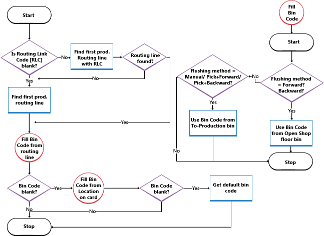

# Designdetaljer: Interne lagerflyterDesign Details: Internal Warehouse Flows
Flyten av varer mellom hyller på en selskapslokasjon dreier seg i hovedsak om å plukke komponenter og plassere sluttvarer for montering eller produksjonsordrer og adhocflyttinger, for eksempel etterfylling av hyller, uten en relasjon til kildedokumenter.The flow of items between bins at a company location centers on picking components and putting away end items for assembly or production orders and ad-hoc movements, such as bin replenishments, without a relation to source documents. Omfanget av og karakteren til aktivitetene som er involvert, varierer mellom grunnleggende og avanserte lagerstyring.The scope and nature of the involved activities vary between basic and advanced warehousing.  

 Enkelte interne flyter overlapper inngående eller utgående flyter.Some internal flows overlap with inbound or outbound flows. Noe av denne overlappingen vises som trinn 4 og 5 i de grafiske diagrammene for henholdsvis avanserte inngående og utgående flyter.Some of this overlap is shown as steps 4 and 5 in the graphical diagrams for advanced inbound and outbound flows respectively. Hvis du vil ha mer informasjon, kan du se [Designdetaljer: Inngående lagerflyt](design-details-outbound-warehouse-flow.md).For more information, see [Design Details: Inbound Warehouse Flow](design-details-outbound-warehouse-flow.md).  

## Interne flyter i Grunnleggende lagerstyringInternal Flows in Basic Warehousing  
 I grunnleggende lageroppsett vil flyten av varer mellom hyller i selskapet være sentrert rundt plukk av komponenter og plassering av sluttvarer for produksjons- og monteringsordrer og adhocflyttinger, for eksempel etterfylling av hyller, uten relasjon til kildedokumenter.In basic warehouse configuration, the flow of items between bins inside the company centers on picking component and putting away end items for production or assembly orders and ad-hoc movements, such as bin replenishments, without relation to source documents.  

### Flyter til og fra produksjonFlows to and from Production  
 Hovedintegrasjonen mellom produksjonsordrer og grunnleggende lageraktiviteter representeres av muligheten til å plukke produksjonskomponenter i vinduet **Lagerplukk** eller **Lagerflytting**.The main integration between production orders and basic warehouse activities is represented by the ability to pick production components with the **Inventory Pick** or the **Inventory Movement** windows.  

> [!NOTE]  
>  I vinduet **Lagerplukk** bokføres komponentforbruket sammen med plukkbokføringen.In the **Inventory Pick** window, the component consumption is posted together with the pick posting. Ved hjelp av vinduet **Lagerflytting**, blir bare hyllejusteringer registrert, og det utføres ingen finansbokføringer for varen.By using the **Inventory Movement** window, only bin adjustments are registered, no item ledger posting occurs.  

 I tillegg til komponenthåndtering representeres integreringen av muligheten til å plassere produserte varer med vinduet **Lagerplassering**.In addition to component handling, the integration is represented by the ability to put produced items away with the **Inventory Put-away** window.  

 Feltene **Til-Hyllekode for produksjon**, **Fra-Hyllekode for produksjon** og **Åpen prod.hyllekode** på lokasjonskortet eller kortene for produksjonsressurs/arbeidssenter definerer standardflyter til og fra produksjonsområder.The **To-Production Bin Code**, **From-Production Bin Code**, and **Open Shop Floor Bin Code** fields on the location card or the machine/work center cards define default flows to and from production areas.  

 Hvis du vil ha mer informasjon om hvordan komponentforbruk er trekkes fra hyller til produksjon eller åpne produksjonshyller, kan du se avsnittet Trekke produksjonskomponenter i lageret i dette emnet.For more information about how component consumption is flushed from the To-Production or Open Shop Floor bins, see the “Flushing Production Components in the Warehouse” section in this topic.  

### Flyter til og fra monteringFlows to and from Assembly  
 Hovedintegrasjonen mellom monteringsordrer og grunnleggende lageraktiviteter representeres av muligheten til å flytte en monteringskomponent til monteringsområdet.The main integration between assembly orders and basic warehouse activities is represented by the ability to move assembly components to the assembly area.  

 Det finnes ingen bestemt lagerfunksjonalitet for å plassere monteringsvarer, men du kan angi en standard plasseringshylle for hyllekoden i monteringsordrehodet.While no specific warehouse functionality exists for putting assembly items away, the bin code on the assembly order header may be set to a default put-away bin. Bokføring av monteringsordre Funksjoner da som bokføring av en plassering.Posting the assembly order then functions like posting a put-away. Lageraktiviteten som flytter monteringsvarer til lageret, kan håndteres i vinduet **Intern flytting** uten noen relasjon til monteringsordren.The warehouse activity to move assembly items into the warehouse can be managed in the **Internal Movement** window, with no relation to the assembly order.  

 Følgende monteringsflyter finnes.The following assembly flows exist.  

|FlytFlow|BeskrivelseDescription|  
|----------|---------------------------------------|  
|Monter til lagerAssemble-to-stock|Komponentene trengs i en monteringsordre der avgangen lagres på lageret.The components are needed on an assembly order where the output is stored in the warehouse.   Denne lagerflyten håndteres i vinduet **Lagerflytting**.This warehouse flow is managed in the **Inventory Movement** window. Én hentelinje angir hvor komponentene skal hentes fra.One take line specifies where to take the components. Én plasseringslinje angir hvor komponentene skal plasseres.One place line specifies where to place the components.|  
|Monter til ordreAssemble-to-order|Komponentene trengs i en monteringsordre som er knyttet til en ordre som leveres når den solgte varen er montert.The components are needed on an assembly order that is linked to a sales order that is shipped when the sold item is assembled.|  

> [!NOTE]  
>  Hvis varer monteres til ordre, vil lagerplukk for den tilknyttede ordren deretter utløse en lagerflytting for alle involverte monteringskomponenter, ikke bare for den solgte varen som når du leverer varer på lager.If items are assembled to order, then the inventory pick of the linked sales order triggers an inventory movement for all the involved assembly components, not just for the sold item as when shipping inventory items.  

 Feltene **Til-Hyllekode for montering**, **Fra-Hyllekode for montering** og **Hyllek. lev. fra m. til ordre** på lokasjonskortet definerer standardflyter til og fra monteringsområder.The **To-Assembly Bin Code**, **From-Assembly Bin Code**, and **Asm.-to-Order Shpt. Bin Code** fields on the location card define default flows to and from assembly areas.  

> [!NOTE]  
>  Feltet **Hyllek. lev. fra m. til ordre** fungerer som fra-hylle for montering i monter-til-ordre-scenarier.The **Asm.-to-Order Shpt. Bin Code** field functions as the from-assembly bin in assemble-to-order scenarios.  

### AdhocflyttingerAd-Hoc Movements  
 I grunnleggende lagerstyring blir flytting av varer fra hylle til hylle uten relasjon til kildedokumenter, utført i vinduet **Intern flytting**, som fungerer sammen med vinduet **Lagerflytting**.In basic warehousing, the movement of items from bin to bin without relation to source documents is performed in the **Internal Movement** window, which functions together with the **Inventory Movement** window.  

 En metode for flytting av varer ad hoc mellom hyller, er å bokføre positive poster i feltet **Ny hyllekode** i vinduet **Vareoverf.kladd**.Another way to move items ad hoc between bins is to post positive entries in the **New Bin Code** field in the **Item Reclass. Journal** window.  

## Interne flyter i Avansert lagerstyringInternal Flows in Advanced Warehousing  
 I avanserte lageroppsett er flyten av varer mellom hyller i selskapet sentrert rundt plukk av komponenter og plassering av sluttvarer for produksjonsordrer og plukk av komponenter for monteringsordrer.In advanced warehouse configurations, the flow of items between bins inside the company centers on picking component and putting away end items for production orders and picking components for assembly orders. I tillegg oppstår interne flyter som ad hoc-flyttinger, for eksempel etterfylling av hyller, uten relasjon til kildedokumenter.In addition, internal flows occur as ad-hoc movements, such as bin replenishments, without relation to source documents.  

### Flyter til og fra produksjonFlows To and From Production  
 Hovedintegrasjonen mellom produksjonsordrer og avanserte lageraktiviteter representeres av muligheten til å plukke produksjonskomponenter i **Plukk**-vinduet og **Plukkforslag**-vinduet og muligheten til å plassere produserte varer i **Intern plassering**-vinduet.The main integration between production orders and advanced warehouse activities is represented by the ability to pick production components, in the **Warehouse Pick** window and the **Pick Worksheet** window, and the ability to put produced items away with the **Whse. Internal-Put-away** window.  

 Et annet integreringspunkt i produksjonen finnes i vinduet **Lagerflytting** og i vinduet Flytteforslag, der du kan plassere komponenter og ta produserte varer for frigitte produksjonsordrer.Another integration point in production is provided with the **Warehouse Movement** window, together with the Movement Worksheet window, which enables you to place components and take produced items for released production orders.  

 Feltene **Til-Hyllekode for produksjon**, **Fra-Hyllekode for produksjon** og **Åpen prod.hyllekode** på lokasjonskortet eller kortene for produksjonsressurs/arbeidssenter definerer standardflyter til og fra produksjonsområder.The **To-Production Bin Code**, **From-Production Bin Code**, and **Open Shop Floor Bin Code** fields on the location card or the machine/work center cards define default flows to and from production areas.  

 Hvis du vil ha mer informasjon om hvordan komponentforbruk er trekkes fra hyller til produksjon eller åpne produksjonshyller, kan du se avsnittet Trekke produksjonskomponenter i lageret i dette emnet.For more information about how component consumption is flushed from the To-Production or Open Shop Floor Bins, see the “Flushing Production Components in the Warehouse” section in this topic.  

### Flyter til og fra monteringFlows to and from Assembly  
 Hovedintegrasjonen mellom monteringsordrer og avanserte lageraktiviteter representeres av muligheten til å plukke monteringskomponenter i både **Plukk**-vinduet og **Plukkforslag**-vinduet.The main integration between assembly orders and advanced warehouse activities is represented by the ability to pick assembly components, both with the **Warehouse Pick** window and the **Pick Worksheet** window. Denne funksjonaliteten fungerer nøyaktig slik som plukking av komponenter for produksjonsordrer.This functionality works just like when picking components for production orders.  

 Det finnes ingen bestemt lagerfunksjonalitet for å plassere monteringsvarer, men du kan angi en standard plasseringshylle for hyllekoden i monteringsordrehodet.While no specific warehouse functionality exists for putting assembly items away, the bin code on the assembly order header may be set to a default put-away bin. Bokføring av monteringsordre Funksjoner da som bokføring av en plassering.Posting the assembly order then functions like posting a put-away. Lageraktiviteten som flytter monteringsvarer til lageret, kan håndteres i vinduet **Flytteforslag** eller vinduet **Intern plassering** uten noen relasjon til monteringsordren.The warehouse activity to move assembly items into the warehouse can be managed in the **Movement Worksheet** window or the **Whse. Internal Put-away** window, with no relation to the assembly order.  

> [!NOTE]  
>  Hvis varer monteres til ordre, vil lagerlevering for den tilknyttede ordren deretter utløse lagerplukk for alle involverte monteringskomponenter, ikke bare for den solgte varen som når du leverer varer på lager.If items are assembled to order, then the warehouse shipment of the linked sales order triggers a warehouse pick for all the involved assembly components, not just for the sold item as when shipping inventory items.  

 Feltene **Til-Hyllekode for montering** og **Fra-Hyllekode for montering** på lokasjonskortet definerer standardflyter til og fra monteringsområder.The **To-Assembly Bin Code** and **From-Assembly Bin Code** fields on the location card define default flows to and from assembly areas.  

### AdhocflyttingerAd-Hoc Movements  
 I avansert lagerstyring blir flytting av varer fra hylle til hylle uten relasjon til kildedokumenter, behandlet i vinduet **Flytteforslag** og registrert i vinduet Lagerflytting.In advanced warehousing, the movement of items from bin to bin without relation to source documents is managed in the **Movement Worksheet** window and registered in the Warehouse Movement window.  

## Trekke produksjonskomponenter i lageretFlushing Production Components in the Warehouse  
 Hvis det er angitt på varekortet, vil komponenter som er plukket med lagerplukk, bli bokført som forbrukte av produksjonsordren når lagerplukket registreres.If set up on the item card, components picked with warehouse picks are posted as consumed by the production order when the warehouse pick is registered. Ved hjelp av trekkmetodene **Plukk + Fremover** og **Plukk + Bakover**, utløser plukkregistreringen den relaterte forbruksbokføringen henholdsvis når den første operasjonen starter, eller når den siste operasjonen er fullført.By using the **Pick + Forward** method and the **Pick + Backward** flushing method, the pick registration triggers the related consumption posting when the first operation starts or when the last operation finishes, respectively.  

 Tenk deg følgende scenario basert på [!INCLUDE[d365fin](includes/d365fin_md.md)]-demonstrasjonsdatabasen, HVIT lokasjon.Consider the following scenario based on the [!INCLUDE[d365fin](includes/d365fin_md.md)] demonstration database, WHITE location.  

 Det finnes en produksjonsordre for 15 STK av varen LS-100.A production order for 15 PCS of item LS-100 exists. Noen av varene i komponentoversikten må trekkes manuelt i en forbrukskladd, og andre varer i oversikten kan plukkes og trekkes automatisk ved hjelp av trekkmetoden **Plukk + Bakover**.Some of the items on the component list must be flushed manually in a consumption journal, and other items on the list can be picked and flushed automatically using the **Pick + Backward** flushing method.  

> [!NOTE]  
>  **Plukk + fremover** fungerer bare hvis den andre operasjonen for produksjonsrutelinjen bruker en rutekoblingskode.**Pick + Forward** only works if the second production routing line operation uses a routing link code. Hvis en planlagt produksjonsordre frigis, starter lagertrekk fremover for komponenter som **Plukk + Fremover** er angitt for.Releasing a planned production order initiates forward flushing of components set to **Pick + Forward**. Trekking kan imidlertid ikke finne sted før plukk av komponentene er registrert, noe som igjen bare kan finne sted når ordren frigis.However, the flushing cannot take place until the pick of the components is registered, which again can only take place when the order is released.  

 Fremgangsmåten nedenfor beskriver hva ulike brukere gjør, og det relaterte svaret:The following steps describe the involved actions by different users and the related response:  

1.  Verkstedlederen frigir produksjonsordren.The shop floor supervisor releases the production order. Varer med trekkmetoden **Fremover** og ingen rutekoblingskode, trekkes fra den åpne produksjonshylle.Items with **Forward** flushing method and no routing link code are deducted from the open shop floor bin.  
2.  Verkstedlederen velger knappen **Opprett lagerplukk** på produksjonsordren.The shop floor supervisor chooses the **Create Warehouse Pick** button on the production order. Et lagerplukkdokumentet opprettet plukking for varer med trekkmetodene **Manuell**, **Plukk + Bakover** og **Plukk + Fremover**.A warehouse pick document is created pick for items with **Manual**, **Pick + Backward**, and **Pick + Forward** flushing methods. Disse varene plasseres i hyllen til produksjon.These items are placed in the To-Production bin.  
3.  Lagerlederen tilordner plukkingene til en lagermedarbeider.The warehouse manager assigns the picks to a warehouse worker.  
4.  Lagermedarbeideren plukker varene fra aktuelle hyller og plasserer dem i hyllen til produksjon eller i hyllen som er angitt i plukkingen, som kan være en arbeidssenterhylle eller produksjonsressurshylle.The warehouse worker picks the items from appropriate bins and places them in the To-Production bin or in the bin specified on the warehouse pick, which may be a work center or machine center bin.  
5.  Lagermedarbeideren registrerer plukkingen.The warehouse worker registers the pick. Antallet trekkes fra plukkhyllene og legges til forbrukshyllen.The quantity is subtracted from the pick bins and added to the consumption bin. **Plukket ant.**-feltet oppdateres i komponentoversikten for alle plukkede varer.The **Qty. Picked** field on the component list for all picked items is updated.  

    > [!NOTE]  
    >  Bare antallet som plukkes kan brukes.Only the quantity that is picked can be consumed.  

6.  Maskinoperatøren gir produksjonssjefen beskjed om at sluttvarene er ferdige.The machine operator informs the production manager that the end items are finished.  
7.  Verkstedlederen bruker forbrukskladden eller produksjonskladden til å bokføre forbruk av komponentvarer som bruker enten trekkmetoden **Manuell** eller trekkmetoden **Fremover** eller **Plukk + Fremover** sammen med rutekoblingskoder.The shop floor supervisor uses the consumption journal or production journal to post the consumption of component items that use either **Manual** flushing method or **Forward** or **Pick + Forward** flushing methods together with routing link codes.  
8.  Produksjonssjefen bokfører avgangen til produksjonsordren og endrer statusen til **Ferdig**.The production manager posts the output of the production order and changes status to **Finished**. Antallet komponentvarer som bruker trekkmetoden **Bakover**, trekkes fra den åpne produksjonshyllen, og antallet komponentvarer som bruker trekkmetoden **Plukk + Bakover**, trekkes fra hyllen til produksjon.The quantity of component items that use **Backward** flushing method is deducted from the open shop floor bin, and the quantity of component items that use **Pick + Backward** flushing method is deducted from the To-Production bin.  

 Illustrasjonen nedenfor viser når **Hyllekode**-feltet i komponentoversikten fylles i henhold til lokasjonsoppsettet eller oppsettet for produksjonsressurs/arbeidssenter.The following illustration shows when the **Bin Code** field on the component list is filled according to your location or machine/work center setup.  

   

## Se ogsåSee Also  
 [Designdetaljer: LagerstyringDesign Details: Warehouse Management](design-details-warehouse-management.md)

