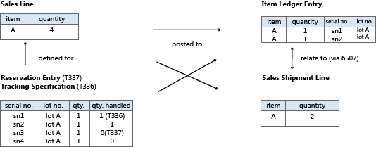

# Designdetaljer: Varesporingsutforming
I den første versjonen av varesporing i [!INCLUDE[d365fin](includes/d365fin_md.md)] 2.60 ble serie- eller partinumre registrert direkte på vareposter. Denne utformingen ga fullstendig tilgjengelighetsinformasjon og enkel sporing av historiske poster, men den manglet fleksibilitet og funksjonalitet.  

Fra [!INCLUDE[d365fin](includes/d365fin_md.md)] 3.00 var varesporingsfunksjonaliteten i en separat objektstruktur med kompliserte koblinger til bokførtedokumenter og vareposter. Denne utformingen var fleksibel og hadde mange funksjoner, men varesporingsposter ble ikke fullstendig tatt med i tilgjengelighetsberegninger.  

Varesporingsfunksjonalitet har siden [!INCLUDE[d365fin](includes/d365fin_md.md)] 3.60 vært integrert med reservasjonssystemet, som håndterer reservasjon, sporing og handlingsmeldinger. Hvis du vil ha mer informasjon, kan du se Designdetaljer: Reservasjon, ordresporing og handlingsmeldinger i Designdetaljer: Forsyningsplanlegging.  

Denne nyeste utformingen omfatter varesporingsposter i samlede tilgjengelighetsberegninger i hele systemet, inkludert planlegging, produksjon og lager. Det gamle konseptet der du har serie- og partinumre i vareposter, gjeninnføres for å sikre enkel tilgang til historiske data for varesporingsformål. I forbindelse med varesporingsforbedringer i [!INCLUDE[d365fin](includes/d365fin_md.md)] 3.60 ble reservasjonssystemet utvidet til ikke-ordrenettverksenheter, for eksempel kladder, fakturaer og kreditnotaer.  

Med tilføyelsen av serie- eller partinumre håndterer reservasjonssystemet permanente vareattributter samtidig som det håndterer uregelmessige koblinger mellom forsyning og behov i form av sporingsposter og reservasjonsposter. Et annet ulikt kjennetegn på serie- eller partinumre sammenlignet med vanlige reservasjonsdata, er at de kan bokføres delvis eller fullstendig. **Reservasjonspost**-tabellen (T337) fungerer derfor nå med den tilknyttede **Sporingsspesifikasjon**-tabellen (T336), som behandler og viser summering på tvers av aktive og bokførte varesporingsantall. Hvis du vil ha mer informasjon, se [Designdetaljer: Aktive kontra historiske varesporingsposter](design-details-active-versus-historic-item-tracking-entries.md).  

Diagrammet nedenfor gir en oversikt over utformingen av varesporingsfunksjonaliteten i [!INCLUDE[d365fin](includes/d365fin_md.md)].  

  

Hovedbokføringsobjektet er omformet slik at det kan håndtere den unike underklassifiseringen av en dokumentlinje i form av serie- eller partinumre, og spesielle relasjonstabeller er lagt til for å opprette én-til-mange-relasjoner mellom bokførte dokumenter og de delte varepostene og verdipostene.  

Kodeenhet 22, **Varekld. – Posteringslinje**, deler nå posteringen i henhold til varesporingsnumrene som er angitt på dokumentlinjen. Hvert unike varesporingsnummer på linjen, oppretter sin egen varepost for varen. Dette betyr at koblingen fra den bokførte dokumentlinjen til de tilknyttede varepostene nå er en én-til-mange-relasjon. Denne relasjonen håndteres av følgende relasjonstabeller for varesporing.  

|Felt|Beskrivelse|  
|---------------|---------------------------------------|  
|**Vareposttilknytning** (T6507)|Knytter leverte eller mottatte linjer til vareposter|  
|**Verdiposttilknytning** (T6508)|Knytter fakturerte linjer til verdiposter|  

Hvis du vil ha mer informasjon, kan du se [Designdetaljer: Bokføringsstruktur for varesporing](design-details-item-tracking-posting-structure.md).  

## Se også  
[Designdetaljer: Varesporing](design-details-item-tracking.md)

