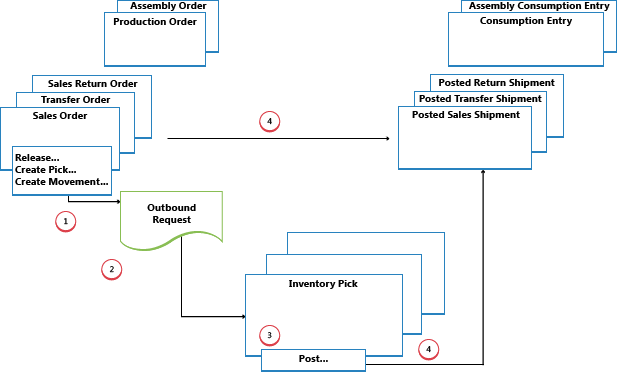
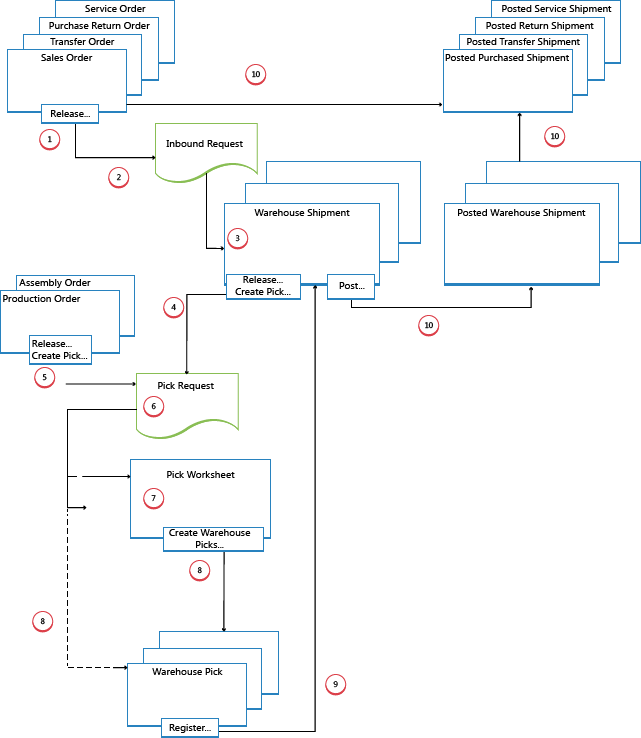

# Designdetaljer: Utgående lagerflyt
Den utgående flyten på lageret begynner med en forespørsel fra frigitte kildedokumenter om å sende varene ut av lagerlokasjonen, for å leveres til en ekstern part eller en annen selskapslokasjon. Fra lagringsområdet utførers lageraktiviteter på ulike kompleksitetsnivåer for å hente varer ut til leveringsområdene.  

 Hvert element identifiseres og samsvares med en tilsvarende inngående kildedokument. Følgende utgående kildedokumenter finnes:  

- Ordre  
- Utgående overføringsordre  
- Bestillingsretur  
- Serviceordre  

I tillegg finnes følgende interne kildedokumenter som fungerer som utgående kilder:  

- Produksjonsordre med komponentbehov  
- Monteringsordre med komponentbehov  

 De to siste dokumentene representerer utgående flyter fra lageret til interne operasjonsområder. Hvis du vil ha mer informasjon om lagerhåndtering for interne innkommende og utgående prosesser, kan du se
[Designdetaljer: Interne lagerflyter](design-details-internal-warehouse-flows.md).  

 Prosesser og dokumenter for brukergrensesnitt i utgående lagerflyter er forskjellige for grunnleggende og avanserte lagerkonfigurasjoner. Hovedforskjellen er at aktiviteter utføres ordre for ordre i grunnleggende lagerkonfigurasjoner, og de konsolideres for flere ordrer i avanserte lagerkonfigurasjoner. Hvis du vil ha mer informasjon om ulike kompleksitetsnivåer for lageret, kan du se [Designdetaljer: Lageroversikt](design-details-warehouse-setup.md).  

 I [!INCLUDE[d365fin](includes/d365fin_md.md)] kan de utgående prosessene for plukking og levering utføres på fire måter ved hjelp av forskjellige funksjoner, avhengig av kompleksitetsnivået til lageret.  

|Metode|Inngående prosess|Hyller|Plukking|Følgesedler|Kompleksitetsnivå (se [Designdetaljer: Lageroppsett](design-details-warehouse-setup.md))|  
|------------|---------------------|----------|-----------|---------------|--------------------------------------------------------------------------------------------------------------------|  
|A|Bokføre plukking og levering fra ordrelinjen|X|||2|  
|B|Bokføre plukking og levering fra et lagerplukkdokument||X||3|  
|L|Bokføre plukking og levering fra en lagerfølgeseddel|||X|4/5/6|  
|D|Bokføre plukking fra et lagerplukkdokument og bokføre leveringen fra en lagerfølgeseddel||X|X|4/5/6|  

 Hvis du vil ha mer informasjon, kan du se [Designdetaljer: Utgående lagerflyt]().  

 Hvilken metode som er aktuell å velge, avhenger av selskapets vanlige praksis og organisasjonens kompleksitetsnivå. I et ordre for ordre-miljø med enkle prosesser og enkel hyllestruktur, er metode A riktig, plukk og forsendelse fra ordrelinjen. I andre ordre for ordre-selskaper, der varene for én ordrelinje kan komme fra flere enn én hylle, eller der lagerarbeidere ikke kan arbeide med ordredokumenter, passer det å bruke separate plukkdokumenter (metode B). Når selskapets plukk og levering omfatter håndtering av flere ordre, og derfor krever større kontroll og oversikt, kan selskapet velge å bruke et lagerleveringsdokument og plukkdokument for å skille plukk- og leveringsoppgaver (metode C og D).  

 I metode A, B og C kombineres plukk- og leveringshandlingen i ett trinn når tilsvarende dokument bokføres som levert. I metode D blir plukk først registrert, og deretter bokføres leveringen på et senere tidspunkt fra et annet dokument.  

## Enkle lageroppsett  
 Diagrammet nedenfor illustrerer utgående lagerflyter etter dokumenttype i grunnleggende lagerkonfigurasjoner. Tallene i diagrammet svarer til trinnene nedenfor diagrammet.  

   

### 1: Frigi kildedokumentet / opprette lagerplukk eller flytting  
 Når en bruker som er ansvarlig for kildedokumenter, for eksempel en ordrebehandler eller produksjonsplanlegger, er klar for den utgående lageraktiviteten, frigir vedkommende kildedokumentet for å signalisere til lagermedarbeidere at solgte varer eller komponenter kan plukkes og plasseres i de angitte hyllene. Brukeren kan eventuelt også opprette lagerplukk- eller flyttedokumenter for de enkelte ordrelinjene, på en push-måte, basert på angitte hyller og antall som skal håndteres.  

> [!NOTE]  
>  Lagerflytting brukes til å flytte varer til interne operasjonsområder i grunnleggende lagerkonfigurasjoner, basert på kildedokumenter eller ad hoc.  

### 2: Opprett utgående forespørsel  
 Når det utgående kildedokumentet frigis, opprettes en utgående lagerforespørsel automatisk. Den inneholder referanser til kildedokumenttype og /nummer, og er ikke synlige for brukeren.  

### 3: Opprett lagerplukk eller flytting  
 I vinduet **Lagerplukk** eller **Lagerflytting** henter brukeren som er ansvarlig, de ventende kildedokumentlinjene basert på utgående lagerforespørsler. Det kan også hende at lagerplukklinjene allerede er opprettet med en push-metode, av brukeren som er ansvarlig for kildedokumentet.  

### 4: Bokfør lagerplukk eller registrer lagerflytting  
 På hver linje for varer som er plukket eller flyttet, helt eller delvis, fyller lagermedarbeider ut feltet **Antall** og bokfører deretter lagerplukket eller registrerer lagerflyttingen. Kildedokumenter som er knyttet til lagerplukkingen, bokføres som levert eller forbrukt. Kildedokumenter som er knyttet til lagerflyttinger, bokføres ikke.  

 For vareplukk blir det opprettet negative vareposter og lagerposter, og plukkforespørselen slettes hvis ferdigbehandlet. Eksempel: Feltet **Levert (antall)** i den utgående kildedokumentlinjen oppdateres. Det opprettes et postert leveringsdokument som for eksempel gjenspeiler ordren og de leverte varene.  

## avanserte lageroppsett  
 Diagrammet nedenfor illustrerer utgående lagerflyter etter dokumenttype i avanserte lagerkonfigurasjoner. Tallene i diagrammet svarer til trinnene nedenfor diagrammet.  

   

### 1: Frigi kildedokument  
 Når en bruker som er ansvarlig for kildedokumenter, for eksempel en ordrebehandler eller produksjonsplanlegger, er klar for den utgående lageraktiviteten, frigir vedkommende kildedokumentet for å signalisere til lagermedarbeidere at solgte varer eller komponenter kan plukkes og plasseres i de angitte hyllene.  

### 2: Opprett utgående forespørsel  
 Når det inngående kildedokumentet frigis, opprettes en utgående lagerforespørsel automatisk. Den inneholder referanser til kildedokumenttype og /nummer, og er ikke synlige for brukeren.  

### 3: Opprett lagerlevering  
 I vinduet **Lagerlevering** henter brukeren som er ansvarlig, de ventende kildedokumentlinjene basert på utgående lagerforespørsel. Flere kildedokumentlinjer kan kombineres i ett lagerleveringsdokument.  

### 4: Frigi levering / Opprett lagerplukk  
 Vedkommende som er ansvarlig, frigir lagerleveringen, slik at lagermedarbeidere kan opprette eller koordinere lagerplukkinger for den aktuelle leveringen.  

 Brukeren kan også opprette lagerplukkdokument for enkelte leveringslinjer med en push-metode, basert på angitte hyller og antall som skal håndteres.  

### 5: Frigi intern operasjon / opprett lagerplukk  
 Brukeren som er ansvarlig for interne operasjoner, frigir et internt kildedokument, for eksempel en produksjons- og monteringsordre, slik at lagermedarbeidere kan opprette eller koordinere plukkinger for den aktuelle interne operasjonen.  

 Brukeren kan også opprette lagerplukkdokumenter for enkelte produksjons- eller monteringsordre med en push-metode, basert på angitte hyller og antall som skal håndteres.  

### 6: Opprett plukkforespørsel  
 Når det utgående kildedokumentet frigis, opprettes en lagerplukkforespørsel automatisk. Den inneholder referanser til kildedokumenttype og /nummer, og er ikke synlige for brukeren. Avhengig av oppsettet vil forbruk fra en produksjons- og monteringsordre også opprette en plukkforespørsel om å plukke nødvendige komponenter fra lageret.  

### 7: Generer plukkforslagslinjer  
 Brukeren som er ansvarlig for å koordinere plukking, henter plukklinjer i **Plukkforslag** basert på plukkforespørsler fra lagerleveringer eller interne operasjoner med komponentforbruk. Brukeren velger linjene som skal plukkes, og klargjør plukkingene ved å angi hvilke hyller det skal tas fra, hvilke det skal plasseres i, og hvor mange enheter som skal håndteres. Hyllene kan være forhåndsdefinert av definisjonen av lagerlokasjonen eller operasjonsressursen.  

 Brukeren angir plukkmetoder for optimalisert lagerhåndtering og bruker deretter en funksjon for å opprette de tilsvarende lagerplukkdokumentene, som tilordnes til ulike lagermedarbeidere som utfører plukkingene. Når lagerplukkingene er fullstendig tilordnet, slettes linjene i **Plukkforslag**.  

### 8: Opprett lagerplukkdokumenter  
 Lagermedarbeideren som foretar plukkingen, oppretter et lagerplukkdokument på en hentemåte, basert på det frigitte kildedokumentet. Lagerplukkdokumentet kan også opprettes og tilordnes lagermedarbeidere med en push-metode.  

### 9: Registrer plukk  
 På hver linje for varer som er plukket, helt eller delvis, fyller lagermedarbeider ut feltet **Antall** i vinduet **Plukk**, og registrerer deretter lagerplukket.  

 Lagerposter opprettes, og lagerplukklinjene slettes hvis de er helt ferdigbehandlet. Lagerplukkdokumentet holdes åpent til hele antallet for den tilknyttede lagerleveringen er registrert. Feltet **Plukket ant.** på lagerleveringslinjene oppdateres tilsvarende.  

### 10: Bokfør lagerlevering  
 Når alle varene i lagerleveringsdokumentet er registrert som plukket i de angitte leveringshyllene, bokfører den ansvarlige lagerleveringen. Det blir opprettet negative vareposter. Eksempel: Feltet **Levert (antall)** i den utgående kildedokumentlinjen oppdateres.  

## Se også  
 [Designdetaljer: Lagerstyring](design-details-warehouse-management.md)

