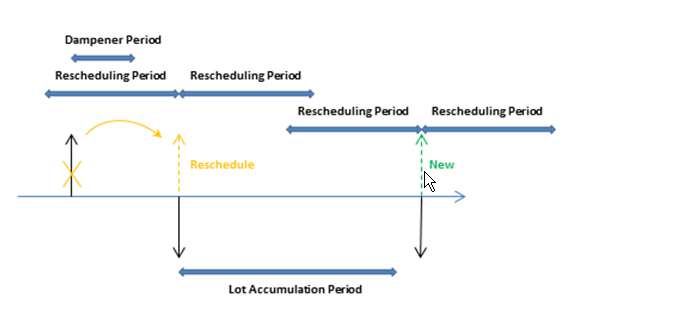

# Designdetaljer: Planleggingsparametere
Dette emnet beskriver de ulike planleggingsparameterne du kan bruke i [!INCLUDE[d365fin](includes/d365fin_md.md)].  

Måten planleggingssystemet kontrollerer vareforsyning på, fastsettes av ulike innstillinger på varekortet eller LFEen og innstillinger i produksjonsoppsettet. Tabellen nedenfor viser hvordan disse parameterne brukes til planlegging.  

|Formål|Parameter|  
|-------------|---------------|  
|Angi om varen skal planlegges|Gjenbestillingsprinsipp = Tom|  
|Angi når det skal gjenbestilles|Tidsperiode   Gjenbestillingspunkt   Sikkerhetsleveringstid|  
|Angi hvor mye som skal gjenbestilles|Sikkerhetslagerantall   Gjenbestillingsprinsipp:   -   Fast gjenbest.ant pluss Gjenbestillingsantall -   Maks.ant. pluss Maks. beholdning -   Bestilling -   Parti for parti|  
|Optimalisere når og hvor mye som skal gjenbestilles|Periode for ny planlegging   Akkumuleringsperiode for parti   Avdempingsperiode|  
|Endre forsyningsordrene|Min. bestillingsantall   Maks. bestillingsantall   Bestillingsfaktor|  
|Avgrense den planlagte varen|Produksjonsprinsipp:   -   Produser-til-lager -   Produser-til-ordre|  

## Angi om varen vil bli planlagt  
Hvis du vil ta med en vare/LFE i planleggingsprosessen, må den ha et gjenbestillingsprinsipp, ellers må den planlegges manuelt, for eksempel med ordreplanleggingsfunksjonen.  

## Angi når det skal gjenbestilles  
Generelt frigis gjenbestillingsforslag bare når forventet disponibelt antall er på eller under et gitt antall. Dette antallet defineres av gjenbestillingspunktet. Hvis ikke, vil den være null. Null kan justeres ved å skrive inn et sikkerhetslagerantall. Hvis brukeren har angitt en sikkerhetsleveringstid, vil dette ført til at forslaget leveres i perioden før den nødvendige forfallsdatoen.  

**Time Bucket**-feltet brukes av prinsipper for gjenbestillingspunkt (**Fast gjenbest.ant.** og **Maks.ant.**), der lagernivået kontrolleres etter hver tidsperiode. Den første tidsperioden begynner på den planlagte startdatoen.  

> [!NOTE]  
>  Ved beregning av tidstidsperioder ignorerer planleggingssystemet arbeidskalendere som er definert i feltet **Hovedkalenderkode** i vinduene **Selskapsopplysninger** og **Lokasjonskort**.  

Minst én dag må angis for standard sikkerhetstid i **Produksjonsoppsett**-vinduet. Forfallsdatoen for behovet kan være kjent, men ikke forfallstidspunktet. Planleggingen foretas bakover for å dekke bruttobehov, og varene kan komme for sent til å dekke behovet hvis ingen sikkerhetsleveringstid defineres.  

Tre andre felt for gjenbestillingsperiode, **Periode for ny planlegging**, **Akkumuleringsperiode for parti** og **Avdempingsperiode**, spiller også en rolle når det gjelder tidspunktet for gjenbestillingen. Hvis du vil ha mer informasjon, kan du se delen "Optimalisere når og hvor mye som skal gjenbestilles".  

## Angi hvor mye som skal gjenbestilles  
Hvis planleggingssystemet oppdager behov for å gjenbestille, vil det valgte gjenbestillingsprinsippet bli brukt til å fastslå når og hvor mye som skal bestilles.  

Planleggingssystemet følger vanligvis denne logikken, uavhengig av gjenbestillingsprinsippet:  

1. Antall på bestillingsforslaget beregnes slik at det dekker det angitte minimumslagernivået for varen, vanligvis sikkerhetslagerantallet. Hvis ingenting er angitt, er minimumslagernivået null.  
2. Hvis den forventede disponible beholdningen er under sikkerhetslagerantallet, foreslås det en bakoverplanlagt forsyningsordre. Ordreantallet fyller minst sikkerhetslagerantallet og kan økes av bruttobehov i tidsperioden, av gjenbestillingsprinsippet og av ordremodifikatorene.  
3. Hvis forventet beholdning er på eller under gjenbestillingspunktet (beregnet fra aggregert endringer i tidsperioden) og over sikkerhetslagerantallet, foreslås det en foroverplanlagt unntaksordre. Både bruttobehov som skal oppfylles og gjenbestillingsprinsippet avgjør ordreantallet. Som et minimum må ordreantallet dekke gjenbestillingspunktet.  
4. Hvis det er forfaller mer behov før sluttdatoen for det foroverplanlagte ordreforslaget, og dette behovet bringer gjeldende beregnede disponibel beholdning under sikkerhetslagerantallet, økes ordreantallet for å oppveie underskuddet. Den foreslåtte forsyningsordren planlegges deretter bakover fra forfallsdatoen for bruttobehovet som hadde ført til for lavt sikkerhetslagerantall.  
5. Hvis feltet **Tidsperiode** ikke fylles ut, vil bare bruttobehovet på samme forfallsdato dato bli lagt til.  

     Følgende felt for gjenbestillingsperiode spiller også en rolle når det gjelder hvor mye som skal gjenbestilles: **Periode for ny planlegging**, **Akkumuleringsperiode for parti** og **Avdempingsperiode**. Hvis du vil ha mer informasjon, kan du se delen "Optimalisere når og hvor mye som skal gjenbestilles".  

### Gjenbestillingsprinsipper  
Følgende gjenbestillingsprinsipper påvirker antallet som skal gjenbestilles.  

|Gjenbestillingsprinsipp|Beskrivelse|  
|-----------------------|---------------------------------------|  
|**Fast gjenbest.ant.**|Som et minimum vil ordreantallet være lik gjenbestillingsantall. Dette kan økes for å dekke behovet eller ønsket beholdningsnivå. Dette gjenbestillingsprinsippet brukes vanligvis med et gjenbestillingspunkt.|  
|**Maks.ant.**|Ordreantallet blir beregnet slik at det svarer til maksimumsbeholdningen. Hvis det brukes antallmodifikatorer, kan maksimumsbeholdningen overskrides. Vi anbefaler ikke at du bruker tidsperioden sammen med maksimumsantallet. Tidsperiode blir vanligvis overstyrt. Dette gjenbestillingsprinsippet brukes vanligvis med et gjenbestillingspunkt.|  
|**Bestilling**|Ordreantallet beregnes for å dekke hver enkelt behovshendelse, og settet med behov/forsyning forblir koblet frem til utførelse. Det tas ikke hensyn til planleggingsparametre.|  
|**Parti for parti**|Antallet beregnes for å dekke summen av behovet som forfaller i tidsperioden.|  

##  Optimalisere når og hvor mye som skal gjenbestilles  
For å få en rasjonell forsyningsplan finjusterer en planlegger planleggingsparametere for å begrense forslag til ny planlegging, akkumulere behov (dynamisk gjenbestillingsantall), eller for å unngå ubetydelige planleggingshandlinger. Følgende felt for gjenbestillingsperiode gjør det enklere å optimalisere når og hvor mye du må gjenbestille.  

|Felt|Beskrivelse|  
|---------------------------------|---------------------------------------|  
|**Periode for ny planlegging**|Dette feltet brukes til å avgjøre om handlingsmeldingen skal tidsplanlegge en eksisterende bestilling på nytt, eller kansellere den og opprette en ny bestilling. Den eksisterende ordren tidsplanlegges på nytt innen én periode for ny planlegging før den aktuelle forsyningen frem til én periode for ny planlegging etter den aktuelle forsyningen.|  
|**Akkumuleringsperiode for parti**|Dette feltet brukes med gjenbestillingsprinsippet Parti for parti til å samle flere forsyningsbehov i én forsyningsordre. Systemet samler alle forsyningsbehov fra første planlagte forsyning i følgende akkumuleringsperiode for parti i én forsyningsordre som plasseres på datoen for første forsyning. Behov utenfor akkumuleringsperioden for partiet dekkes ikke av denne forsyningen.|  
|**Avdempingsperiode**|Dette feltet brukes til å unngå mindre ny planlegging av eksisterende forsyningsordrer på et senere tidspunkt. Endringer fra forsyningsdatoen til én avdempingsperiode fra forsyningsdatoen, vil ikke generere handlingsmeldinger.   Derfor vil en positiv delta mellom den foreslåtte nye forsyningsdatoen og den opprinnelige forsyningsdatoen, alltid være større enn avdempingsperioden.|  

Tidsberegningen av periode for ny planlegging, avdempingsperiode og akkumuleringsperiode for parti er basert på en forsyningsdato. Tidsperioden er basert på den planlagte startdatoen, som vist i illustrasjonen nedenfor.  

  

I eksemplene nedenfor representerer svarte piler eksisterende forsyning (opp) og behov (ned). Røde, grønne og oransje piler er planleggingsforslag.  

**Eksempel 1**: Den endrede datoen er utenfor perioden for ny planlegging, noe som fører til at eksisterende forsyning avbrytes. En ny forsyning blir foreslått for å dekke behovet i akkumuleringsperioden for partiet.  

  

**Eksempel 2**: Den endrede datoen er i perioden for ny planlegging, noe som fører til at eksisterende forsyning planlegges på nytt. En ny forsyning blir foreslått for å dekke behovet utenfor akkumuleringsperioden for partiet.  

  

**Eksempel 3**: Det er et behov i avdempingsperioden, og forsyningsantallet i akkumuleringsperioden for parti samsvarer med forsyningsantallet. Det neste behovet er ikke dekket, og en ny forsyning foreslås.  

  

**Eksempel 4**: Det er et behov i avdempingsperioden, og forsyningen forblir på samme dato. Gjeldende forsyningsantall er imidlertid ikke nok til å dekke behovet i akkumuleringsperioden for partiet, slik at det foreslås en handling for antallsendring for den eksisterende forsyningsordren.  

  

**Standardverdier:** Standardverdien for feltet **Tidsperiode** og de tre feltene for gjenbestillingsperiode er tomme. For alle felt, bortsett fra feltet **Avdempingsperiode**, betyr dette 0D (null dager). Hvis **Avdempingsperiode**-feltet er tomt, brukes den globale verdien i feltet **Standard avdempingsperiode** i vinduet **Produksjonsoppsett**.  

## Endre forsyningsordrene  
Når antallet på bestillingsforslaget er beregnet, kan én eller flere av ordremodifikatorene justere det. Maksimumsordreantallet er for eksempel større enn eller lik minimumsordreantallet, som er større enn eller lik bestillingsfaktoren.  

Antallet reduseres hvis det overskrider maksimumsordreantallet. Deretter økes det hvis det er under minimumsordreantallet. Til slutt rundes dette opp slik at det samsvarer med en angitt bestillingsfaktor. Restantall bruker de samme justeringene før det totale behovet er blitt konvertert til ordreforslag.  

## Avgrense varen  
Alternativet **Produksjonsprinsipp** angir hvilke ytterligere ordrer MRP-beregningen kommer til å foreslå.  

Hvis alternativet **Produser til lager** brukes, vil ordrene bare gjelde den aktuelle varen.  

Hvis alternativet **Produser til ordre** brukes, vil g planleggingssystemet analysere produksjonsstykklisten for varen og opprette flere koblede ordreforslag for disse varene på lavere nivå, som også er angitt som Produser til ordre. Dette fortsetter så lenge det finnes produser-til-ordre-varer i de synkende stykklistestrukturene.  

## Se også  
[Designdetaljer: Håndtere gjenbestillingsprinsipper](design-details-handling-reordering-policies.md)   
[Designdetaljer: Balansere behov og forsyning](design-details-balancing-demand-and-supply.md)   
[Designdetaljer: Sentrale begreper for planleggingssystemet](design-details-central-concepts-of-the-planning-system.md)

