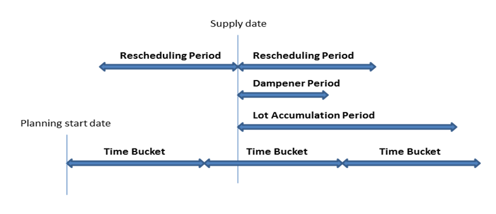
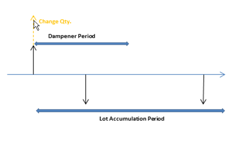

# Designdetaljer: PlanleggingsparametereDesign Details: Planning Parameters
Dette emnet beskriver de ulike planleggingsparameterne du kan bruke i [!INCLUDE[d365fin](includes/d365fin_md.md)].This topic describes the different planning parameters that you can use in [!INCLUDE[d365fin](includes/d365fin_md.md)].  

Måten planleggingssystemet kontrollerer vareforsyning på, fastsettes av ulike innstillinger på varekortet eller LFEen og innstillinger i produksjonsoppsettet.The way in which the planning system controls item supply is determined by various settings on the item card or SKU, and settings in manufacturing setup. Tabellen nedenfor viser hvordan disse parameterne brukes til planlegging.The following table shows how these parameters are used for planning.  

|FormålPurpose|ParameterParameter|  
|-------------|---------------|  
|Angi om varen skal planleggesDefine if the item is to be planned|Gjenbestillingsprinsipp = TomReordering Policy = Blank|  
|Angi når det skal gjenbestillesDefine when to reorder|TidsperiodeTime Bucket   GjenbestillingspunktReorder Point   SikkerhetsleveringstidSafety Lead Time|  
|Angi hvor mye som skal gjenbestillesDefine how much to reorder|SikkerhetslagerantallSafety Stock Quantity   Gjenbestillingsprinsipp:Reordering Policy:   -   Fast gjenbest.ant pluss Gjenbestillingsantall-   Fixed Reorder Qty. plus Reorder Quantity -   Maks.ant. pluss Maks. beholdning-   Maximum Qty. plus Maximum Inventory -   Bestilling-   Order -   Parti for parti-   Lot-for-Lot|  
|Optimalisere når og hvor mye som skal gjenbestillesOptimize when and how much to reorder|Periode for ny planleggingRescheduling Period   Akkumuleringsperiode for partiLot Accumulation Period   AvdempingsperiodeDampener Period|  
|Endre forsyningsordreneModify the supply orders|Min. bestillingsantallMinimum Order Quantity   Maks. bestillingsantallMaximum Order Quantity   BestillingsfaktorOrder Multiple|  
|Avgrense den planlagte varenDelimit the planned item|Produksjonsprinsipp:Manufacturing Policy:   -   Produser-til-lager-   Make-to-Stock -   Produser-til-ordre-   Make-to-Order|  

## Angi om varen vil bli planlagtDefine If the Item Will Be Planned  
Hvis du vil ta med en vare/LFE i planleggingsprosessen, må den ha et gjenbestillingsprinsipp, ellers må den planlegges manuelt, for eksempel med ordreplanleggingsfunksjonen.To include an item/SKU in the planning process, it must have a reordering policy otherwise it must be planned manually, for example, with the Order Planning feature.  

## Angi når det skal gjenbestillesDefine When to Reorder  
Generelt frigis gjenbestillingsforslag bare når forventet disponibelt antall er på eller under et gitt antall.Reorder proposals are generally released only when the projected available quantity has fallen to or below a given quantity. Dette antallet defineres av gjenbestillingspunktet.This quantity is defined by the reorder point. Hvis ikke, vil den være null.Otherwise, it will be zero. Null kan justeres ved å skrive inn et sikkerhetslagerantall.Zero can be adjusted by entering a safety stock quantity. Hvis brukeren har angitt en sikkerhetsleveringstid, vil dette ført til at forslaget leveres i perioden før den nødvendige forfallsdatoen.If the user has defined a safety lead time, it will cause the proposal to be delivered in the period prior to the required due date.  

**Time Bucket**-feltet brukes av prinsipper for gjenbestillingspunkt (**Fast gjenbest.ant.** og **Maks.ant.**), der lagernivået kontrolleres etter hver tidsperiode.The **Time Bucket** field is used by reorder point policies (**Fixed Reorder Qty.** and **Maximum Qty.**), where the inventory level is checked after each time bucket. Den første tidsperioden begynner på den planlagte startdatoen.The first time bucket begins on the planning starting date.  

> [!NOTE]  
>  Ved beregning av tidstidsperioder ignorerer planleggingssystemet arbeidskalendere som er definert i feltet **Hovedkalenderkode** i vinduene **Selskapsopplysninger** og **Lokasjonskort**.When calculating time buckets, the planning system ignores any working calendars that are defined in the **Base Calendar Code** field in the **Company Information** and **Location Card** windows.  

Minst én dag må angis for standard sikkerhetstid i **Produksjonsoppsett**-vinduet.The default safety lead time, in the **Manufacturing Setup** window, should be set to at least one day. Forfallsdatoen for behovet kan være kjent, men ikke forfallstidspunktet.The due date of the demand may be known, but not the due time. Planleggingen foretas bakover for å dekke bruttobehov, og varene kan komme for sent til å dekke behovet hvis ingen sikkerhetsleveringstid defineres.The planning schedules backward to meet gross demand, and, if no safety lead time is defined, the goods may arrive too late to meet the demand.  

Tre andre felt for gjenbestillingsperiode, **Periode for ny planlegging**, **Akkumuleringsperiode for parti** og **Avdempingsperiode**, spiller også en rolle når det gjelder tidspunktet for gjenbestillingen.Three additional reorder period fields, **Rescheduling Period**, **Lot Accumulation Period**, and **Dampener Period**, also play a role in defining when to reorder. Hvis du vil ha mer informasjon, kan du se delen "Optimalisere når og hvor mye som skal gjenbestilles".For more information, see the "Optimize When and How Much to Reorder" section.  

## Angi hvor mye som skal gjenbestillesDefine How Much to Reorder  
Hvis planleggingssystemet oppdager behov for å gjenbestille, vil det valgte gjenbestillingsprinsippet bli brukt til å fastslå når og hvor mye som skal bestilles.If the planning system detects the need to reorder, the selected reordering policy is used to determine when and how much to order.  

Planleggingssystemet følger vanligvis denne logikken, uavhengig av gjenbestillingsprinsippet:Independent of the reordering policy, the planning system usually follows this logic:  

1. Antall på bestillingsforslaget beregnes slik at det dekker det angitte minimumslagernivået for varen, vanligvis sikkerhetslagerantallet.The quantity of the order proposal is calculated to meet the specified minimum inventory level of the item, usually the safety stock quantity. Hvis ingenting er angitt, er minimumslagernivået null.If nothing is specified, the minimum inventory level is zero.  
2. Hvis den forventede disponible beholdningen er under sikkerhetslagerantallet, foreslås det en bakoverplanlagt forsyningsordre.If the projected available inventory is below the safety stock quantity, a backward-scheduled supply order is suggested. Ordreantallet fyller minst sikkerhetslagerantallet og kan økes av bruttobehov i tidsperioden, av gjenbestillingsprinsippet og av ordremodifikatorene.The order quantity will at least fill the safety stock quantity, and can be increased by gross demand within the time bucket, by the reordering policy, and by the order modifiers.  
3. Hvis forventet beholdning er på eller under gjenbestillingspunktet (beregnet fra aggregert endringer i tidsperioden) og over sikkerhetslagerantallet, foreslås det en foroverplanlagt unntaksordre.If the projected inventory is on or below the reorder point (calculated from aggregated changes within the time bucket) and above the safety stock quantity, a forward-scheduled exception order is suggested. Både bruttobehov som skal oppfylles og gjenbestillingsprinsippet avgjør ordreantallet.Both the gross demand to be met and the reordering policy will determine the order quantity. Som et minimum må ordreantallet dekke gjenbestillingspunktet.At minimum, the order quantity will meet the reorder point.  
4. Hvis det er forfaller mer behov før sluttdatoen for det foroverplanlagte ordreforslaget, og dette behovet bringer gjeldende beregnede disponibel beholdning under sikkerhetslagerantallet, økes ordreantallet for å oppveie underskuddet.If there is more gross demand due before the ending date of the forward-scheduled order proposal, and this demand brings the currently calculated projected available inventory below the safety stock quantity, the order quantity is increased to make up the deficit. Den foreslåtte forsyningsordren planlegges deretter bakover fra forfallsdatoen for bruttobehovet som hadde ført til for lavt sikkerhetslagerantall.The suggested supply order is then scheduled backward from the due date of the gross demand that would have violated the safety stock quantity.  
5. Hvis feltet **Tidsperiode** ikke fylles ut, vil bare bruttobehovet på samme forfallsdato dato bli lagt til.If the **Time Bucket** field is not filled in, only the gross demand on the same due date will be added.  

     Følgende felt for gjenbestillingsperiode spiller også en rolle når det gjelder hvor mye som skal gjenbestilles: **Periode for ny planlegging**, **Akkumuleringsperiode for parti** og **Avdempingsperiode**.The following reorder period fields also play a role in defining how much to reorder: **Rescheduling Period**, **Lot Accumulation Period**, and **Dampener Period**. Hvis du vil ha mer informasjon, kan du se delen "Optimalisere når og hvor mye som skal gjenbestilles".For more information, see the "Optimize When and How Much to Reorder" section.  

### GjenbestillingsprinsipperReordering Policies  
Følgende gjenbestillingsprinsipper påvirker antallet som skal gjenbestilles.The following reordering policies affect the quantity that is being reordered.  

|GjenbestillingsprinsippReordering policy|BeskrivelseDescription|  
|-----------------------|---------------------------------------|  
|**Fast gjenbest.ant.****Fixed Reorder Qty.**|Som et minimum vil ordreantallet være lik gjenbestillingsantall.At a minimum, the order quantity will be equal to the reorder quantity. Dette kan økes for å dekke behovet eller ønsket beholdningsnivå.It can be increased to meet the demand or the desired inventory level. Dette gjenbestillingsprinsippet brukes vanligvis med et gjenbestillingspunkt.This reordering policy is usually used with a reorder point.|  
|**Maks.ant.****Maximum Qty.**|Ordreantallet blir beregnet slik at det svarer til maksimumsbeholdningen.The order quantity will be calculated to meet the maximum inventory. Hvis det brukes antallmodifikatorer, kan maksimumsbeholdningen overskrides.If quantity modifiers are used, then maximum inventory can be violated. Vi anbefaler ikke at du bruker tidsperioden sammen med maksimumsantallet.We do not recommend that you use the time bucket together with maximum quantity. Tidsperiode blir vanligvis overstyrt.The time bucket will usually be overruled. Dette gjenbestillingsprinsippet brukes vanligvis med et gjenbestillingspunkt.This reordering policy is usually used with a reorder point.|  
|**Bestilling****Order**|Ordreantallet beregnes for å dekke hver enkelt behovshendelse, og settet med behov/forsyning forblir koblet frem til utførelse.The order quantity will be calculated to meet each single demand event and the demand-supply set will remain linked until execution. Det tas ikke hensyn til planleggingsparametre.No planning parameters are considered.|  
|**Parti for parti****Lot-for-Lot**|Antallet beregnes for å dekke summen av behovet som forfaller i tidsperioden.The quantity is calculated to meet the sum of the demand that comes due in the time bucket.|  

##  Optimalisere når og hvor mye som skal gjenbestillesOptimize When and How Much to Reorder  
For å få en rasjonell forsyningsplan finjusterer en planlegger planleggingsparametere for å begrense forslag til ny planlegging, akkumulere behov (dynamisk gjenbestillingsantall), eller for å unngå ubetydelige planleggingshandlinger.To obtain a rational supply plan, a planner will fine-tune planning parameters to limit rescheduling suggestions, accumulate demand (dynamic reorder quantity), or to avoid insignificant planning actions. Følgende felt for gjenbestillingsperiode gjør det enklere å optimalisere når og hvor mye du må gjenbestille.The following reorder period fields help optimize when and how much to reorder.  

|FeltField|BeskrivelseDescription|  
|---------------------------------|---------------------------------------|  
|**Periode for ny planlegging****Rescheduling Period**|Dette feltet brukes til å avgjøre om handlingsmeldingen skal tidsplanlegge en eksisterende bestilling på nytt, eller kansellere den og opprette en ny bestilling.This field is used to determine whether the action message should reschedule an existing order or cancel it and create a new order. Den eksisterende ordren tidsplanlegges på nytt innen én periode for ny planlegging før den aktuelle forsyningen frem til én periode for ny planlegging etter den aktuelle forsyningen.The existing order will be rescheduled within one rescheduling period before the current supply and until one rescheduling period after the current supply.|  
|**Akkumuleringsperiode for parti****Lot Accumulation Period**|Dette feltet brukes med gjenbestillingsprinsippet Parti for parti til å samle flere forsyningsbehov i én forsyningsordre.With reordering policy Lot-for-Lot, this field is used to accumulate multiple supply needs into one supply order. Systemet samler alle forsyningsbehov fra første planlagte forsyning i følgende akkumuleringsperiode for parti i én forsyningsordre som plasseres på datoen for første forsyning.From the first planned supply, the system accumulates all supply needs in the following lot accumulation period into one supply, which is placed on the date of the first supply. Behov utenfor akkumuleringsperioden for partiet dekkes ikke av denne forsyningen.Demand outside the lot accumulation period is not covered by this supply.|  
|**Avdempingsperiode****Dampener Period**|Dette feltet brukes til å unngå mindre ny planlegging av eksisterende forsyningsordrer på et senere tidspunkt.This field is used to avoid minor rescheduling of existing supply out in time. Endringer fra forsyningsdatoen til én avdempingsperiode fra forsyningsdatoen, vil ikke generere handlingsmeldinger.Changes from the supply date until one dampener period from the supply date will not generate any action messages.   Derfor vil en positiv delta mellom den foreslåtte nye forsyningsdatoen og den opprinnelige forsyningsdatoen, alltid være større enn avdempingsperioden.As a result a positive delta between the suggested new supply date and the original supply date will always be larger than the dampener period.|  

Tidsberegningen av periode for ny planlegging, avdempingsperiode og akkumuleringsperiode for parti er basert på en forsyningsdato.The timing of rescheduling period, dampener period, and lot accumulation period is based on a supply date. Tidsperioden er basert på den planlagte startdatoen, som vist i illustrasjonen nedenfor.The time bucket is based on the planning start date, as shown in the following illustration.  

  

I eksemplene nedenfor representerer svarte piler eksisterende forsyning (opp) og behov (ned).In the following examples, the black arrows represent existing supply (up) and demand (down). Røde, grønne og oransje piler er planleggingsforslag.Red, green, and orange arrows are planning suggestions.  

**Eksempel 1**: Den endrede datoen er utenfor perioden for ny planlegging, noe som fører til at eksisterende forsyning avbrytes.**Example 1**: The changed date is outside the rescheduling period, which causes the existing supply to be canceled. En ny forsyning blir foreslått for å dekke behovet i akkumuleringsperioden for partiet.A new supply is suggested to cover the demand in the lot accumulation period.  

  

**Eksempel 2**: Den endrede datoen er i perioden for ny planlegging, noe som fører til at eksisterende forsyning planlegges på nytt.**Example 2**: The changed date is in the rescheduling period, which causes the existing supply to be rescheduled. En ny forsyning blir foreslått for å dekke behovet utenfor akkumuleringsperioden for partiet.A new supply is suggested to cover the demand outside the lot accumulation period.  

  

**Eksempel 3**: Det er et behov i avdempingsperioden, og forsyningsantallet i akkumuleringsperioden for parti samsvarer med forsyningsantallet.**Example 3**: There is a demand in the dampener period and the supply quantity in the lot accumulation period matches the supply quantity. Det neste behovet er ikke dekket, og en ny forsyning foreslås.The next demand is uncovered and a new supply is suggested.  

  

**Eksempel 4**: Det er et behov i avdempingsperioden, og forsyningen forblir på samme dato.**Example 4**: There is a demand in the dampener period and the supply remains on the same date. Gjeldende forsyningsantall er imidlertid ikke nok til å dekke behovet i akkumuleringsperioden for partiet, slik at det foreslås en handling for antallsendring for den eksisterende forsyningsordren.However, the current supply quantity is not enough to cover the demand in the lot accumulation period, so a change quantity action for the existing supply order is suggested.  

  

**Standardverdier:** Standardverdien for feltet **Tidsperiode** og de tre feltene for gjenbestillingsperiode er tomme.**Default values:** The default value of the **Time Bucket** field and the three reorder period fields is blank. For alle felt, bortsett fra feltet **Avdempingsperiode**, betyr dette 0D (null dager).For all fields, except the **Dampener Period** field, this means 0D (zero days). Hvis **Avdempingsperiode**-feltet er tomt, brukes den globale verdien i feltet **Standard avdempingsperiode** i vinduet **Produksjonsoppsett**.If the **Dampener Period** field is blank, the global value in the **Default Dampener Period** field in the **Manufacturing Setup** window will be used.  

## Endre forsyningsordreneModify the Supply Orders  
Når antallet på bestillingsforslaget er beregnet, kan én eller flere av ordremodifikatorene justere det.When the quantity of the order proposal has been calculated, one or more of the order modifiers can adjust it. Maksimumsordreantallet er for eksempel større enn eller lik minimumsordreantallet, som er større enn eller lik bestillingsfaktoren.For example, the maximum order quantity is larger than or equal to the minimum order quantity, which is larger than or equal to the order multiple.  

Antallet reduseres hvis det overskrider maksimumsordreantallet.The quantity is decreased if it exceeds the maximum order quantity. Deretter økes det hvis det er under minimumsordreantallet.Then, it is increased if it is below the minimum order quantity. Til slutt rundes dette opp slik at det samsvarer med en angitt bestillingsfaktor.Finally, it is rounded up so that it matches a specified order multiple. Restantall bruker de samme justeringene før det totale behovet er blitt konvertert til ordreforslag.Any remaining quantity uses the same adjustments until the total demand has been converted into order proposals.  

## Avgrense varenDelimit the Item  
Alternativet **Produksjonsprinsipp** angir hvilke ytterligere ordrer MRP-beregningen kommer til å foreslå.The **Manufacturing Policy** option defines which additional orders the MRP calculation will propose.  

Hvis alternativet **Produser til lager** brukes, vil ordrene bare gjelde den aktuelle varen.If the **Make-to-Stock** option is used, the orders concern only the item in question.  

Hvis alternativet **Produser til ordre** brukes, vil g planleggingssystemet analysere produksjonsstykklisten for varen og opprette flere koblede ordreforslag for disse varene på lavere nivå, som også er angitt som Produser til ordre.If the **Make-to-Order** option is used, the planning system will analyze the production BOM of the item and create additional linked order proposals for those lower-level items that are also defined as make-to-order. Dette fortsetter så lenge det finnes produser-til-ordre-varer i de synkende stykklistestrukturene.This continues as long as there are make-to-order items in the descending BOM structures.  

## Se ogsåSee Also  
[Designdetaljer: Håndtere gjenbestillingsprinsipper](design-details-handling-reordering-policies.md) [Design Details: Handling Reordering Policies](design-details-handling-reordering-policies.md)   
[Designdetaljer: Balansere behov og forsyning](design-details-balancing-demand-and-supply.md) [Design Details: Balancing Demand and Supply](design-details-balancing-demand-and-supply.md)   
[Designdetaljer: Sentrale begreper for planleggingssystemetDesign Details: Central Concepts of the Planning System](design-details-central-concepts-of-the-planning-system.md)

