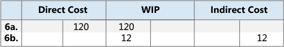

# Designdetaljer: Avstemming med konti i FinansDesign Details: Reconciliation with the General Ledger
Når du bokfører lagertransaksjoner, for eksempel følgesedler, produksjonsavgang eller nedjusteringer, registreres endringene i antall og verdi på lageret i henholdsvis varepostene og verdipostene.When you post inventory transactions, such as sales shipments, production output, or negative adjustments, the quantity and value changes to the inventory are recorded in the item ledger entries and the value entries, respectively. Det neste trinnet i denne fremgangsmåten er å bokføre lagerverdier i lagerkontiene i Finans.The next step in the process is to post the inventory values to the inventory accounts in the general ledger.  

Det er to måter å avstemme lagerposten med Finans på:There are two ways to reconcile the inventory ledger with the general ledger:  

* Manuelt, ved å kjøre kjørselen **Bokfør lagerkost i Finans**.Manually, by running the **Post Inventory Cost to G/L** batch job.  
* Automatisk, hver gang du bokfører en lagertransaksjon.Automatically, every time that you post an inventory transaction.  

## Kjørselen Bokfør lagerkost i FinansPost Inventory Cost to G/L Batch Job  
Når du kjører kjørselen **Bokfør lagerkost i Finans**, opprettes finansposter basert på verdiposter.When you run the **Post Inventory Cost to G/L** batch job, the general ledger entries are created based on value entries. Du kan summere finansposter for hver verdipost eller opprette finansposter for hver kombinasjon av bokføringsdato, lokasjonskode, lagerbokføringsgruppe, firmabokføringsgruppe og varebokføringsgruppe.You have the option to summarize general ledger entries for each value entry, or create general ledger entries for each combination of posting date, location code, inventory posting group, general business posting group, and general product posting group.  

Bokføringsdatoene for finanspostene settes til bokføringsdatoen for den tilsvarende verdiposten, unntatt når verdiposten er i en lukket regnskapsperiode.The posting dates of the general ledger entries are set to the posting date of the corresponding value entry, except when the value entry falls in a closed accounting period. I slike tilfeller blir verdiposten hoppet over, og du må endre i finansoppsettet eller brukeroppsett for å aktivere bokføring i datointervallet.In this case, the value entry is skipped, and you must change either the general ledger setup or the user setup to enable posting in the date range.  

Når du kjører kjørselen **Bokfør lagerkost i Finans**, får du kanskje feil på grunn av manglende oppsett eller inkompatibelt dimensjonsoppsett.When you run the **Post Inventory Cost to G/L** batch job, you might receive errors because of missing setup or incompatible dimension setup. Hvis det oppstår feil i dimensjonsoppsettet, overstyrer kjørselen disse feilene og bruker dimensjonene til verdiposten.If the batch job encounters errors in the dimension setup, it overrides these errors and uses the dimensions of the value entry. Når det gjelder andre feil, bokfører ikke kjørselen verdipostene, og det vises en oversikt over dem på slutten av rapporten i en del med overskriften **Poster som er hoppet over**.For other errors, the batch job does not post the value entries and lists them at the end of the report in a section titled, **Skipped Entries**. Hvis du vil bokføre disse postene, må du først rette feilene.To post these entries, you must first fix the errors. Hvis du vil ha en oversikt over feil før du kjører den satsvise jobben, kan du kjøre rapporten **Bokfør lagerkost i Finans - test**.To see a list of errors before you run the batch job, you can run the **Post Invt. Cost to G/L - Test** report. Denne rapporten viser en oversikt over alle feilene som oppstår under en kontrollbokføring.This report lists all of the errors that are encountered during a test posting. Du kan rette feilene og deretter kjøre kjørselen for lagerkost uten å hoppe over noen poster.You can fix the errors, and then run the inventory cost posting batch job without skipping any entries.  

## Automatisk kostbokføringAutomatic Cost Posting  
Du kan konfigurere kostbokføring i finans slik at den kjører automatisk når du bokfører en lagertransaksjon, ved å merke av for **Automatisk kostbokføring** i **Lageroppsett**-vinduet.To set up cost posting to the general ledger to run automatically when you post an inventory transaction, select the **Automatic Cost Posting** check box in the **Inventory Setup** window. Bokføringsdatoen for finansposten er den samme som bokføringsdatoen for vareposten.The posting date of the general ledger entry is the same as the posting date of the item ledger entry.  

## KontotyperAccount Types  
Under avstemming bokføres lagerverdier i lagerkontoen i balansen.During reconciliation, inventory values are posted to the inventory account in the balance sheet. Den samme beløpet, men med motsatt fortegn, bokføres på den aktuelle motkontoen.The same amount, but with the reverse sign, is posted to the relevant balancing account. Motkontoen er vanligvis en resultatregnskapskonto.Usually the balancing account is an income statement account. Når du imidlertid bokfører direktekostnader knyttet til forbruk eller avgang, er motkontoen en balansekonto.However, when you post direct cost related to consumption or output, the balancing account is a balance sheet account. Typen varepost og verdipost fastsetter hvilken finanskonto det skal bokføres i.The type of the item ledger entry and value entry determines which general ledger account to post to.  

Posttypen angir hvilken finanskonto det skal bokføres i.The entry type indicates which general ledger account to post to. Dette fastsettes enten av fortegnet til antallet i vareposten eller det verdisatte antallet i vareposten siden antallene alltid har samme fortegn.This is determined either by the sign of the quantity on the item ledger entry or the valued quantity on the value entry, since the quantities always have the same sign. En salgspost med et positivt antall beskriver for eksempel en lagerreduksjon forårsaket av et salg, og en salgspost med et negativt antall beskriver en lagerøkning forårsaket av en ordreretur.For example, a sales entry with a positive quantity describes an inventory decrease caused by a sale, and a sales entry with a negative quantity describes an inventory increase caused by a sales return.  

### EksempelExample  
Følgende eksempel viser en sykkelkjede som produseres fra ledd som kjøpes.The following example shows a bike chain that is manufactured from purchased links. Dette eksemplet viser hvordan de ulike finanskontotypene brukes i et typisk scenario.This example shows how the various general ledger account types are used in a typical scenario.  

Det er merket av for **Bokf. av forventet kost i Finans** i **Lageroppsett**-vinduet, og følgende oppsett er definert.The **Expected Cost Posting to G/L** check box in the **Inventory Setup** window is selected, and the following setup is defined.  

Tabellen nedenfor viser hvordan leddet er definert på varekortet.The following table shows how the link is set up on the item card.  

|OppsettfeltSetup Field|VerdiValue|  
|-----------------|-----------|  
|**Lagermetode****Costing Method**|StandardStandard|  
|**Kostpris (standard)****Standard Cost**|NOK 1,00LCY 1.00|  
|**Sats for indirekte kostnader****Overhead Rate**|NOK 0,02LCY 0.02|  

Tabellen nedenfor viser hvordan kjeden er definert på varekortet.The following table shows how the chain is set up on the item card.  

|OppsettfeltSetup Field|VerdiValue|  
|-----------------|-----------|  
|**Lagermetode****Costing Method**|StandardStandard|  
|**Kostpris (standard)****Standard Cost**|NOK 150,00LCY 150.00|  
|**Sats for indirekte kostnader****Overhead Rate**|NOK 25,00LCY 25.00|  

Tabellen nedenfor viser hvordan arbeidssenteret er definert på arbeidssenterkortet.The following table shows how the work center is set up on the work center card.  

|OppsettfeltSetup Field|VerdiValue|  
|-----------------|-----------|  
|**Direkte enhetskost****Direct Unit Cost**|NOK 2,00LCY 2.00|  
|**Indirekte kostprosent****Indirect Cost Percentage**|1010|  

##### ScenarioScenario  
1. Brukeren kjøper 150 ledd og bokfører bestillingen som mottatt.The user purchases 150 links and posts the purchase order as received. (Kjøp)(Purchase)  
2. Brukeren bokfører bestillingen som fakturert.The user posts the purchase order as invoiced. Dermed opprettes et beløp for indirekte kostnader på NOK 3,00 som skal tildeles, og et avviksbeløp på NOK 18,00.This creates an overhead amount of LCY 3.00 to be allocated and a variance amount of LCY 18.00. (Kjøp)(Purchase)  

    1. De midlertidige kontiene fjernes.The interim accounts are cleared. (Kjøp)(Purchase)  
    2. Den direkte kostnaden bokføres.The direct cost is posted. (Kjøp)(Purchase)  
    3. Den indirekte kosten beregnes og bokføres.The indirect cost is calculated and posted. (Kjøp)(Purchase)  
    4. Kjøpsavviket beregnes og bokføres (bare for standardkostnadsvarer).The purchase variance is calculated and posted (only for standard-cost items). (Kjøp)(Purchase)  
3. Brukeren selger én kjede og bokfører ordren som levert.The user sells one chain and posts the sales order as shipped. (Salg)(Sale)  
4. Brukeren bokfører ordren som fakturert.The user posts the sales order as invoiced. (Salg)(Sale)  

    1. De midlertidige kontiene fjernes.The interim accounts are cleared. (Salg)(Sale)  
    2. Solgte varers kost (VAREFORBRUK) blir bokført.Cost of goods sold (COGS) is posted. (Salg)(Sale)  

          
5. Brukeren bokfører forbruk av 150 ledd, som er antallet ledd som brukes til å produsere én kjede.The user posts consumption of 150 links, which is the number of links used to produce one chain. (Forbruk, Materiale)(Consumption, Material)  

      
6. Arbeidssenteret brukte 60 minutter på å produsere kjeden.The work center used 60 minutes to produce the chain. Brukeren bokfører konverteringskostnaden.The user posts the conversion cost. (Forbruk, Kapasitet)(Consumption, Capacity)  

    1. De direkte kostnadene bokføres.The direct costs are posted. (Forbruk, Kapasitet)(Consumption, Capacity)  
    2. De indirekte kostnadene beregnes og bokføres.The indirect costs are calculated and posted. (Forbruk, Kapasitet)(Consumption, Capacity)  

          
7. Brukeren bokfører den forventede kostnaden for én kjede.The user posts the expected cost of one chain. (Avgang)(Output)  
8. Brukeren fullfører produksjonsordren og kjører kjørselen **Juster kostverdi - vareposter**.The user finishes the production order and runs the **Adjust Cost - Item Entries** batch job. (Avgang)(Output)  

    1. De midlertidige kontiene fjernes.The interim accounts are cleared. (Avgang)(Output)  
    2. Den direkte kostnaden overføres fra VIA-kontoen til lagerkontoen.The direct cost is transferred from the WIP account to the inventory account. (Avgang)(Output)  
    3. Den indirekte kosten (indirekte kostnader) overføres fra kontoen for indirekte kost til lagerkontoen.The indirect cost (overhead) is transferred from the indirect cost account to the inventory account. (Avgang)(Output)  
    4. Dette resulterer i et avviksbeløp på NOK 157,00.This results in a variance amount of LCY 157.00. Avvik beregnes bare for varer med standard kostpris.Variances are only calculated for standard-cost items. (Avgang)(Output)  

          

        > [!NOTE]  
        >  For enkelhets skyld vises bare én avvikskonto.For the sake of simplicity, only one variance account is shown. Det finnes i virkeligheten fem forskjellige kontoer:In reality, five different accounts exist:  
        >   
        >  * MaterialavvikMaterial Variance  
        >  * KapasitetsavvikCapacity Variance  
        >  * Avvik for indirekte kapasitetskostCapacity Overhead Variance  
        >  * UnderleveranseavvikSubcontracting Variance  
        >  * Avvik i indirekte produksjonskostnaderManufacturing Overhead Variance  

9. Brukeren revaluerer kjeden fra NOK 150,00 til NOK 140,00.The user revalues the chain from LCY 150.00 to LCY 140.00. (Justering/revaluering/avrunding/overføring)(Adjustment/Revaluation/Rounding/Transfer)  

      

Hvis du vil ha mer informasjon om relasjonen mellom kontotyper og ulike typer verdier, kan du se [Designdetaljer: Konti i Finans](design-details-accounts-in-the-general-ledger.md).For more information about the relationship between the account types and the different types of value entries, see [Design Details: Accounts in the General Ledger](design-details-accounts-in-the-general-ledger.md).  

## Se ogsåSee Also  
[Designdetaljer: Kostberegning for beholdning](design-details-inventory-costing.md) [Design Details: Inventory Costing](design-details-inventory-costing.md)   
[Designdetaljer: Bokføre forventet kost](design-details-expected-cost-posting.md) [Design Details: Expected Cost Posting](design-details-expected-cost-posting.md)   
[Designdetaljer: Kostjustering](design-details-cost-adjustment.md)
[Administrere lagerkostnader](finance-manage-inventory-costs.md)[Design Details: Cost Adjustment](design-details-cost-adjustment.md)
[Managing Inventory Costs](finance-manage-inventory-costs.md)  
[FinansFinance](finance.md)  
[Arbeide med [!INCLUDE[d365fin](includes/d365fin_md.md)]](ui-work-product.md)[Working with [!INCLUDE[d365fin](includes/d365fin_md.md)]](ui-work-product.md)

