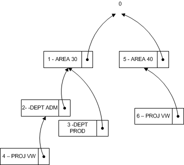

# <a name="design-details-searching-for-dimension-combinations"></a><span data-ttu-id="21513-104">Designdetaljer: Søke etter dimensjonskombinasjoner</span><span class="sxs-lookup"><span data-stu-id="21513-104">Design Details: Searching for Dimension Combinations</span></span>
<span data-ttu-id="21513-105">Når du lukker et vindu etter å ha redigert et sett med dimensjoner, undersøker [!INCLUDE[d365fin](includes/d365fin_md.md)] om det redigerte settet med dimensjoner finnes.</span><span class="sxs-lookup"><span data-stu-id="21513-105">When you close a window after you edit a set of dimensions, [!INCLUDE[d365fin](includes/d365fin_md.md)] evaluates whether the edited set of dimensions exists.</span></span> <span data-ttu-id="21513-106">Hvis gruppen ikke finnes, blir det opprettet et nytt sett, og det kombinasjon-IDen for dimensjonen blir returnert.</span><span class="sxs-lookup"><span data-stu-id="21513-106">If the set does not exist, a new set is created and the dimension combination ID is returned.</span></span>  

## <a name="building-search-tree"></a><span data-ttu-id="21513-107">Bygge søketre</span><span class="sxs-lookup"><span data-stu-id="21513-107">Building Search Tree</span></span>  
 <span data-ttu-id="21513-108">Tabell 481 **Trenode for dimensjonssett** brukes når [!INCLUDE[d365fin](includes/d365fin_md.md)] vurderer om et sett med dimensjoner allerede finnes i tabell 480 **Dimensjonssettpost**.</span><span class="sxs-lookup"><span data-stu-id="21513-108">Table 481 **Dimension Set Tree Node** is used when [!INCLUDE[d365fin](includes/d365fin_md.md)] evaluates whether a set of dimensions already exists in table 480 **Dimension Set Entry** table.</span></span> <span data-ttu-id="21513-109">Evalueringen utføres ved å traversere søketreet rekursivt fra det øverste nivået, som har fått nummeret 0.</span><span class="sxs-lookup"><span data-stu-id="21513-109">The evaluation is performed by recursively traversing the search tree starting at the top level numbered 0.</span></span> <span data-ttu-id="21513-110">Det øverste nivået 0 representerer et dimensjonssett uten dimensjonssettposter.</span><span class="sxs-lookup"><span data-stu-id="21513-110">The top level 0 represents a dimension set with no dimension set entries.</span></span> <span data-ttu-id="21513-111">De underordnede elementene for dette dimensjonssettet representerer dimensjonssett med bare én dimensjonssettpost.</span><span class="sxs-lookup"><span data-stu-id="21513-111">The children of this dimension set represent dimension sets with only one dimension set entry.</span></span> <span data-ttu-id="21513-112">De underordnede elementene for disse dimensjonssettene representerer dimensjonssett med to underordnede elementer og så videre.</span><span class="sxs-lookup"><span data-stu-id="21513-112">The children of these dimension sets represent dimension sets with two children, and so on.</span></span>  

### <a name="example-1"></a><span data-ttu-id="21513-113">Eksempel 1</span><span class="sxs-lookup"><span data-stu-id="21513-113">Example 1</span></span>  
 <span data-ttu-id="21513-114">Diagrammet nedenfor representerer et søketre med seks dimensjonssett.</span><span class="sxs-lookup"><span data-stu-id="21513-114">The following diagram represents a search tree with six dimension sets.</span></span> <span data-ttu-id="21513-115">Bare den spesielle dimensjonssettposten vises i diagrammet.</span><span class="sxs-lookup"><span data-stu-id="21513-115">Only the distinguishing dimension set entry is displayed in the diagram.</span></span>  

 <span data-ttu-id="21513-116"></span><span class="sxs-lookup"><span data-stu-id="21513-116"></span></span>  

 <span data-ttu-id="21513-117">Tabellen nedenfor beskriver en fullstendig liste over dimensjonssettpostene som utgjør hvert dimensjonssett.</span><span class="sxs-lookup"><span data-stu-id="21513-117">The following table describes a complete list of dimension set entries that make up each dimension set.</span></span>  

|<span data-ttu-id="21513-118">Dimensjonssett</span><span class="sxs-lookup"><span data-stu-id="21513-118">Dimension Sets</span></span>|<span data-ttu-id="21513-119">Dimensjonssettposter</span><span class="sxs-lookup"><span data-stu-id="21513-119">Dimension Set Entries</span></span>|  
|--------------------|---------------------------|  
|<span data-ttu-id="21513-120">Sett 0</span><span class="sxs-lookup"><span data-stu-id="21513-120">Set 0</span></span>|<span data-ttu-id="21513-121">Ingen</span><span class="sxs-lookup"><span data-stu-id="21513-121">None</span></span>|  
|<span data-ttu-id="21513-122">Sett 1</span><span class="sxs-lookup"><span data-stu-id="21513-122">Set 1</span></span>|<span data-ttu-id="21513-123">AREA 30</span><span class="sxs-lookup"><span data-stu-id="21513-123">AREA 30</span></span>|  
|<span data-ttu-id="21513-124">Sett 2</span><span class="sxs-lookup"><span data-stu-id="21513-124">Set 2</span></span>|<span data-ttu-id="21513-125">AREA 30, DEPT ADM</span><span class="sxs-lookup"><span data-stu-id="21513-125">AREA 30, DEPT ADM</span></span>|  
|<span data-ttu-id="21513-126">Sett 3</span><span class="sxs-lookup"><span data-stu-id="21513-126">Set 3</span></span>|<span data-ttu-id="21513-127">AREA 30, DEPT PROD</span><span class="sxs-lookup"><span data-stu-id="21513-127">AREA 30, DEPT PROD</span></span>|  
|<span data-ttu-id="21513-128">Sett 4</span><span class="sxs-lookup"><span data-stu-id="21513-128">Set 4</span></span>|<span data-ttu-id="21513-129">AREA 30, DEPT ADM, PROJ VW</span><span class="sxs-lookup"><span data-stu-id="21513-129">AREA 30, DEPT ADM, PROJ VW</span></span>|  
|<span data-ttu-id="21513-130">Sett 5</span><span class="sxs-lookup"><span data-stu-id="21513-130">Set 5</span></span>|<span data-ttu-id="21513-131">AREA 40</span><span class="sxs-lookup"><span data-stu-id="21513-131">AREA 40</span></span>|  
|<span data-ttu-id="21513-132">Sett 6</span><span class="sxs-lookup"><span data-stu-id="21513-132">Set 6</span></span>|<span data-ttu-id="21513-133">AREA 40, PROJ VW</span><span class="sxs-lookup"><span data-stu-id="21513-133">AREA 40, PROJ VW</span></span>|  

### <a name="example-2"></a><span data-ttu-id="21513-134">Eksempel 2</span><span class="sxs-lookup"><span data-stu-id="21513-134">Example 2</span></span>  
 <span data-ttu-id="21513-135">Dette eksemplet viser hvordan [!INCLUDE[d365fin](includes/d365fin_md.md)] vurderer om det finnes et dimensjonssett som består av dimensjonssettpostene AREA 40, DEPT PROD.</span><span class="sxs-lookup"><span data-stu-id="21513-135">This example shows how [!INCLUDE[d365fin](includes/d365fin_md.md)] evaluates whether a dimension set that consists of the dimension set entries AREA 40, DEPT PROD exists.</span></span>  

 <span data-ttu-id="21513-136">Først oppdaterer [!INCLUDE[d365fin](includes/d365fin_md.md)] også tabellen **Trenode for dimensjonssett** for å sikre at søketreet ser ut som diagrammet nedenfor.</span><span class="sxs-lookup"><span data-stu-id="21513-136">First, [!INCLUDE[d365fin](includes/d365fin_md.md)] also updates the **Dimension Set Tree Node** table to make sure that the search tree looks like the following diagram.</span></span> <span data-ttu-id="21513-137">Dimensjonssett 7 blir dermed underordnet dimensjonssett 5.</span><span class="sxs-lookup"><span data-stu-id="21513-137">Thus dimension set 7 becomes a child of the dimension set 5.</span></span>  

 <span data-ttu-id="21513-138"></span><span class="sxs-lookup"><span data-stu-id="21513-138"></span></span>  

### <a name="finding-dimension-set-id"></a><span data-ttu-id="21513-139">Finne dimensjonssett-ID</span><span class="sxs-lookup"><span data-stu-id="21513-139">Finding Dimension Set ID</span></span>  
 <span data-ttu-id="21513-140">På et grunnleggende nivå vil **Overordnet ID**, **Dimensjon** og **Dimensjonsverdi** i søketreet, kombineres og brukes som primærnøkkel fordi [!INCLUDE[d365fin](includes/d365fin_md.md)] går gjennom treet i samme rekkefølge som dimensjonspostene.</span><span class="sxs-lookup"><span data-stu-id="21513-140">At a conceptual level, **Parent ID**, **Dimension**, and **Dimension Value**, in the search tree, are combined and used as the primary key because [!INCLUDE[d365fin](includes/d365fin_md.md)] traverses the tree in the same order as the dimension entries.</span></span> <span data-ttu-id="21513-141">GET-funksjonen (post) brukes til å søke etter dimensjonssett-ID.</span><span class="sxs-lookup"><span data-stu-id="21513-141">The GET function (record) is used to search for dimension set ID.</span></span> <span data-ttu-id="21513-142">Følgende kodeeksempel viser hvordan du finner dimensjonssett-IDen når det finnes tre dimensjonsverdier.</span><span class="sxs-lookup"><span data-stu-id="21513-142">The following code example shows how to find the dimension set ID when there are three dimension values.</span></span>  

```  
DimSet."Parent ID" := 0;  // 'root'  
IF UserDim.FINDSET THEN  
  REPEAT  
      DimSet.GET(DimSet."Parent ID",UserDim.DimCode,UserDim.DimValueCode);  
  UNTIL UserDim.NEXT = 0;  
EXIT(DimSet.ID);  

```  

 <span data-ttu-id="21513-143">For å beholde muligheten for [!INCLUDE[d365fin](includes/d365fin_md.md)] til å gi nytt navn til en dimensjon og dimensjonsverdi, utvides imidlertid tabell 348 **Dimensjonsverdi**, med et heltallsfelt av **Dimensjonsverdi-ID**.</span><span class="sxs-lookup"><span data-stu-id="21513-143">However, to preserve the ability of [!INCLUDE[d365fin](includes/d365fin_md.md)] to rename a dimension and dimension value, table 348 **Dimension Value** is extended with an integer field of **Dimension Value ID**.</span></span> <span data-ttu-id="21513-144">Denne tabellen konverterer feltparet **Dimensjon** og **Dimensjonsverdi** til en heltallsverdi.</span><span class="sxs-lookup"><span data-stu-id="21513-144">This table converts the field pair **Dimension** and **Dimension Value** to an integer value.</span></span> <span data-ttu-id="21513-145">Når du gir dimensjonen og dimensjonsverdien nytt navn, endres ikke heltallsverdien.</span><span class="sxs-lookup"><span data-stu-id="21513-145">When you rename the dimension and dimension value, the integer value is not changed.</span></span>  

```  
DimSet."Parent ID" := 0;  // 'root'  
IF UserDim.FINDSET THEN  
  REPEAT  
      DimSet.GET(DimSet.ParentID,UserDim."Dimension Value ID");  
  UNTIL UserDim.NEXT = 0;  
EXIT(DimSet.ID);  

```  

## <a name="see-also"></a><span data-ttu-id="21513-146">Se også</span><span class="sxs-lookup"><span data-stu-id="21513-146">See Also</span></span>  
 <span data-ttu-id="21513-147">[GET-funksjonen (post)](https://msdn.microsoft.com/en-us/library/dd301056.aspx)  </span><span class="sxs-lookup"><span data-stu-id="21513-147">[GET Function (Record)](https://msdn.microsoft.com/en-us/library/dd301056.aspx)  </span></span>  
 <span data-ttu-id="21513-148">[Designdetaljer: Dimensjonssettposter](design-details-dimension-set-entries.md) </span><span class="sxs-lookup"><span data-stu-id="21513-148">[Design Details: Dimension Set Entries](design-details-dimension-set-entries.md) </span></span>  
 <span data-ttu-id="21513-149">[Dimensjonssettposter – oversikt](design-details-dimension-set-entries-overview.md) </span><span class="sxs-lookup"><span data-stu-id="21513-149">[Dimension Set Entries Overview](design-details-dimension-set-entries-overview.md) </span></span>  
 <span data-ttu-id="21513-150">[Designdetaljer: Tabellstruktur](design-details-table-structure.md) </span><span class="sxs-lookup"><span data-stu-id="21513-150">[Design Details: Table Structure](design-details-table-structure.md) </span></span>  
 <span data-ttu-id="21513-151">[Designdetaljer: Dimensjonsbehandling for kodeenhet 408](design-details-codeunit-408-dimension-management.md) </span><span class="sxs-lookup"><span data-stu-id="21513-151">[Design Details: Codeunit 408 Dimension Management](design-details-codeunit-408-dimension-management.md) </span></span>  
 [<span data-ttu-id="21513-152">Designdetaljer: Kodeeksempler på endrede mønstre i endringer</span><span class="sxs-lookup"><span data-stu-id="21513-152">Design Details: Code Examples of Changed Patterns in Modifications</span></span>](design-details-code-examples-of-changed-patterns-in-modifications.md)

