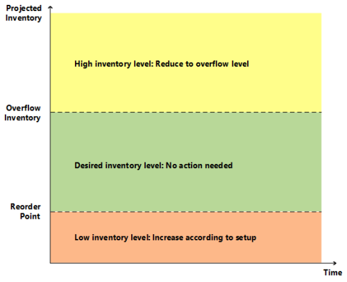

# Designdetaljer: Holde seg under overflytnivået
Når Maks.ant. og Fast gjenbest.ant. brukes, fokuserer planleggingssystemet bare på den beregnede beholdningen i den angitte tidsperioden. Dette betyr at planleggingssystemet kan foreslå overflødig forsyning når endring av negativt behov eller positiv forsyning skjer utenfor den angitte tidsperioden. Hvis det derfor blir foreslått en overflødig forsyning, vil planleggingssystemet beregne antallet forsyningen skal reduseres til (eller slettes) for å unngå overflødig forsyning. Dette antallet kalles "overflyt nivået." Overflyt formidles som en planleggingslinje med handlingen **Endre ant. (reduksjon)** eller **Avbryt** og følgende advarsel:  

*Viktig: Den beregnede beholdningen [xx] er høyere enn overflytnivået [xx] på forfallsdatoen [xx].*  

  

##  Beregne overflytnivået  
Overflytnivået beregnes på ulike måter avhengig av planleggingsoppsettet.  

### Gjenbestillingsprinsippet Maks.ant  
Overflytnivå = Maks. beholdning  

> [!NOTE]  
>  Hvis det finnes et minimumsordreantall, blir det lagt til som følger: Overflytnivå = Maksimumsbeholdning + Min. bestillingsantall.  

### Gjenbestillingsprinsippet for Fast gjenbest.ant.  
Overflytnivå = Gjenbestillingsantall + Gjenbestillingspunkt  

> [!NOTE]  
>  Hvis minimumsordreantallet er høyere enn gjenbestillingspunktet, vil dette erstatte slik: Overflytnivå = Gjenbestillingsantall + Min. bestillingsantall  

### Bestillingsfaktor  
Hvis det finnes en bestillingsfaktor, vil den justere overflytnivået for gjenbestillingsprinsippene Maks.ant og Fast gjenbest.ant.  

##  Opprette planleggingslinjen med overflytadvarsel  
Når en eksisterende forsyning fører til at den beregnede beholdningen blir høyere enn overflytnivået på slutten av en tidsperiode, opprettes en planleggingslinje. For å advare om den potensielt overflødige forsyningen vises en advarsel på planleggingslinjen, feltet **Godta handlingsmelding** er ikke valgt og handlingsmeldingen er enten Avbryt eller Endre ant.  

### Beregne antall for planleggingslinjen  
Antall for planleggingslinje = Gjeldende forsyningsantall - (Beregnet beholdning – Overflytnivå)  

> [!NOTE]  
>  Som med alle advarselslinjer vil alle maksimum/minimum ordreantall eller bestillingsfaktor bli ignorert.  

### Angi handlingsmeldingstype  

-   Hvis planleggingslinjeantall er større enn 0, er handlingsmeldingen Endre ant.  
-   Hvis planleggingslinjeantall er lik eller mindre enn 0, er handlingsmeldingen Avbryt  

### Skrive advarselsmeldingen  
Hvis det oppstår overflyt, viser vinduet **Ikke-sporede planleggingselementer** en advarsel med følgende informasjon:  

-   Det beregnede beholdningsnivået som utløste advarselen  
-   Det beregnede overflytnivået  
-   Forfallsdatoen for forsyningshendelsen.  

Eksempel: "Den beregnede beholdningen 120 er høyere enn overflytnivået 60 28.01.11."  

## Scenario  
I dette scenariet endrer en kunde en ordre fra 70 til 40 enheter mellom to planleggingskjøringer. Overflytfunksjonen trer i kraft for å redusere kjøpet som ble foreslått for det første salgsantallet.  

### Vareoppsett  

|Gjenbestillingsprinsipp|Maks.ant.|  
|-----------------------|------------------|  
|Maks. bestillingsantall|100|  
|Gjenbestillingspunkt|50|  
|Beholdning|80|  

### Situasjonen før salgsreduksjon  

|Hendelse|Endre ant.|Beregnet lager|  
|-----------|-----------------|-------------------------|  
|Dag én|Ingen|80|  
|Salg|-70|10|  
|Slutten av tidsperioden|Ingen|10|  
|Foreslå ny bestilling|+90|100|  

### Situasjonen etter salgsreduksjon  

|Endre|Endre ant.|Beregnet lager|  
|------------|-----------------|-------------------------|  
|Dag én|Ingen|80|  
|Salg|-40|40|  
|Kjøp|+90|130|  
|Slutten av tidsperioden|Ingen|130|  
|Foreslå å redusere bestilling   ordre fra 90 til 60|-30|100|  

### Resulterende planleggingslinjer  
 Én planleggingslinje (advarsel) blir opprettet for å redusere kjøpet med 30 fra 90 til 60, for å holde den beregnede beholdningen på 100 i henhold til overflytnivået.  

  

> [!NOTE]  
>  Uten overflytsfunksjonen vises det ingen advarsel hvis det beregnede beholdningsnivået er over maksimumsbeholdningen. Dette kan føre til en overflødig forsyning på 30.  

## Se også  
[Designdetaljer: Gjenbestillingsprinsipper](design-details-reordering-policies.md)   
[Designdetaljer: Planleggingsparametere](design-details-planning-parameters.md)   
[Designdetaljer: Håndtere gjenbestillingsprinsipper](design-details-handling-reordering-policies.md)   
[Designdetaljer: Forsyningsplanlegging](design-details-supply-planning.md)

