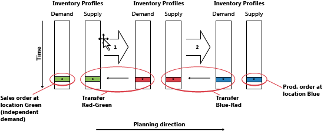
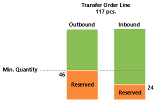
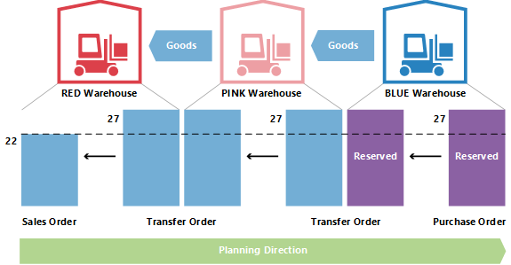

# Designdetaljer: Overføringer i planlegging
Overføringsordrer er også en kilde til forsyning når du arbeider på LFE-nivået. Når flere lokasjoner (lagre) brukes, kan Overfør angis for LFE-etterfyllingssystemet, som betyr at lokasjonen etterfylles ved å overføre varer fra en annen lokasjon. I en situasjon med flere lagre kan selskaper ha en kjede av overføringer der forsyning til GRØNN lokasjon overføres fra GUL, forsyning til GUL overføres fra RØD og så videre. I begynnelsen av kjeden finnes etterfyllingssystemet Prod.ordre. eller Kjøp.  
  
  
  
Når du sammenligner situasjonen der en forsyningsordre er vendt direkte mot en behovsordre, med en situasjon der ordren leveres gjennom en kjede med LFE-overføringer, er det åpenbart at planleggingsoppgaven i sistnevnte situasjon kan bli svært komplisert. Hvis behov endres, kan dette føre til at dominoeffekt i kjeden, fordi alle overføringsordrer og kjøps-/produksjonsordren i den andre enden av kjeden, må manipuleres til å gjenopprette balansen mellom behov og forsyning.  
  
  
  
## Hvorfor er overføring et spesialtilfelle?  
En overføringsordre er ganske lik andre ordre i programmet. I bakgrunnen er det imidlertid svært forskjellig.  
  
Ett grunnleggende aspekt som gjør at overføringer i planleggingen er forskjellig fra bestillinger og produksjonsordrer, er at en overføringslinje representerer behov og forsyning samtidig. Den utgående delen, som leveres fra den gamle lokasjonen, er behov. Den inngående delen, som skal mottas på den nye lokasjonen, er forsyning på denne lokasjonen.  
  
  
  
Dette betyr at når systemet endrer forsyningssiden av overføringen, må det gjøre en lignende endring på behovssiden.  
  
## Overføringer er avhengig behov  
Tilknyttet behov og forsyning har visse likheter med komponenter på en produksjonsordrelinje, men forskjellen er at komponenter kommer til å være på neste planleggingsnivå og med en annen vare, mens de to delene av overføringen er på samme nivå for den samme varen.  
  
En viktig likheten er at på samme måte som komponentene er avhengig av behov, så er overføringsbehovet det også. Behovet fra en overføringslinje bestemmes av forsyningssiden av overføringen i den forstand at hvis forsyningen endres, påvirkes behovet direkte.  
  
Med mindre planleggingsfleksibiliteten er Ingen, må en overføringslinje aldri behandles som uavhengig behov i planleggingen.  
  
I fremgangsmåten for planlegging skal overføringsbehovet bare tas hensyn til når forsyningssiden er behandlet av planleggingssystemet. Det faktiske behovet er ikke kjent før dette. Rekkefølgen til endringene er derfor svært viktig når det gjelder overføringsordrer.  
  
## Planleggingsrekkefølge  
Illustrasjonen nedenfor viser hvordan en rekke med overføringer kan se ut.  
  
  
  
I dette eksemplet bestiller en kunde varen på GRØNN lokasjon. GRØNN lokasjon forsynes ved hjelp av overføring fra det sentrale lageret på RØD lokasjon. Det sentrale lageret i RØD lokasjon forsynes ved hjelp av overføring fra produksjon i BLÅ lokasjon.  
  
I dette eksemplet vil planleggingssystemet starte på kundebehovet og arbeide seg bakover gjennom kjeden. Behovene og forsyningene behandles på én lokasjon om gangen.  
  
  
  
## Overføringsnivåkode  
Rekkefølgen som lokasjonene behandles i, i planleggingssystemet, bestemmes av overføringsnivåkoden for LFEen.  
  
Overføringsnivåkoden er et internt felt som beregnes og lagres automatisk i LFEen når LFE opprettes eller endres. Beregningen kjøres på tvers av alle LFEer for en bestemt kombinasjon av vare/variant og bruker lokasjonskoden og overfør-fra-koden til å bestemme ruten planleggingen må bruke når den traverserer gjennom LFEene for å sikre at alle krav behandles.  
  
Overføringsnivåkoden blir 0 for LFEer med etterfyllingssystemet Kjøp eller Prod.ordre, og blir -1 for det første overføringsnivået, -2 for det andre og så videre. I overføringskjeden som er beskrevet ovenfor, vil nivåene derfor være -1 for RØD og -2 for GRØNN, som vist i illustrasjonen nedenfor.  
  
  
  
Når en LFE oppdateres, registrerer planleggingssystemet om LFEer med etterfyllingssystemet Overfør er definert med sirkelreferanser.  
  
## Planleggingsoverføringer uten LFE  
  
Selv om LFE-funksjonen ikke brukes, er det mulig å bruke lokasjoner og foreta manuelle overføringer mellom lokasjoner. For selskaper med mindre avanserte lageroppsett, støtter planleggingssystemet scenarier der eksisterende beholdning blir overført manuelt til en annen lokasjon, for eksempel for å dekke en ordre på denne lokasjonen. Samtidig skal planleggingssystemet reagere på behovsendringer.  
  
For å støtte manuelle overføringer analyserer planleggingen eksisterende overføringsordrer og planlegger deretter rekkefølgen lokasjonene skal behandles i. Internt fungerer planleggingssystemet med midlertidig LFEer med overføringsnivåkoder.  
  
  
  
Hvis det finnes flere overføringer til en bestemt lokasjon, vil den første overføringsordren angi planleggingsretningen. Overføringer som går i motsatt retning, blir avbrutt.  
  
## Endre antall med reservasjoner  
Når du endrer antall i en eksisterende forsyning, tar planleggingssystemet reservasjoner med i betraktningen i den forstand at det reserverte antallet representerer den nedre grensen for hvor mye forsyningen kan reduseres med.  
  
Når du endrer antallet på en eksisterende overføringsordrelinje, må du huske at den nedre grensen defineres som høyeste reserverte antall på den utgående og inngående overføringslinjen.  
  
hvis en overføringsordrelinje på 117 stykker for eksempel reserveres mot en salgslinje med 46 og en bestillingslinje med 24, er det ikke mulig å redusere overføringslinjen under 46 stykker, selv om dette kan representere overflødige forsyning på innkommende side.  
  
  
  
## Endre antall i en overføringskjede  
I eksemplet nedenfor er utgangspunktet en balansert situasjon med en overføringskjed som leverer en ordre på 27 på RØD lokasjon med en tilsvarende bestilling på BLÅ lokasjon, overført via ROSA lokasjon. Derfor finnes det, i tillegg til salg og kjøp, to overføringsordrer: BLÅ-ROSA og ROSA-RØD.  
  
  
  
Planleggeren på ROSA lokasjon velger nå å reservere mot kjøpet.  
  
  
  
Dette betyr vanligvis at planleggingssystemet ignorerer bestillingen og overføringsbehovet. Så lenge det er balanse, er det ikke noe problem. Men hva skjer når kunden på RØD lokasjon delvis angrer på ordren og endrer den til 22?  
  
  
  
Når planleggingssystemet kjøres på nytt, skal det kunne bli kvitt overflødig forsyning. Reservasjonen vil imidlertid låse kjøp og overføring til antallet 27.  
  
  
  
ROSA-RØD-overføringen er redusert til 22. Den inngående delen av BLÅ-ROSA-overføringen er ikke reservert, men fordi den utgående delen er reservert, er det ikke mulig å redusere antallet under 27.  
  
## Beregning av leveringstid  
Når forfallsdatoen for en overføringsordre beregnes, blir ulike typer leveringstid tatt med i betraktningen.  
  
Følgende leveringstider er aktive når du planlegger en overføringsordre:  
  
* Utgående lagerhåndteringstid  
* Leveringstid  
* Inngående lagerhåndteringstid  
* Følgende felt brukes på planleggingslinjen til å gi informasjon om beregningen.  
* Overføringsseddeldato  
* Startdato  
* Sluttdato  
* Forfallsdato  
  
Leveringsdatoen på overføringslinjen vises i feltet Overføringsseddeldato, og mottaksdatoen på overføringslinjen vises i Forfallsdato-feltet.  
  
Start- og sluttdatoene brukes til å beskrive den faktiske transportperioden.  
  
Følgende illustrasjon viser tolkningen av startdato-tidspunkt og sluttdato-tidspunkt på planleggingslinjer som er knyttet til overføringsordrer.  
  
  
  
I dette eksemplet betyr dette at:  
  
* Forsendelsesdato + utgående håndtering = startdato  
* Startdato + leveringstid = sluttdato  
* Sluttdato + inngående håndtering = mottaksdato  
  
## Sikkerhetsleveringstid  
Feltet Standard sikkerhetstid i Produksjonsoppsett-vinduet og det tilknyttede feltet Sikkerhetsleveringstid på varekortet tas ikke med i betraktningen når en overføringsordre beregnes. Sikkerhetsleveringstiden vil imidlertid fremdeles påvirke den totale planen, slik det vil påvirke etterfyllingsordren (bestilling eller produksjon) i begynnelsen av overføringskjeden når varene blir plassert på lokasjonen de skal overføres fra.  
  
  
  
På produksjonsordrelinjen er Sluttdato + sikkerhetsleveringstid + inngående lagerhåndteringstid = forfallsdato.  
  
På bestillingslinjen er Planlagt mottaksdato + sikkerhetsleveringstid + inngående lagerhåndteringstid = forventet mottaksdato.  
  
## Tidsplanlegg på nytt  
Når en eksisterende overføringslinje planlegges på nytt, må planleggingssystemet slå opp den utgående delen og endre dato og klokkeslett for den. Det er viktig å legge merke til at hvis leveringstiden er angitt, vil det være et mellomrom mellom levering og mottak. Som nevnt, kan leveringstiden bestå av flere elementer, for eksempel transporttid og lagerhåndteringstid. På en tidslinje vil planleggingssystemet gå tilbake i tid mens elementene balanseres.  
  
  
  
Når forfallsdatoen endres på en overføringslinje, må derfor leveringstiden beregnes for at den utgående siden av overføringen skal oppdateres.  
  
## Serie-/partinumrene i overføringskjeder  
Hvis behovet har serie-/partinumre og planleggingsmotoren kjører, vil dette føre til overføringsordrer som opprettes direkte. Hvis du vil ha mer informasjon om dette konseptet, kan du se Vareattributter. Hvis serie-/partinumre imidlertid fjernes fra etterspørselen, vil de opprettede overføringsordrene i kjeden fortsatt inneholde serie-/partinumre og blir derfor ignorert av planlegging (ikke slettet).  
  
## Odre-til-ordre-koblinger  
I dette eksemplet konfigureres BLÅ LFE med ordregjenbestillingsprinsippet, mens ROSA og RØD bruker Parti for parti. Når en ordre på 27 opprettes i RØD lokasjon, fører det til en kjede av overføringer der siste ledd reserveres med binding i BLÅ lokasjon. I dette eksemplet er ikke reservasjoner faste reservasjoner som er opprettet av planleggeren på ROSA lokasjon, men bindinger som er opprettet av planleggingssystemet. Den viktige forskjellen er at planleggingssystemet kan endre sistnevnte.  
  
  
  
Hvis behovet endrete fra 27 til 22, vil systemet redusere antallet ned gjennom kjeden, og bindingsreservasjonen blir også redusert.  
  
## Se også  
[Designdetaljer: Planleggingsparametere](design-details-planning-parameters.md)   
[Designdetaljer: Tabell for planleggingstilordning](design-details-planning-assignment-table.md)   
[Designdetaljer: Håndtere gjenbestillingsprinsipper](design-details-handling-reordering-policies.md)   
[Designdetaljer: Behov på tom lokasjon](design-details-demand-at-blank-location.md)   
[Designdetaljer: Sentrale begreper for planleggingssystemet](design-details-central-concepts-of-the-planning-system.md)   
[Designdetaljer: Balansere behov og forsyning](design-details-balancing-demand-and-supply.md)   
[Designdetaljer: Forsyningsplanlegging](design-details-supply-planning.md)
