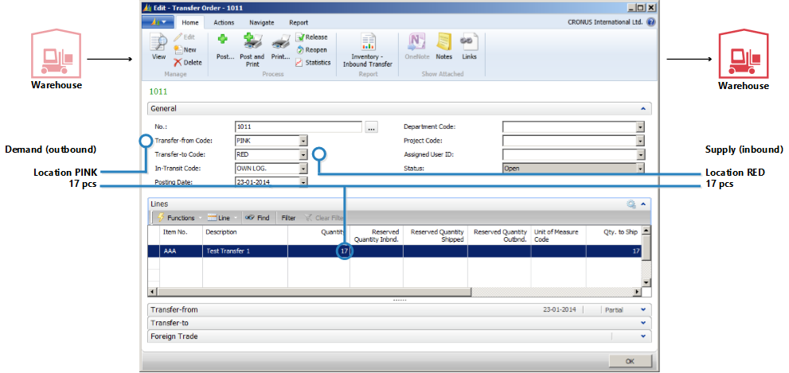

# Designdetaljer: Overføringer i planleggingDesign Details: Transfers in Planning
Overføringsordrer er også en kilde til forsyning når du arbeider på LFE-nivået.Transfer orders are also a source of supply when working at the SKU level. Når flere lokasjoner (lagre) brukes, kan Overfør angis for LFE-etterfyllingssystemet, som betyr at lokasjonen etterfylles ved å overføre varer fra en annen lokasjon.When using multiple locations (warehouses), the SKU replenishment system can be set to Transfer, implying that the location is replenished by transferring goods from another location. I en situasjon med flere lagre kan selskaper ha en kjede av overføringer der forsyning til GRØNN lokasjon overføres fra GUL, forsyning til GUL overføres fra RØD og så videre.In a situation with more warehouses, companies might have a chain of transfers where supply to GREEN location is transferred from YELLOW, and supply to YELLOW is transferred from RED and so on. I begynnelsen av kjeden finnes etterfyllingssystemet Prod.ordre. eller Kjøp.In the beginning of the chain, there is a replenishment system of Prod. Order or Purchase.  
  
  
  
Når du sammenligner situasjonen der en forsyningsordre er vendt direkte mot en behovsordre, med en situasjon der ordren leveres gjennom en kjede med LFE-overføringer, er det åpenbart at planleggingsoppgaven i sistnevnte situasjon kan bli svært komplisert.When comparing the situation where a supply order is directly facing a demand order to a situation where the sales order is supplied through a chain of SKU transfers, it is obvious that the planning task in the latter situation can become very complex. Hvis behov endres, kan dette føre til at dominoeffekt i kjeden, fordi alle overføringsordrer og kjøps-/produksjonsordren i den andre enden av kjeden, må manipuleres til å gjenopprette balansen mellom behov og forsyning.If demand changes, it might cause a ripple effect through the chain, because all transfer orders plus the purchase/production order in the opposite end of the chain will have to be manipulated to reestablish balance between demand and supply.  
  
  
  
## Hvorfor er overføring et spesialtilfelle?Why is Transfer a Special Case?  
En overføringsordre er ganske lik andre ordre i programmet.A transfer order looks much like any other order in the program. I bakgrunnen er det imidlertid svært forskjellig.However, behind the scene it is very different.  
  
Ett grunnleggende aspekt som gjør at overføringer i planleggingen er forskjellig fra bestillinger og produksjonsordrer, er at en overføringslinje representerer behov og forsyning samtidig.One fundamental aspect that makes transfers in planning different from purchase and production orders is that a transfer line represents demand and supply at the same time. Den utgående delen, som leveres fra den gamle lokasjonen, er behov.The outbound part, which is shipped from the old location, is demand. Den inngående delen, som skal mottas på den nye lokasjonen, er forsyning på denne lokasjonen.The inbound part, which is to be received at the new location, is supply at that location.  
  
  
  
Dette betyr at når systemet endrer forsyningssiden av overføringen, må det gjøre en lignende endring på behovssiden.This means that when the system manipulates the supply side of the transfer, it must make a similar change on the demand side.  
  
## Overføringer er avhengig behovTransfers are Dependent Demand  
Tilknyttet behov og forsyning har visse likheter med komponenter på en produksjonsordrelinje, men forskjellen er at komponenter kommer til å være på neste planleggingsnivå og med en annen vare, mens de to delene av overføringen er på samme nivå for den samme varen.The related demand and supply has some resemblance with components of a production order line, but the difference is that components will be on the next planning level and with a different item, whereas the two parts of the transfer is situated on the same level, for the same item.  
  
En viktig likheten er at på samme måte som komponentene er avhengig av behov, så er overføringsbehovet det også.An important similarity is that just as components are dependent demand, so is the transfer demand. Behovet fra en overføringslinje bestemmes av forsyningssiden av overføringen i den forstand at hvis forsyningen endres, påvirkes behovet direkte.The demand from a transfer line is dictated by the supply side of the transfer in the sense that if the supply is changed, the demand is directly affected.  
  
Med mindre planleggingsfleksibiliteten er Ingen, må en overføringslinje aldri behandles som uavhengig behov i planleggingen.Unless the planning flexibility is None, a transfer line should never be treated as independent demand in planning.  
  
I fremgangsmåten for planlegging skal overføringsbehovet bare tas hensyn til når forsyningssiden er behandlet av planleggingssystemet.In the planning procedure, the transfer demand should only be taken into account after the supply side has been processed by the planning system. Det faktiske behovet er ikke kjent før dette.Before this, the actual demand is not known. Rekkefølgen til endringene er derfor svært viktig når det gjelder overføringsordrer.The sequence of the changes made is therefore very important when it comes to transfer orders.  
  
## PlanleggingsrekkefølgePlanning Sequence  
Illustrasjonen nedenfor viser hvordan en rekke med overføringer kan se ut.The following illustration shows what a string of transfers could look like.  
  
  
  
I dette eksemplet bestiller en kunde varen på GRØNN lokasjon.In this example, a customer orders the item at location GREEN. GRØNN lokasjon forsynes ved hjelp av overføring fra det sentrale lageret på RØD lokasjon.Location GREEN is supplied through transfer from the central warehouse RED. Det sentrale lageret i RØD lokasjon forsynes ved hjelp av overføring fra produksjon i BLÅ lokasjon.The central warehouse RED is supplied by transfer from production on location BLUE.  
  
I dette eksemplet vil planleggingssystemet starte på kundebehovet og arbeide seg bakover gjennom kjeden.In this example, the planning system will start at the customer demand and work its way backwards through the chain. Behovene og forsyningene behandles på én lokasjon om gangen.The demands and supplies will be processed one location at a time.  
  
  
  
## OverføringsnivåkodeTransfer Level Code  
Rekkefølgen som lokasjonene behandles i, i planleggingssystemet, bestemmes av overføringsnivåkoden for LFEen.The sequence in which the locations are processed in the planning system is determined by the transfer level code of the SKU.  
  
Overføringsnivåkoden er et internt felt som beregnes og lagres automatisk i LFEen når LFE opprettes eller endres.The transfer level code is an internal field which is automatically calculated and stored on the SKU when SKU is created or modified. Beregningen kjøres på tvers av alle LFEer for en bestemt kombinasjon av vare/variant og bruker lokasjonskoden og overfør-fra-koden til å bestemme ruten planleggingen må bruke når den traverserer gjennom LFEene for å sikre at alle krav behandles.The calculation runs across all SKUs for a given combination of Item/Variant and uses the location code and the transfer-from code to determine the route the planning will have to use when traversing through the SKUs to ensure that all demands are processed.  
  
Overføringsnivåkoden blir 0 for LFEer med etterfyllingssystemet Kjøp eller Prod.ordre, og blir -1 for det første overføringsnivået, -2 for det andre og så videre.The transfer level code will be 0 for SKUs with replenishment system Purchase or Prod. Order and will be -1 for the first transfer level, -2 for the second and so on. I overføringskjeden som er beskrevet ovenfor, vil nivåene derfor være -1 for RØD og -2 for GRØNN, som vist i illustrasjonen nedenfor.In the transfer chain described above, the levels would therefore be -1 for RED and -2 for GREEN, as shown in the following illustration.  
  
  
  
Når en LFE oppdateres, registrerer planleggingssystemet om LFEer med etterfyllingssystemet Overfør er definert med sirkelreferanser.When updating a SKU, the planning system will detect if SKUs with replenishment system Transfer are set up with circular references.  
  
## Planleggingsoverføringer uten LFEPlanning Transfers without SKU  
  
Selv om LFE-funksjonen ikke brukes, er det mulig å bruke lokasjoner og foreta manuelle overføringer mellom lokasjoner.Even if the SKU feature is not used, it is possible to use locations and make manual transfers between locations. For selskaper med mindre avanserte lageroppsett, støtter planleggingssystemet scenarier der eksisterende beholdning blir overført manuelt til en annen lokasjon, for eksempel for å dekke en ordre på denne lokasjonen.For companies with less advanced warehouse setup, the planning system supports scenarios where existing inventory is transferred manually to another location, for example to cover a sales order at that location. Samtidig skal planleggingssystemet reagere på behovsendringer.At the same time, the planning system should react to changes in the demand.  
  
For å støtte manuelle overføringer analyserer planleggingen eksisterende overføringsordrer og planlegger deretter rekkefølgen lokasjonene skal behandles i.To support manual transfers, the planning will analyze existing transfer orders and then plan the order in which the locations should be processed. Internt fungerer planleggingssystemet med midlertidig LFEer med overføringsnivåkoder.Internally, the planning system will operate with temporary SKUs carrying transfer level codes.  
  
  
  
Hvis det finnes flere overføringer til en bestemt lokasjon, vil den første overføringsordren angi planleggingsretningen.If more transfers to a given location exist, the first transfer order will define the planning direction. Overføringer som går i motsatt retning, blir avbrutt.Transfers running in the opposite direction will be canceled.  
  
## Endre antall med reservasjonerChanging Quantity with Reservations  
Når du endrer antall i en eksisterende forsyning, tar planleggingssystemet reservasjoner med i betraktningen i den forstand at det reserverte antallet representerer den nedre grensen for hvor mye forsyningen kan reduseres med.When changing quantities on existing supply, the planning system takes reservations into account in the sense that the reserved quantity represents the lower limit for how much the supply can be reduced.  
  
Når du endrer antallet på en eksisterende overføringsordrelinje, må du huske at den nedre grensen defineres som høyeste reserverte antall på den utgående og inngående overføringslinjen.When changing the quantity on an existing transfer order line, keep in mind that the lower limit will be defined as the highest reserved quantity of the outbound and inbound transfer line.  
  
hvis en overføringsordrelinje på 117 stykker for eksempel reserveres mot en salgslinje med 46 og en bestillingslinje med 24, er det ikke mulig å redusere overføringslinjen under 46 stykker, selv om dette kan representere overflødige forsyning på innkommende side.For example, if a transfer order line of 117 pieces is reserved against a sales line of 46 and a purchase line of 24, it is not possible to reduce the transfer line below 46 pieces even though this might represent excess supply on the inbound side.  
  
  
  
## Endre antall i en overføringskjedeChanging Quantity in a Transfer Chain  
I eksemplet nedenfor er utgangspunktet en balansert situasjon med en overføringskjed som leverer en ordre på 27 på RØD lokasjon med en tilsvarende bestilling på BLÅ lokasjon, overført via ROSA lokasjon.In the following example, the starting point is a balanced situation with a transfer chain supplying a sales order of 27 on location RED with a corresponding purchase order on location BLUE, transferred via location PINK. Derfor finnes det, i tillegg til salg og kjøp, to overføringsordrer: BLÅ-ROSA og ROSA-RØD.Therefore, apart from sales and purchase, there are two transfer orders: BLUE-PINK and PINK-RED.  
  
  
  
Planleggeren på ROSA lokasjon velger nå å reservere mot kjøpet.Now the planner at PINK location chooses to reserve against the purchase.  
  
  
  
Dette betyr vanligvis at planleggingssystemet ignorerer bestillingen og overføringsbehovet.This usually means that the planning system will ignore the purchase order and the transfer demand. Så lenge det er balanse, er det ikke noe problem.As long as there is balance, there is no problem. Men hva skjer når kunden på RØD lokasjon delvis angrer på ordren og endrer den til 22?But what happens when the customer at RED location partly regrets his order and changes it to 22?  
  
  
  
Når planleggingssystemet kjøres på nytt, skal det kunne bli kvitt overflødig forsyning.When the planning system runs again, it should get rid of excess supply. Reservasjonen vil imidlertid låse kjøp og overføring til antallet 27.However, the reservation will lock the purchase and the transfer to a quantity of 27.  
  
  
  
ROSA-RØD-overføringen er redusert til 22.The PINK-RED transfer has been reduced to 22. Den inngående delen av BLÅ-ROSA-overføringen er ikke reservert, men fordi den utgående delen er reservert, er det ikke mulig å redusere antallet under 27.The inbound part of the BLUE-PINK transfer is not reserved, but because the outbound part is reserved it is not possible to reduce the quantity below 27.  
  
## Beregning av leveringstidLead Time Calculation  
Når forfallsdatoen for en overføringsordre beregnes, blir ulike typer leveringstid tatt med i betraktningen.When calculating the due date of a transfer order different kinds of lead time will be taken into account.  
  
Følgende leveringstider er aktive når du planlegger en overføringsordre:The lead times that are active when planning a transfer order are:  
  
* Utgående lagerhåndteringstidOutbound Warehouse Handling Time  
* LeveringstidShipping Time  
* Inngående lagerhåndteringstidInbound Warehouse Handling Time  
* Følgende felt brukes på planleggingslinjen til å gi informasjon om beregningen.On the planning line, the following fields are used to provide information about the calculation.  
* OverføringsseddeldatoTransfer Shipment Date  
* StartdatoStarting Date  
* SluttdatoEnding Date  
* ForfallsdatoDue Date  
  
Leveringsdatoen på overføringslinjen vises i feltet Overføringsseddeldato, og mottaksdatoen på overføringslinjen vises i Forfallsdato-feltet.The shipment date of the transfer line will be shown in the Transfer Shipment Date field, and the receipt date of the transfer line will be shown in the Due Date field.  
  
Start- og sluttdatoene brukes til å beskrive den faktiske transportperioden.The starting and ending dates will be used to describe the actual transportation period.  
  
Følgende illustrasjon viser tolkningen av startdato-tidspunkt og sluttdato-tidspunkt på planleggingslinjer som er knyttet til overføringsordrer.The following illustration shows the interpretation of the starting date-time and ending date-time on planning lines related to transfer orders.  
  
  
  
I dette eksemplet betyr dette at:In this example, it means that:  
  
* Forsendelsesdato + utgående håndtering = startdatoShipment date + Outbound handling = Starting Date  
* Startdato + leveringstid = sluttdatoStarting Date + Shipping time = Ending Date  
* Sluttdato + inngående håndtering = mottaksdatoEnding Date + Inbound Handling = Receipt Date  
  
## SikkerhetsleveringstidSafety Lead Time  
Feltet Standard sikkerhetstid i Produksjonsoppsett-vinduet og det tilknyttede feltet Sikkerhetsleveringstid på varekortet tas ikke med i betraktningen når en overføringsordre beregnes.The Default Safety Lead Time field in the Manufacturing Setup window and the related Safety Lead Time field on the item card will not be taken into account in the calculation of a transfer order. Sikkerhetsleveringstiden vil imidlertid fremdeles påvirke den totale planen, slik det vil påvirke etterfyllingsordren (bestilling eller produksjon) i begynnelsen av overføringskjeden når varene blir plassert på lokasjonen de skal overføres fra.However, the safety lead time will still influence the total plan like it will affect the replenishment order (purchase or production) in the beginning of the transfer chain when the items are put on the location from which they will be transferred.  
  
  
  
På produksjonsordrelinjen er Sluttdato + sikkerhetsleveringstid + inngående lagerhåndteringstid = forfallsdato.On the production order line, the Ending Date + Safety Lead Time + Inbound Warehouse Handling Time = Due Date.  
  
På bestillingslinjen er Planlagt mottaksdato + sikkerhetsleveringstid + inngående lagerhåndteringstid = forventet mottaksdato.On the purchase order line, the Planned Receipt Date + Safety Lead Time + Inbound Warehouse Handling Time = Expected Receipt Date.  
  
## Tidsplanlegg på nyttReschedule  
Når en eksisterende overføringslinje planlegges på nytt, må planleggingssystemet slå opp den utgående delen og endre dato og klokkeslett for den.When rescheduling an existing transfer line, the planning system must look up the outbound part and change the date-time on this. Det er viktig å legge merke til at hvis leveringstiden er angitt, vil det være et mellomrom mellom levering og mottak.It is important to note that if lead time has been defined, there will be a gap between the shipment and the receipt. Som nevnt, kan leveringstiden bestå av flere elementer, for eksempel transporttid og lagerhåndteringstid.As mentioned, the lead time can consist of more elements, such as transportation time and warehouse handling time. På en tidslinje vil planleggingssystemet gå tilbake i tid mens elementene balanseres.On a time line, the planning system will move back in time while it balances the elements.  
  
  
  
Når forfallsdatoen endres på en overføringslinje, må derfor leveringstiden beregnes for at den utgående siden av overføringen skal oppdateres.Therefore, when changing the due date on a transfer line, the lead time must be calculated in order to update the outbound side of the transfer.  
  
## Serie-/partinumrene i overføringskjederSerial/Lot Numbers in Transfer Chains  
Hvis behovet har serie-/partinumre og planleggingsmotoren kjører, vil dette føre til overføringsordrer som opprettes direkte.If the demand carries serial/lot numbers, and the planning engine is run, it will give rise to some directly created transfer orders. Hvis du vil ha mer informasjon om dette konseptet, kan du se Vareattributter.For more information about this concept, see Item Attributes. Hvis serie-/partinumre imidlertid fjernes fra etterspørselen, vil de opprettede overføringsordrene i kjeden fortsatt inneholde serie-/partinumre og blir derfor ignorert av planlegging (ikke slettet).If, however, serial/lot numbers are removed from the demand, the created transfer orders in the chain will still carry the serial/lot numbers and will therefore be ignored by planning (not deleted).  
  
## Odre-til-ordre-koblingerOrder-to-Order Links  
I dette eksemplet konfigureres BLÅ LFE med ordregjenbestillingsprinsippet, mens ROSA og RØD bruker Parti for parti.In this example, BLUE SKU is set up with the Order reordering policy, while PINK and RED use Lot-for-Lot. Når en ordre på 27 opprettes i RØD lokasjon, fører det til en kjede av overføringer der siste ledd reserveres med binding i BLÅ lokasjon.When a sales order of 27 is created on location RED, it will lead to a chain of transfers with the last joint at location BLUE being reserved with binding. I dette eksemplet er ikke reservasjoner faste reservasjoner som er opprettet av planleggeren på ROSA lokasjon, men bindinger som er opprettet av planleggingssystemet.In this example, the reservations are not hard reservations created by the planner at PINK location, but bindings created by the planning system. Den viktige forskjellen er at planleggingssystemet kan endre sistnevnte.The important difference is that the planning system can change the latter.  
  
  
  
Hvis behovet endrete fra 27 til 22, vil systemet redusere antallet ned gjennom kjeden, og bindingsreservasjonen blir også redusert.If demand is changed from 27 to 22, the system will lower the quantity down through the chain, with the binding reservation also being reduced.  
  
## Se ogsåSee Also  
[Designdetaljer: Planleggingsparametere](design-details-planning-parameters.md) [Design Details: Planning Parameters](design-details-planning-parameters.md)   
[Designdetaljer: Tabell for planleggingstilordning](design-details-planning-assignment-table.md) [Design Details: Planning Assignment Table](design-details-planning-assignment-table.md)   
[Designdetaljer: Håndtere gjenbestillingsprinsipper](design-details-handling-reordering-policies.md) [Design Details: Handling Reordering Policies](design-details-handling-reordering-policies.md)   
[Designdetaljer: Behov på tom lokasjon](design-details-demand-at-blank-location.md) [Design Details: Demand at Blank Location](design-details-demand-at-blank-location.md)   
[Designdetaljer: Sentrale begreper for planleggingssystemet](design-details-central-concepts-of-the-planning-system.md) [Design Details: Central Concepts of the Planning System](design-details-central-concepts-of-the-planning-system.md)   
[Designdetaljer: Balansere behov og forsyning](design-details-balancing-demand-and-supply.md) [Design Details: Balancing Demand and Supply](design-details-balancing-demand-and-supply.md)   
[Designdetaljer: ForsyningsplanleggingDesign Details: Supply Planning](design-details-supply-planning.md)
