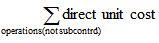
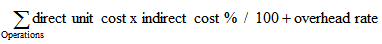
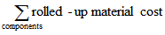
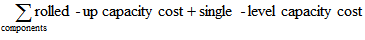
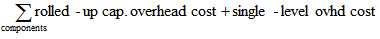
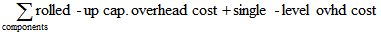
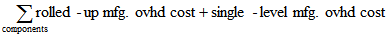

# Designdetaljer: AvvikDesign Details: Variance
Avvik er definert som differansen mellom faktisk kost og standardkost, som beskrevet i følgende formel.Variance is defined as the difference between the actual cost and the standard cost, as described in the following formula.  

 faktisk kost – standardkost = avvikactual cost – standard cost = variance  

 Hvis den faktiske kostnaden endres, for eksempel fordi du bokfører et varegebyr på en senere dato, vil avviket bli oppdatert i henhold til dette.If the actual cost changes, for example, because you post an item charge on a later date, then the variance is updated accordingly.  

> [!NOTE]  
>  Revaluering påvirker ikke avviksberegningen, fordi revaluering bare endrer lagerverdien.Revaluation does not affect the variance calculation, because revaluation only changes the inventory value.  

## EksempelExample  
 Følgende eksempel illustrerer hvordan avvik beregnes for kjøpte varer.The following example illustrates how variance is calculated for purchased items. Dette er basert på følgende scenario:It is based on the following scenario:  

1.  Brukeren kjøper en vare for NOK 90,00, men standardkosten er NOK 100,00.The user purchases an item at LCY 90.00, but the standard cost is LCY 100.00. Derfor blir netto kjøpsavvik NOK -10,00.Accordingly, the purchase variance is LCY –10.00.  
2.  NOK 10,00 krediteres kontoen for kjøpsavvik.LCY 10.00 is credited to the purchase variance account.  
3.  Brukeren bokfører et varegebyr på NOK 20,00.The user posts an item charge of LCY 20.00. Den faktiske kostnaden økes derfor til NOK 110,00, og verdien av kjøpsavvik blir NOK 10,00.Accordingly, the actual cost is increased to LCY 110.00, and the value of the purchase variance becomes LCY 10.00.  
4.  NOK 20,00 debiteres kontoen for kjøpsavvik.LCY 20.00 is debited to the purchase variance account. Derfor blir netto kjøpsavvik NOK 10,00.Accordingly, the net purchase variance becomes LCY 10.00.  
5.  Brukeren revaluerer varen fra NOK 100,00 til NOK 70,00.The user revalues the item from LCY 100.00 to LCY 70.00. Dette påvirker ikke avviksberegningen, bare lagerverdien.This does not affect the variance calculation, only the inventory value.  

 Tabellen nedenfor viser de resulterende verdipostene.The following table shows the resulting value entries.  

   

## Fastslå standardkostDetermining the Standard Cost  
 Standardkosten brukes ved beregning av avvik og beløpet som skal kapitaliseres.The standard cost is used when calculating variance and the amount to capitalize. Siden standardkosten kan endres over tid på grunn av manuell oppdatering av beregning, trenger du et tidspunkt der standardkost er fast for avviksberegning.Since the standard cost can be changed over time because of manual update calculation, you need a point in time when the standard cost is fixed for variance calculation. Dette er tidspunktet når lagerøkningen faktureres.This point is when the inventory increase is invoiced. Punktet der standardkost fastslås når kostnaden justeres for varer som produseres eller monteres.For produced or assembled items, the point when standard cost is determined is when the cost is adjusted.  

 Tabellen nedenfor viser hvordan ulike kostandeler beregnes for produserte og monterte varer når du bruker funksjonen Beregn standardkost.The following table shows how different cost shares are calculated for produced and assembled items when you use the Calculate Standard Cost function.  

|KostandelCost Share|Kjøpt varePurchased Item|Produsert/montert vareProduced/Assembled Item|  
|----------------|--------------------|------------------------------|  
|**Kostpris (standard)****Standard Cost**||Materialkostn. - enkeltnivå + Kapasitetskostn. - enkeltnivå + Underlevrd.kostn - enkeltnivå + Indir. kap.kostn - enkeltnivå + Indir. prod.kostn - enkeltnivåSingle-Level Material Cost + Single-Level Capacity Cost + Single-Level Subcontrd. Cost + Single-Level Cap. Ovhd. Cost + Single-Level Mfg. Ovhd. Cost|  
|**Materialkostn. - enkeltnivå****Single-Level Material Cost**|EnhetskostUnit Cost||  
|**Kapasitetskostn. - enkeltnivå****Single-Level Capacity Cost**|Ikke i brukNot applicable||  
|**Underlevrd.kostn - enkeltnivå****Single-Level Subcontrd. Cost**|Ikke i brukNot applicable||  
|**Indir. kap.kostn - enkeltnivå****Single-Level Cap. Ovhd Cost**|Ikke i brukNot applicable||  
|**Indir. prod.kostn - enkeltnivå****Single-Level Mfg. Ovhd Cost**|Ikke i brukNot applicable|(Materialkostn. - enkeltnivå + Kapasitetskostn. - enkeltnivå + Underlevrd.kostn - enkeltnivå) * Indirekte kostnad % / 100 + Sats for indirekte kostnader(Single-Level Material Cost + Single-Level Capacity Cost + Single-Level Subcontrd. Cost) * Indirect Cost % / 100 + Overhead Rate|  
|**Opprullert materialkost****Rolled-up Material Cost**|EnhetskostUnit Cost||  
|**Opprullert kapasitetskost****Rolled-up Capacity Cost**|Ikke i brukNot applicable||  
|**Underlever.kostn. - opprullert****Rolled-Up Subcontracted Cost**|Ikke i brukNot applicable||  
|**Opprullert indir. kap.kostn.****Rolled-up Capacity Ovhd. Cost**|Ikke i brukNot applicable||  
|**Opprullert indir. prod.kostn.****Rolled-up Mfg. Ovhd. Cost**|Ikke i brukNot applicable||  

## Se ogsåSee Also  
 [Designdetaljer: Kostberegning for beholdning](design-details-inventory-costing.md) [Design Details: Inventory Costing](design-details-inventory-costing.md)   
 [Designdetaljer: Kostmetoder](design-details-costing-methods.md) [Administrere lagerkostnader](finance-manage-inventory-costs.md)[Design Details: Costing Methods](design-details-costing-methods.md) [Managing Inventory Costs](finance-manage-inventory-costs.md)  
 [FinansFinance](finance.md)  
 [Arbeide med [!INCLUDE[d365fin](includes/d365fin_md.md)]](ui-work-product.md)[Working with [!INCLUDE[d365fin](includes/d365fin_md.md)]](ui-work-product.md)

