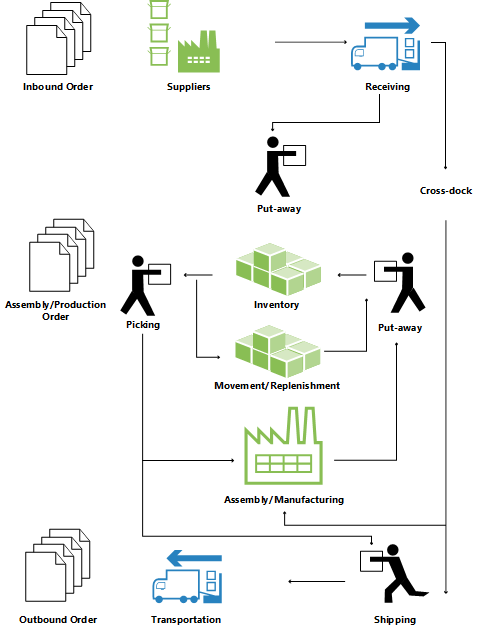

# Designdetaljer: Lageroversikt
For å støtte den fysiske håndteringen av varer på sone- og hyllenivå må all informasjon spores for hver transaksjon eller flytting på lageret. Dette håndteres i **Lagerpost**-tabellen. Hver transaksjon lagres i en lagerjournal.  

Lagerdokumenter og en lagerkladd brukes til å registrere flytting av varer på lageret. Hver gang et element i lageret flyttes, mottas, plasseres, plukkes, leveres eller justeres, blir det registrert lagerposter for å lagre den fysiske informasjonen om sone, hylle og antall. Hvis du vil ha mer informasjon, kan du se [Designdetaljer: Inngående lagerflyt](design-details-outbound-warehouse-flow.md).  

**Hylleinnhold**-tabellen brukes til å håndtere de ulike dimensjonene til innholdet i en hylle per vare, for eksempel enhet, maksimumsantall og minimumsantall. **Hylleinnhold**-tabellen inneholder også flytfelt til lagerpostene, lagerinstruksjonene og lagerkladdelinjene, som sikrer at tilgjengeligheten til en vare per hylle og en hylle for en vare kan beregnes raskt. Hvis du vil ha mer informasjon, kan du se [Designdetaljer: Tilgjengelighet i lageret](design-details-availability-in-the-warehouse.md).  

Når varebokføringer skjer utenfor lagermodulen, brukes en standard justeringshylle per lokasjon til å synkronisere lagerposter med beholdningsposter. Under vareopptelling for lageret registreres eventuelle forskjeller mellom beregnet og opptalt antall i justeringshyllen, og deretter posteres dette som korrigerende vareposter. Hvis du vil ha mer informasjon, kan du se [Designdetaljer: Integrasjon med lagerbeholdning](design-details-integration-with-inventory.md).  

Illustrasjonen nedenfor gir en oversikt over vanlig lagerflyter.  

  

## Grunnleggende eller avanserte lagerstyring  
Lagerfunksjonaliteten i [!INCLUDE[d365fin](includes/d365fin_md.md)] kan implementeres på ulike kompleksitetsnivåer, avhengig av rutiner og ordrevolum i et selskap. Hovedforskjellen er at aktiviteter utføres ordre for ordre i grunnleggende lagerstyring, mens de konsolideres for flere ordrer i avansert lagerstyring.  

 For å skille mellom de ulike kompleksitetsnivåene henviser denne dokumentasjonen til to generelle betegnelser, grunnleggende og avansert lagerstyring. Denne enkle differensieringen dekker flere ulike kompleksitetsnivåer, som defineres av produktgranuler og lokasjonsoppsettet, der hvert nivå støttes av ulike grensesnittdokumenter. Hvis du vil ha mer informasjon, kan du se [Designdetaljer: Lagerstyringsoppsett](design-details-warehouse-setup.md).  

> [!NOTE]  
>  De mest avanserte lagerstyringsnivået kalles "LA-installasjoner" i denne dokumentasjonen, siden dette nivået krever den mest avanserte granulen, Lagerstyringssystem.  

 De ulike grensesnittdokumentene nedenfor brukes i grunnleggende og avansert lagerstyring.  

## Dokumenter for grunnleggende brukergrensesnitt  

-   **Lagerplassering**  
-   **Lagerplukk**  
-   **Lagerflytting**  
-   **Varekladd**  
-   **Varereklassifiseringskladd**  
-   (Forskjellige rapporter)  

## Dokumenter for avanserte brukergrensesnitt  

-   **Lagermottak**  
-   **Plasseringsforslag**  
-   **Plassering**  
-   **Plukkforslag**  
-   **Plukk**  
-   **Flytteforslag**  
-   **Lagerflytting**  
-   **Intern plukk**  
-   **Intern plassering**  
-   **Hylleoppretting**  
-   **Hylleinnholdopprett. - forslag**  
-   **Lagervarekladd**  
-   **Lagervarereklassif.kladd**  
-   (Forskjellige rapporter)  

Hvis du vil ha mer informasjon om hvert dokument, kan du se de respektive emnene for vinduet.  

### Terminologi  
Lagerdokumentasjonen for [!INCLUDE[d365fin](includes/d365fin_md.md)] henviser til følgende termer for vareflyt på lageret, slik at den passer med de økonomiske begrepene om kjøp og salg.  

|Begrep|Beskrivelse|  
|----------|---------------------------------------|  
|Inngående flyt|Varer som flyttes på lagerlokasjonen, for eksempel innkjøp og inngående overføringer.|  
|Intern flyt|Varer som flyttes på lagerlokasjonen, for eksempel produksjonskomponenter og utligning.|  
|Utgående flyt|Varer som flyttes ut av lagerlokasjonen, for eksempel salg og utgående overføringer.|  

## Se også  
 [Designdetaljer: Lagerstyring](design-details-warehouse-management.md)

