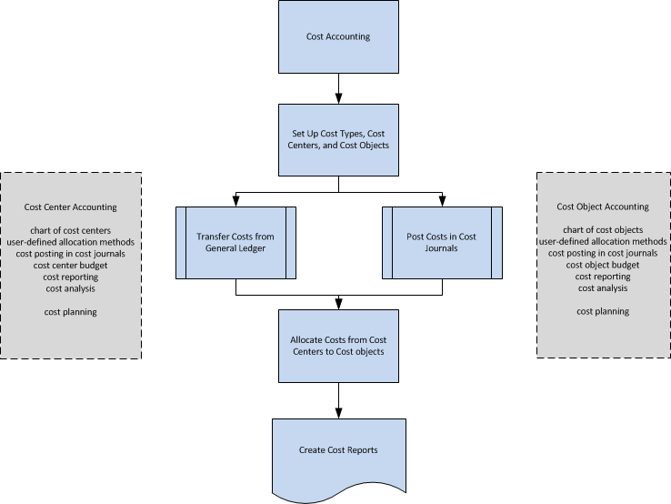

# Om kostregnskap
Kostregnskap kan hjelpe deg med å forstå kostnadene ved å drive et selskap. Informasjon i kostregnskap er utformet for å analysere:  

-   Hvilke kosttyper du pådrar deg når du kjører en bedrift.  
-   Hvor oppstår kostnadene?  
-   Hvem har ansvaret for kostnadene?  

I kostnadsregnskap fordeler du faktiske og budsjetterte kostnader for operasjoner, avdelinger, produkter og prosjekter for å analysere lønnsomhet for firmaet ditt.  

## Arbeidsflyt i kostregnskap  
Kostregnskap har følgende hovedkomponenter:  

-   Kosttyper, kostsentre og kostobjekter  
-   Kostposter og kostkladder  
-   Kostfordelinger  
-   Kostbudsjetter
-   Kostrapportering  

Følgende diagram viser arbeidsflyten i kostregnskap.  

  

## Kosttyper, kostsentre og kostobjekter  
Du definerer kosttyper, kostsentre og kostobjekter for å analysere hva kostnadene er, hvor kostnadene kommer fra og hvem som skal bære kostnadene.  

Du definerer et diagram med kosttyper med en struktur og funksjonalitet som ligner på finanskontoplanen. Du kan overføre resultatregnskapskontoene for finans eller opprette ditt eget diagram med kosttyper.  

Kostsentre er avdelinger og lønnsomhetssentre som er ansvarlig for kostnader og inntekter. Ofte er flere kostsentre definert i kostregnskap enn i noen av dimensjonene som er definert i finans. I finans brukes vanligvis bare kostsentre på første nivå for direkte kostnader og innledende kostnader. I kostregnskap opprettes ytterligere kostsentre for ytterligere fordelingsnivåer.  

Kostobjekter er et selskaps produkter, produktgrupper eller tjenester. Dette er de ferdige varene for et selskap som bærer kostnadene.  

Du kan koble kostsentre til avdelinger og kostobjekter til prosjekter i selskapet. Du kan imidlertid koble kostsentre og kostobjekter til dimensjoner i finans og supplere dem med delsummer og titler.  

## Kostposter og kostkladder  
Driftskostnadene kan overføres fra finans. Du kan automatisk overføre kostpostene fra finans til kostposter for hver bokføring. Du kan også bruke en kjørsel til å overføre finanspostene til kostposter basert på daglig eller månedlig sammendragsbokføring.  

I kostkladder kan du bokføre kost og aktiviteter som ikke kommer fra finans eller ikke genereres av fordelinger. Du kan for eksempel bokføre rene driftskostnader, interne gebyrer, fordelinger og korreksjonsposter mellom kosttyper, kostsentre og kostobjekter enkeltvis eller på en gjentaksbasis.  

## Kostfordelinger  
Fordelingder flytter kostnader og inntekter mellom kosttyper, kostsentre og kostobjekter. Indirekte kostnader blir først bokført til kostsentre og senere belastet kostobjekter. Dette kan for eksempel gjøres i salgsavdelingen som selger flere produkter samtidig. Direkte kostnader kan fordeles direkte til et kostobjekt, for eksempel materiale kjøpt til et bestemt produkt.  

Fordelingsbasen som brukes, og nøyaktigheten av fordelingsdefinisjonen har en innflytelse på resultatene for kostnadsfordelinger. Fordelingsdefinisjonen brukes til å fordele kostnader først fra såkalte pre-kostsentre til hovedkostsentre og deretter fra kostsentre til kostobjekter.  

Hver fordeling består av en fordelingskilde og ett eller flere fordelingsmål. Du kan fordele faktiske verdier eller budsjetterte verdier ved å bruke metoden for statisk fordeling som er basert på en definitiv verdi, for eksempel kvadratmeterantall, eller et fastsatt fordelingsforhold på 5 : 2 : 4. Du kan også fordele faktiske verdier eller budsjetterte verdier ved å bruke metoden for dynamisk fordeling med ni forhåndsdefinerte fordelingsgrunnlag og tolv dynamiske datointervaller.  

## Kostbudsjetter  
Du kan opprette så mange kostbudsjetter som du vil. Du kan kopiere kostbudsjettet til finansbudsjettet, og omvendt. Du kan overføre budsjetterte kostnader som faktiske kostnader.  

## Kostrapportering  
De fleste rapporter og statistikker er basert på bokførte kostposter. Du kan angi sorteringen av resultatene og bruke filtre for å definere hvilke data som skal vises. Du kan opprette rapporter for analyse av kostdistribusjon. I tillegg kan du bruke standard kontoskjemaer til å definere hvordan rapportene for diagrammet med kosttyper skal vises.  

## Se også  
 [Gjøre rede for kostnader](finance-manage-cost-accounting.md)  
 [Finans](finance.md)   
 [Terminologi i kostregnskap](finance-terminology-in-cost-accounting.md)  
 [Arbeide med [!INCLUDE[d365fin](includes/d365fin_md.md)]](ui-work-product.md)

