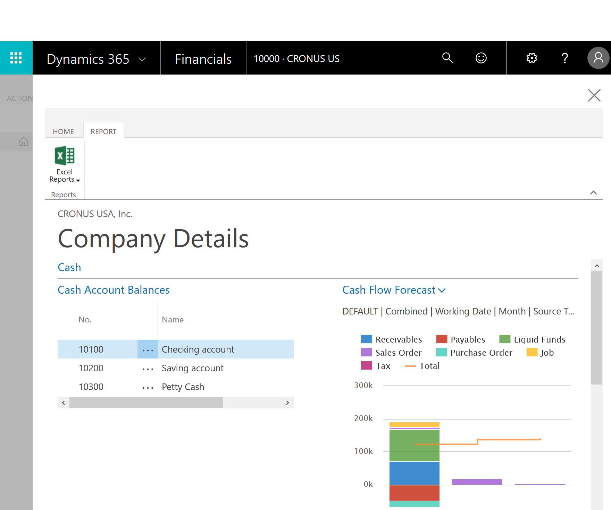

# Regnskapsføreropplevelser i [!INCLUDE[d365fin_long](includes/d365fin_long_md.md)]
Alle virksomheter må føre regnskap og godkjenne regnskapet. Enkelte virksomheter bruker en ekstern regnskapsfører, og andre har en regnskapsfører ansatt. Uansett hvilken type regnskapsfører du er, kan du bruke rollesenteret **Revisor** som hjemmet ditt i [!INCLUDE[d365fin](includes/d365fin_md.md)]. Herfra har du tilgang til alle vinduene du trenger i arbeidet.  

## Rollesenter for regnskapsfører
Rollesenteret er et instrumentbord med aktivitetsfliser som viser deg nøkkeltall i sanntid og gir deg rask tilgang til data. På båndet øverst i vinduet har du tilgang til flere handlinger, som åpne mest vanlig brukte finansrapporter og årsregnskap i Excel. I navigasjonsruten til venstre kan du raskt bytte mellom oversiktene du bruker mest. Hvis du utvider **Hjem**-menyen i navigasjonsruten, vises andre områder, for eksempel **Bokførte bilag** med de ulike bilagstypene selskapet har bokført.  

Hvis [!INCLUDE[d365fin](includes/d365fin_md.md)] er nytt for deg, kan du vise en oversikt over videoer rett fra hjemmesiden. Du kan også starte **Komme i gang**, som angir viktige områder.  

### Bli invitert til en klients [!INCLUDE[d365fin](includes/d365fin_md.md)]
Et selskap som bruker [!INCLUDE[d365fin](includes/d365fin_md.md)], kan invitere deg til [!INCLUDE[d365fin](includes/d365fin_md.md)] som deres eksterne regnskapsfører. Dette krever at de har definert SMTP-e-post, slik at de kan ta kontakt med sin [!INCLUDE[d365fin](includes/d365fin_md.md)]-partner for assistanse. Hvis du vil ha mer informasjon, se [Invitere den eksterne regnskapsføreren](finance-invite-external-accountant.md). Vi anbefaler også at du gir dem e-postadressen du har tenkt å bruke i regnskapsarbeidet. På denne måten kan du velge om du vil bruke *me@accountant.com* eller *me@client.com*  

Derfor vil du motta e-post fra klienten med en kobling til deres [!INCLUDE[d365fin](includes/d365fin_md.md)]  

Du har deretter tilgang til de økonomiske dataene deres fra rollesenteret **Revisor**. Hvis du bruker regnskapsførerportalen, kan du også legge til denne klienten i oversikten over klienter på instrumentbordet i regnskapsførerportalen.  

## Regnskapsførerportal
Hvis du er en regnskapsfører med flere klienter, kan du bruke regnskapsførerportalen som instrumentbord for å få en bedre oversikt over klientene dine. Herfra har du tilgang til hver klients leier i [!INCLUDE[d365fin](includes/d365fin_md.md)], og du kan bruke rollesenter for regnskapsfører som beskrevet ovenfor.  

Regnskapsførerportalen er en dedikert versjon av [!INCLUDE[d365fin](includes/d365fin_md.md)]. Du kan få tilgang til instrumentbordet ved å registrere deg fra [Dynamics NAV for regnskapsførere på Microsoft.com](https://www.microsoft.com/en-us/dynamics365/financial-insights-for-accountants).  

> [!TIP]  
>  Når du registrerer deg for regnskapsførerportalen, må du angi et e-postadressen din, for eksempel *me@accountant.com*. Vi anbefaler at du bruker samme e-postadressen når du arbeider i dine kunders [!INCLUDE[d365fin](includes/d365fin_md.md)], slik at du kan bytte mellom klienter.  

Når du logger på regnskapsførerportalen første gang, vises en eksempelklient på instrumentbordet for å hjelpe deg å komme i gang. Du kan fjerne eksempelklienten når du føler at du ikke lenger trenger den.  

### Arbeide med individuelle klienter
Instrumentbordet viser de viktigste opplysningene om hver klient.  

Kolonnen **Selskapsnavn** viser alle selskapene som klientene dine har i [!INCLUDE[d365fin](includes/d365fin_md.md)], og kolonnen **Klientnavn** viser navnene på klientene dine. Du kan tilpasse instrumentbordet slik at de ønskede datapunktene vises, ved å legge til eller fjerne kolonner. Du kan for eksempel vise avgifter som er forfalt, hvor mange åpne salgsdokumenter hver klient har, eller antall kjøpsfakturaer som forfaller neste uke. Du kan konfigurere visningen etter behov. Hvis du har mange klienter, kan du bruke filtre til å sortere visningen.  

Ellipsen (...) ved siden av selskapsnavnet viser en kort meny:

* Oppdater gjeldende selskap og hent nye data for klienten  
* Gå til klientens selskap  
* Velg flere selskaper  

Likeledes kan du for eksempel bruke rullegardinmenyen **Klientsammendrag** til å oppdatere alle selskapene eller åpne selskapet som er valgt.  

### Opplysninger om selskap
Du finner mer informasjon om dataene til klientene dine ved å velge navnet på selskapet som du vil lære mer om. Dette åpnes **Selskapsnavn**-ruten, der du kan se mer informasjon, for eksempel følgende:  

* Saldo for kontantkontoer  
* Kontantstrømprognose  
* Forfalte kjøpsfakturaer  
* Forfalte salgsfakturaer  

Teknisk sett du har nå logget deg på kundens [!INCLUDE[d365fin](includes/d365fin_md.md)], og dataene du ser, er aktive data. Hvis du vil se nærmere på dataene, for eksempel en forfalt kjøpsfaktura, velger du koblingen, og du kommer til klientselskapet.  

> [!TIP]  
>  Du kan starte forhåndsdefinerte Excel-arbeidsbøker fra **Rapporter**-fanen på båndet. Disse Excel-arbeidsbøkene er utformet som klare til å skrive ut viktige regnskap og rapporter, men du kan også endre dem. etter behov. Hvis du vil ha mer informasjon, se [Analyser årsregnskap i Microsoft Excel](finance-analyze-excel.md).  

Ellers kan du lukke detaljervinduet og gå videre til neste klient.  

### Arbeide i klientselskapet
Hvis du vil arbeide mer for en klient, kan du gjøre dette i rollesenteret for regnskapsførere i deres [!INCLUDE[d365fin](includes/d365fin_md.md)] - velg bare **Gå til klient**-menyelementet, og du logges på automatisk.  

I klientselskapet kan du vise og endre dataene du trenger i arbeidet ditt. Hvis du vil ha mer informasjon, kan du se toppen av denne siden.

> [!NOTE]  
>  Hvis du ikke vil gå tilbake til denne klienten i løpet av noen minitter, anbefaler vi at du lukker nettleserfanen.  

### Legge til klienter
Du kan legge til en klient ved å bruke **Klienter**-vinduet, som du kan åpne ved å velge handlingen **Administrer klienter** på båndet. Velg ganske enkelt **Ny**, og fyll deretter ut feltene.  

Dataene på kortet for hver klient angis av deg, og du kan endre dem etter behov. Feltet **URL-adresse til klient** er avgjørende – det er slik du får tilgang til hver klients [!INCLUDE[d365fin](includes/d365fin_md.md)]. Bruk handlingen **Test URL-adresse til klient** på båndet for å teste at du har angitt riktig kobling. URL-adressen du må angi, peker på klientens [!INCLUDE[d365fin](includes/d365fin_md.md)], som for eksempel *https://mybusiness.financials.dynamics.com*. URL-adressen brukes deretter når du velger **Gå til selskap**-menyelementet.  

## Se også
[Finans](finance.md)  
[Konfigurere finans](finance-setup-finance.md)  
[Finans og kontoplanen](finance-general-ledger.md)  
[Avslutte år og perioder](year-close-years-periods.md)  
[Arbeide med dimensjoner](finance-dimensions.md)  
[Analysere årsregnskap i Excel](finance-analyze-excel.md)  
[Arbeide med [!INCLUDE[d365fin](includes/d365fin_md.md)]](ui-work-product.md)  
[Invitere den eksterne regnskapsføreren til [!INCLUDE[d365fin](includes/d365fin_md.md)]](finance-invite-external-accountant.md)  
[Dynamics NAV for regnskapsførere på Microsoft.com](https://www.microsoft.com/en-us/dynamics365/financial-insights-for-accountants)  
[Definere kontantstrømanalyse](finance-setup-cash-flow-analyses.md)  

