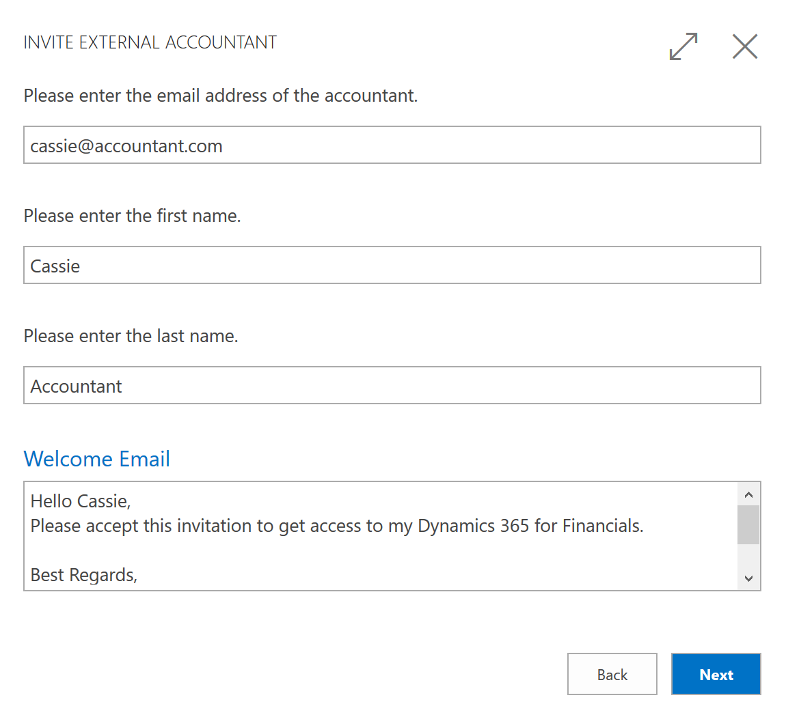

# Invitere den eksterne regnskapsføreren til [!INCLUDE[d365fin](includes/d365fin_md.md)]
Hvis du bruker en ekstern regnskapsfører til å administrere regnskap og finansrapportering, kan du invitere regnskapsføreren til [!INCLUDE[d365fin](includes/d365fin_md.md)], slik at vedkommende kan arbeide med regnskapsdataene.

Når regnskapsføreren har fått tilgang til [!INCLUDE[d365fin](includes/d365fin_md.md)], kan vedkommende bruke rollesenteret **Revisor**, som gir enkel tilgang til de mest relevante vinduene for arbeidet.  

## Invitere regnskapsføreren til [!INCLUDE[d365fin](includes/d365fin_md.md)]
I den siste versjonen av [!INCLUDE[d365fin](includes/d365fin_md.md)], vi har gjort det mulig for deg å invitere den eksterne regnskap. Bare åpne **Brukere**-vinduet, og velg deretter **Inviter ekstern regnskapsfører** i båndet. En e-post er opprettet slik at du bare legger til regnskapsførerens arbeids-e-post og sender invitasjonen.  

> [!TIP]  
>  Dette krever at du har definert SMTP-e-post. Du kan gjøre dette selv eller be din [!INCLUDE[d365fin](includes/d365fin_md.md)]-partner. I tillegg du må være logge på [!INCLUDE[d365fin](includes/d365fin_md.md)] som brukeradministrator, ikke som bedriftseier eller andre brukere.  

### Egen lisens
Regnskapsføreren blir lagt til i Active Directory-leietakeren din bakgrunnen. Systemansvarlig kan kontrollere at regnskapsføreren godtar invitasjonen og tilordnes riktig lisens. Fremgangsmåten for å gjøre dette er avhengig av kontotypen du brukte da du registrerte deg for [!INCLUDE[d365fin](includes/d365fin_md.md)]. Dette emnet er basert på bruken av en Office 365-konto, som bruker Microsoft Azure Active Directory.  

Hvis du har aktivert abonnementet på [!INCLUDE[d365fin](includes/d365fin_md.md)] og ikke lenger bruker evalueringsselskapet, har du en Azure Active Directory-leier. Administratoren eller [!INCLUDE[d365fin](includes/d365fin_md.md)]-partneren administrerer denne leieren i vinduet [Azure Portal](https://portal.azure.com). Det er her nye brukere legges til og lisenser brukes og fjernes. Hvis du vil ha mer informasjon, kan du se [Oversikt over Microsoft Azure Portal](https://docs.microsoft.com/en-us/azure/azure-portal-overview).  

En av lisenstypene for [!INCLUDE[d365fin](includes/d365fin_md.md)] er lisensen *Ekstern regnskapsfører*. Denne lisenstypen er beregnet på brukere som eksterne regnskapsførere. Dette betyr at du slipper å kjøpe en ekstra plass i Active Directory eller bruke en av de eksisterende [!INCLUDE[d365fin](includes/d365fin_md.md)]-brukerkontiene på den eksterne regnskapsføreren. Hvis det gjeldende Office 365-abonnementet ditt omfatter ti brukere for [!INCLUDE[d365fin](includes/d365fin_md.md)], og du bruker ti *Fullstendig bruker*-lisenser, kan systemansvarlig ganske enkelt legge til den eksterne regnskapsføreren som en gjestebruker i Azure Portal og tilordne denne brukeren til lisensen *Ekstern regnskapsfører* uten ekstra kostnad. Du kan imidlertid bare ha én bruker med lisensen *Ekstern regnskapsfører*. Hvis du vil legge til flere brukere, må du oppdatere Office 365-abonnementet tilsvarende.  

## Se også
[Finans](finance.md)  
[Konfigurere e-post manuelt eller bruke assistert oppsett](madeira-how-setup-email.md)  
[Regnskapsføreropplevelser i Dynamics NAV](finance-accounting.md)  
[Dynamics NAV for regnskapsførere på Microsoft.com](https://www.microsoft.com/en-us/dynamics365/financial-insights-for-accountants)  

