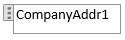

# Lage og endre en egendefinert rapport eller et egendefinert dokumentoppsettHow to: Create and Modify a Custom Report or Document Layout
En rapport har som standard et innebygd rapportoppsett, som kan være et RDLC-rapportoppsett, et innebygd Word-rapportoppsett eller i noen tilfeller begge typer.By default, a report will have a built-in report layout, which can be either an RDLC report layout or Word report layout, or both. Du kan ikke endre innebygde oppsett.You cannot modify built-in layouts. Du kan imidlertid opprette egendefinerte oppsett der du kan endre utseendet på rapporten når den vises, skrives ut eller lagres.However, you can create your own custom layouts that enable you to change the appearance of report when it is viewed, printed or saved. Du kan opprette flere egendefinerte rapportoppsett for samme rapport og deretter bytte oppsettet som brukes av en rapport, etter behov.You can create multiple custom report layouts for the same report, and then switch the layout that is used by a report as needed.

> [!NOTE]  
>   I [!INCLUDE[d365fin](includes/d365fin_md.md)] dekker betegnelsen «rapport» også eksternt rettede dokumenter, for eksempel salgsfakturaer og ordrebekreftelser som du sender til kunder som PDF-filer.In [!INCLUDE[d365fin](includes/d365fin_md.md)], the term "report" also covers externally-facing documents, such as sales invoices and order confirmations that you send to customers as PDF files.

Hvis du vil opprette et egendefinert oppsett, kan du lage en kopi av et eksisterende egendefinert oppsett eller legge til et nytt egendefinert oppsett, som i de fleste tilfeller er basert på et innebygd oppsett.To create a custom layout, you can either make a copy of an existing custom layout or add a new custom layout, which in most cases is based on a built-in layout. Når du legger til et nytt egendefinert oppsett, kan du legge til en RDLC-rapportoppsettype, en Word-rapportoppsettype eller begge typer.When you add a new custom layout, you can choose to add an RDLC report layout type, Word report layout type, or both. Det nye egendefinerte oppsettet baseres automatisk på det innebygde oppsettet for rapporten hvis det er tilgjengelig.The new custom layout will automatically be based on the built-in layout for the report if one is available. Hvis det ikke finnes noen innebygde oppsett for typen, opprettes et nytt, tomt oppsett, som du må endre og utforme fra grunnen av.If there is no built-in layout for the type, then a new blank layout is a created, which you will have to modify and design from scratch. Hvis du vil ha mer informasjon om RDLC- og Word-rapportoppsett, innebygde og egendefinerte oppsett og mer, kan du se [Håndtere rapportoppsett](ui-manage-report-layouts.md).For more information about RDLC and Word report layouts, built-in and custom layouts, and more, see [Manage Report Layouts](ui-manage-report-layouts.md).  

## Slik oppretter du et egendefinert oppsettTo create a custom layout
1. Velg ikonet , angi **Rapportoppsettsvalg**, og velg deretter den relaterte koblingen.Choose the  icon, enter **Report Layout Selection**, and then choose the related link.  

    Vinduet **Rapportoppsettsvalg** viser alle rapportene som er tilgjengelige i selskapet som er angitt i feltet **Selskap** øverst i vinduet.The **Report Layout Selection** window lists all the reports that are available in the company that is specified in the **Company** field at the top of the window.
2. Angi selskapet du vil opprette rapportoppsettet i, i **Selskap**-feltet.Set the **Company** field to the company in which you want to create the report layout.
3. Velg raden for rapporten du vil bruke opprette oppsettet for, og velg deretter handlingen **Egendefinerte oppsett**.Select the row for the report that you want to create the layout for, and then choose the **Custom Layouts** action.  
   Vinduet **Egendefinerte rapportoppsett** vises og inneholder en oversikt over alle de egendefinerte oppsettene som er tilgjengelige for den valgte rapporten.The **Custom Report Layouts** window appears and lists all the custom layouts that are available for the selected report.
4. Hvis du vil opprette en kopi av et eksisterende egendefinert oppsett, velger du det eksisterende egendefinerte oppsettet fra listen, og deretter velger du handlingen **Kopier**.If you want to create a copy of an existing custom layout, select the existing custom layout in the list, and then choose the **Copy** action.  
   Kopien av det egendefinerte oppsettet vises i vinduet **Egendefinerte rapportoppsett** og inneholder ordene *Kopi av* i **Beskrivelse**-feltet.The copy of the custom layout appears in the **Custom Report Layouts** window and has the words *Copy of* in the **Description** field.
5. Hvis du vil legge til et nytt egendefinert oppsett som er basert på et innebygd oppsett, gjør du følgende:If you want to add a new custom layout that is based on a built-in layout, do the following:  
   1. Velg handlingen **Ny**.Choose the **New** action. Vinduet **Sett inn innebygd oppsett for en rapport** vises.The **Insert Built-in Layout for a Report** window appears. Feltene **ID** og **Navn** fylles ut automatisk.The **ID** and **Name** fields are automatically filled in.
   2. Hvis du vil legge til en egendefinert Word-rapportoppsettype, merker du av for **Sett inn Word-oppsett**.To add a custom Word report layout type, then select the **Insert Word Layout** check box.
   3. Hvis du vil legge til en egendefinert RDLC-rapportoppsettype, merker du av for **Sett inn RDLC-oppsett**.To add a custom RDLC report layout type, then select the **Insert RDLC Layout** check box.
   4. Velg **OK**.Choose the **OK** button.  
      De nye egendefinerte oppsettene vises i vinduet **Egendefinerte rapportoppsett**.The new custom layouts appear in the **Custom Report Layouts** window. Hvis et nytt oppsett er basert på et innebygd oppsett, står det **Kopi av innebygd oppsett** i **Beskrivelse**-feltet.If a new layout is based on a built-in layout, then it has the words **Copy of a Built-in Layout** in the **Description** field. Hvis det ikke finnes noe innebygd oppsett for rapporten, står det **Nytt oppsett** i **Beskrivelse**-feltet, som angir at det egendefinerte oppsettet er tomt.If there was no built-in layout for the report, then the new layout has the words **New Layout** in the **Description** field, which indicates that custom layout is blank.
6. **Selskapsnavn**-feltet er som standard tomt, noe som betyr at det egendefinerte oppsettet er tilgjengelig for rapporten i alle selskaper.By default, the **Company Name** field is blank, which means that the custom layout will be available for the report in all companies. Hvis du vil gjøre det egendefinerte oppsettet bare tilgjengelig i et bestemt selskap, velger du **Rediger**, og deretter angir ønsket selskap i **Selskapsnavn**-feltet.To make the custom layout available in a specific company only, choose **Edit**, and then set the **Company Name** field to the company that you want.

Det egendefinerte oppsettet er opprettet.The custom layout has been created. Du kan nå endre det egendefinerte oppsettet etter behov.You can now modify the custom layout as needed.

## Endre et egendefinert oppsettModifying a custom layout
Når du skal endre et rapportoppsett, du må først eksportere rapportoppsettet som en fil til en plassering på datamaskinen eller nettverket, og åpne det eksporterte dokumentet i Word og gjøre endringene.To modify a report layout, you must first export the report layout as a file to a location on your computer or network, and then open the exported document and make the changes. Når du er ferdig å foreta endringer, importerer du rapportoppsettet.When you are finished making the changes, you import the report layout.

### Endre et egendefinert oppsettTo modify a custom layout
1.  Du kan eksportere et egendefinert oppsett fra **Egendefinerte rapportoppsett**-vinduet.You export a custom layout from the **Custom Report Layouts** window. Hvis vinduet ikke allerede er åpent, kan du søke etter og åpne **Rapportoppsettsvalg**-vinduet, velge rapporten som har oppsettet du vil endre, og deretter velge handlingen **Egendefinerte oppsett**.If this window is not already open, search for and open the **Report Layout Selection** window, select the report that has the layout that you want to modify, and then choose the **Custom Layouts** action.  
2.  I **Egendefinerte rapportoppsett**-vinduet velger du oppsettet som du vil endre, velger **Eksporter oppsett**-handlingen, og velger deretter **Lagre** eller **Lagre som** for å lagre rapportoppsettsdokumentet på et sted på datamaskinen eller nettverket.In the **Custom Report Layouts** window, select the layout that you want to modify, choose the **Export Layout** action, and then choose **Save** or **Save As** to save the report layout document to a location on your computer or network.  

3.  Åpne rapportoppsettdokumentet du nettopp lagret, og gjør deretter endringene.Open the report layout document that you just saved, and then make changes.

      Hvis du endrer et Word-oppsett, kan du åpne oppsettsdokumentet i Word.If you are changing a Word layout, open the layout document in Word. Se neste del [Endre rapportoppsettet](ui-how-create-custom-report-layout.md#MakeChangesToLayout) hvis du vil ha mer informasjon om redigering.For editing details, see the next section [Making Changes to the Report Layout](ui-how-create-custom-report-layout.md#MakeChangesToLayout).

      RDLC-rapportoppsett er mer avansert enn Word-rapportoppsett.RDLC report layouts are more advanced than Word report layouts. Hvis du vil ha mer informasjon om hvordan du endrer et RDLC-rapportoppsett, kan du se [Utforme RDLC-rapportoppsett](https://msdn.microsoft.com/en-us/dynamics-nav/designing-rdlc-report-layouts).For more information about modifying an RDLC report layout, see [Designing RDLC Report Layouts](https://msdn.microsoft.com/en-us/dynamics-nav/designing-rdlc-report-layouts).

      Husk å lagre endringene når du er ferdig.Remember to save you changes when done.

4.  Gå tilbake til **Egendefinerte rapportoppsett**-vinduet, velg rapportoppsettet som du har eksportert eller endret, og velg deretter **Importer oppsett**-handlingen.Return to the **Custom Report Layouts** window, select the report layout that you exported and modified, and then choose the **Import Layout** action.  

5. I dialogboksen **Importer** velger du **Velg** for å finne og velge rapportoppsettsdokumentet, og velger deretter **Åpne**.In the **Import** dialog box, select **Choose** to find and select the report layout document, and then choose **Open**.

##  Gjøre endringer i et Word-rapportoppsett Making changes to a Word report layout  
Når du skal foreta generelle formaterings- og oppsettsendringer, for eksempel endre skrift, legge til eller endre en tabell eller fjerne et datafelt, bruker du bare de grunnleggende redigeringsfunksjonene i Word, som du gjør med et Word-dokument.To can make general formatting and layout changes, such as changing text font, adding and modifying a table, or removing a data field, just use the basic editing features of Word, like you do with any Word document.

Hvis du utformer et Word-rapportoppsett fra grunnen av eller legger til nye datafelt, begynner du med å legge til en tabell som inneholder rader og kolonner som omsider skal inneholde datafeltene.If you are designing a Word report layout from scratch or adding new data fields, then start by adding a table that includes rows and columns that will eventually hold the data fields.

> [!TIP]  
>  Vis tabellrutenettet, slik at du kan se cellegrensene i tabellen.Show the table gridlines so that you see the boundaries of table cells. Husk å skjule rutenettet når du er ferdig å redigere.Remember to hide the gridlines when you are done editing. Hvis du vil vise eller skjule tabellrutenett, merker du tabellen. Under **Oppsett** i kategorien **Tabell** velger du deretter **Vis rutenettlinjer**.To show or hide table gridlines, select the table, and then under **Layout** on the **Table** tab, choose **View Gridlines**.  

###   Fjerne etikett- og datafelt i Word-oppsett Removing Label and Data Fields in Word Layouts  
 Etikett- og datafelt i en rapport er i innholdskontroller i Word.Label and data fields of a report are contained in content controls in Word. Den følgende illustrasjonen viser en innholdskontroll når den er valgt i Word-dokumentet.The following figure illustrates a content control when it is selected in the Word document.  

   

 Navnet på etiketten eller datafeltnavnet vises i innholdskontrollen.The name of the label or data field name displays in the content control. I dette eksemplet er feltnavnet CompanyAddr1.In the example, the field name is CompanyAddr1.  

### Fjerne en etikett eller et datafeltTo remove a label or data field  

1.  Høyrevelg feltet som du vil slette, og velg deretter **Fjern innholdskontroll**.Right-choose the field that you want to delete, and then choose **Remove Content Control**.  

     Innholdskontrollen fjernes, men feltnavnet blir stående som tekst.The content control is removed, but the field name remains as text.  

2.  Slett den gjenstående teksten etter behov.Delete the remaining text as needed.  

### Legge til datafeltAdding data fields
Å legge til datafelt fra et rapportdatasett er mer avansert og krever noe kjennskap til rapportdatasettet.Adding data fields from a report dataset is a more advanced and requires some knowledge of the report dataset. Hvis du vil ha informasjon om å legge til felt for data, etiketter og bilder, kan du se [Legge til felt i et Word-rapportoppsett](ui-how-add-fields-word-report-layout.md).For information about adding fields for data, labels, data, and images, see [How to: Add Fields to a Word Report Layout](ui-how-add-fields-word-report-layout.md).  

## Se ogsåSee Also
[Håndtere rapportoppsettManaging Report Layouts](ui-manage-report-layouts.md)  
[Endre gjeldende oppsett som skal brukes i en rapportHow to: Change Which Layout is Currently Used on a Report](ui-how-change-layout-currently-used-report.md)  
[Importere og eksportere en egendefinert rapport eller et egendefinert dokumentoppsettHow to: Import and Export a Custom Report or Document Layout](ui-how-import-and-export-report-layout.md)  
[Arbeide med rapporterWorking with Reports](ui-work-report.md)  
[Arbeide med [!INCLUDE[d365fin](includes/d365fin_md.md)]](ui-work-product.md)[Working with [!INCLUDE[d365fin](includes/d365fin_md.md)]](ui-work-product.md)  

