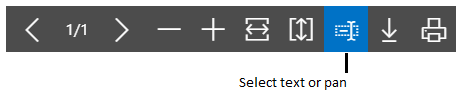

# Arbeide med rapporterWorking with Reports
En rapport samler inn informasjon basert på et bestemt sett med vilkår og organiserer og viser informasjonen i et format som er lett å lese og som kan skrives ut.A report gathers information based on a specified set of criteria, and organizes and presents the information in an easy-to-read, printable format. Det finnes mange tilgjengelige rapporter i programmet.There are many reports that you can access throughout the application. Rapportene inneholder informasjon i forhold til konteksten på siden du er på.The reports typically provide information relative to the context of the page you are on. **Kunde**-siden inneholder for eksempel rapporter for de 10 beste kundene og salgsstatistikken.For example, the **Customer** page includes reports for the top 10 customers and the sales statistics, and more.

Du finner rapportene i **Rapporter**-kategorien på bestemte sider, eller du kan bruke Søk til å finne rapporter etter navn.You can find reports in the **Reports** tab on selected pages, or you can use search to find reports by name. Når du åpner en rapport, vises en side der du kan angi opplysninger (alternativer og filtre) som bestemmer hva du vil ha med i rapporten.When you open a report, you are presented with a page that let's you specify information (options and filters) that determines want to include in the report. Avhengig av rapporten kan du for eksempel angi et datointervall, en bestemt post som en kunde, eller sorteringsrekkefølge.For example, depending on the report, you can specify a date range, a specific record such as a customer, or sorting order.

## Forhåndsvise en rapportPreviewing a report
Velg **Forhåndsvisning** for å vise rapporten i nettleseren.Choose **Preview** to see the report in the Internet browser. Pek på et område i rapporten for å vise menylinjen.Point to an area of the report to show the menu bar.  

..

Bruk menylinjen til følgende:Use the menu bar to:

-   Gå gjennom siderMove through pages
-   Zoome inn og utZoom in and out
-   Endre størrelse for å tilpasse vinduetResize to fit the window
-   Velg tekstSelect text

    Du kan kopiere tekst fra en rapport og lime den inn et annet sted, for eksempel en side i [!INCLUDE[d365fin](includes/d365fin_md.md)] eller Microsoft Word.You can copy text from a report, and then paste it somewhere else, like a page in [!INCLUDE[d365fin](includes/d365fin_md.md)] or Microsoft Word.  Ved hjelp av musen kan du for eksempel trykke og holde der du vil starte, og deretter bevege musen for å merke ett eller flere ord, setninger eller avsnitt.Using a mouse, for example, you press and hold where you want to start, and then move the mouse to select one or more words, sentences, or paragraphs. Du kan deretter trykke på høyreklikknappen og velge **Kopier**.You can then press the right mouse button, and select **Copy**. Du kan deretter lime inn den merkede teksten der du vil ha den.You can the paste the selected text where ever you want it.
-   Panorer dokumentetPan the document

    Du kan flytte det synlige området i rapporten i en hvilken som helst retning slik at du kan vise andre områder i rapporten.You can move the visible area of the report in any direction so you can view other areas or the report. Dette er nyttig når du har zoomet inn for å vise detaljer.This is helpful when you have zoomed in to see details.  Ved hjelp av musen kan du for eksempel trykke på og holde museknappen hvor som helst i rapportforhåndsvisningen, og deretter flytte musen.Using your mouse, for example, press and hold the mouse button anywhere in the report preview, and then move your mouse.

-   Last ned til en PDF-fil på datamaskinen eller nettverket.Download to a PDF file on your computer or network.

## Lagre en rapportSaving a Report
Du kan lagre en rapport i et PDF-dokument, Microsoft Word-dokument eller Microsoft Excel-dokument ved å velge **Send til**, og deretter velge.You can save a report to a PDF document, Microsoft Word document, or Microsoft Excel document by choosing **Send to**, and then making your selection. 

##  Planlegge en rapport for kjøring Scheduling a Report to Run
Du kan planlegge at en rapport skal kjøres på en bestemt dato og et bestemt klokkeslett.You can schedule a report to run at a specific date and time. Planlagte rapporter legges i jobbkøen og behandles på det planlagte tidspunktet, på samme måte som andre jobber.Scheduled reports are entered in the job queue and processed at the scheduled time, similar to other jobs. Du kan velge å lagre den behandlede rapporten som en fil, for eksempel en Excel-, Word- eller PDF-fil, skrive den ut på en valgt skriver eller bare behandle rapporten.You can choose to save the processed report to a file, such as an Excel, Word, or PDF, print it to a selected printer, or process the report only. Hvis du lagrer rapporten i en fil, sendes den behandlede rapporten til området **Rapportinnboks** på Hjem-siden, der du kan vise den.If you choose to save the report to a file, then the processed report is sent to the **Report Inbox** area on your Home page, where you can view it.

Du kan planlegge en rapport når du åpner en rapport.You can schedule a report when you open a report. Du velger **Tidsplan** og angir deretter informasjon om skriveren, og dato og klokkeslett.You choose the **Schedule** action and then you enter information such as printer, and time and date. Rapporten legges deretter til i jobbkøen og kjøres på angitt tidspunkt.The report is then added to the job queue and will be run at the specified time. Når rapporten er behandlet, fjernes elementet fra jobbkøen.When the report is processed, the item will be removed from the job queue. Hvis du lagret den behandlede rapporten i en fil, er den tilgjengelig i området **Rapportinnboks**.If you saved the processed report to a file, it will be available in the **Report Inbox** area.

## Skrive ut en rapportPrinting a Report
Når du vil skrive ut en rapport, må du laste ned rapporten som et PDF-, Word- eller Excel-dokument først ved å velge **Send til**.When you want to print a report you have to download the report as a PDF, Word, or Excel document first by choosing **Send to**. Nå kan du enten åpne rapportdokumentet med en gang og skrive det ut, eller lagre det og skrive det ut senere.Now, you can either open the report document right-away and print it, or save it and print it later.

## Bruke lagrede innstillingerUsing Saved Settings
En rapport kan inneholde én eller flere poster i **Lagrede innstillinger**-feltet.A report can include one or more entries in the **Saved Settings** box. *Lagrede innstillinger* er en forhåndsdefinert gruppe med alternativer og filtre som du kan bruke i rapporten før du forhåndsviser eller sender rapporten til en fil.*Saved settings* are basically a predefined group of options and filters that you can apply to the report before previewing or sending the report to a file. Lagrede innstillinger er en rask og pålitelig metode for å generere konsekvent rapporter som inneholder de riktige dataene.Using saved settings is a fast and reliable way to consistently generate reports that contain the correct data.

Oppføringen med lagrede innstillinger, som kalles **Sist brukte alternativer og filtre**, er alltid tilgjengelig.The saved settings entry called **Last used options and filters** is always available. Denne posten angir at rapporten bruker alternativer og filtre som ble brukt forrige gang du så på rapporten.This entry sets the report to use options and filters that were used the last time you looked at the report.

>[!NOTE]
>Som administrator kan du opprette og administrere lagrede innstillinger for rapporter for alle brukere.As an administrator, you can create and manage the saved settings for reports for all users. Hvis du vil ha mer informasjon, se [Administrere lagrede innstillinger i rapporter](reports-saving-reusing-settings.md).For more information, see [Managing Saved Settings on Reports](reports-saving-reusing-settings.md).

## Endre oppsettet og utseendet på en rapportChanging the layout and look of a report
Et rapportoppsett styrer hva som skal vises i en rapport, hvordan det er ordnet og stilen som brukes.A report layout controls what is shown on a report, how it is arranged, and how it is styled. Hvis du ønsker å bytte til et annet oppsett, kan du se [Endre gjeldende oppsett som skal brukes i en rapports](ui-how-change-layout-currently-used-report.md).If you want to switch to a different layout, see [How to: Change Which Layout is Currently Used on a Report](ui-how-change-layout-currently-used-report.md). Hvis du vil tilpasse ditt eget rapportoppsett, se [Opprette og endre et egendefinert rapportoppsett](ui-how-create-custom-report-layout.md).Or, if you want to customize your own report layout, see [How to: Create and Modify a Custom Report Layout](ui-how-create-custom-report-layout.md).

## Se ogsåSee Also
[Angi skrivervalg for rapporterSpecify Printer Selection for Reports](ui-specify-printer-selection-reports.md)  
[Administrere rapport- og dokumentoppsettManaging Report and Document Layouts](ui-manage-report-layouts.md)  
[Arbeide med [!INCLUDE[d365fin](includes/d365fin_md.md)]](ui-work-product.md)[Working with [!INCLUDE[d365fin](includes/d365fin_md.md)]](ui-work-product.md)

